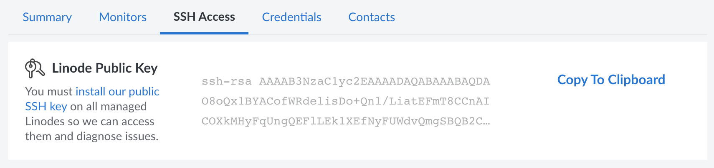
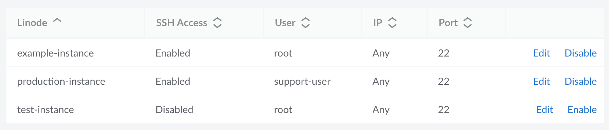

To troubleshoot an issue with a failed monitor check, the Support Team needs access to your system. This access can be provided by using the unique public key generated for your account. You can upload this key to any system user and then configure the SSH access settings for each Compute Instance so that our team is aware of how they should log in. To start using your public key, follow the steps below *for each Compute Instance* on your account.

1. View your account's public key.
1. Install the public key on your preferred system user.
1. Edit the SSH access settings for the Compute Instance.


If you do not wish to use this public key, you can also configure credentials in the form of usernames and passwords. See the [Configure Credentials]() guide.


## View Your Public Key

Linode generates a unique public/private keypair for your account when Managed Services is enabled. The public key is accessible on your account so that you can add it to each Compute Instance. The private key is then used by the Support Team to access your system whenever an issue requires investigation. You can locate your public key through the following steps:

1. Log in to the [Cloud Manager](https://cloud.linode.com) and click the **Managed** link in the sidebar.

1. Navigate to the **SSH Access** tab. Your public key is displayed at the top of this tab.

    

1. Hover over the public key box to view the full public key. To copy it, click the **Copy to clipboard** button.

## Add the Public Key to Your Compute Instance(s)

Installing the public SSH key for the `root` user is the easiest way to add Linode's public key to your server. However, if your server's SSH configuration doesn't allow [root login](/docs/products/compute/compute-instances/guides/set-up-and-secure/#ssh-daemon-options), you may want to skip to the next section to add the public key to another user's account.

1. Log in to your Compute Instance through [LISH](/docs/products/compute/compute-instances/guides/lish/) or [SSH](/docs/products/compute/compute-instances/guides/set-up-and-secure/#connect-to-the-instance).

1. Edit the SSH authorized keys file for whichever user account you want the Support Team to use when logging in.

    - For the root user:

        ```command
        sudo nano /root/.ssh/authorized_keys
        ```

        
        If you followed the instructions in the [Securing Your Server](/docs/products/compute/compute-instances/guides/set-up-and-secure/) guide to disable root login via SSH, you need to re-enable that feature. Follow the relevant instructions within the [Set Up and Secure](/docs/products/compute/compute-instances/guides/set-up-and-secure/#ssh-daemon-options) guide to edit the `sshd_config` file and re-enable root login via SSH.
        

    - For a limited user (editing the home directory as needed):

        ```command
        sudo nano /home/example_user/.ssh/authorized_keys
        ```

        
        In general, [sudo privileges](/docs/guides/linux-users-and-groups/#understanding-sudo) are needed to run many of the troubleshooting commands our Support Team might use. Whenever possible, you should grant the limited user sudo privileges. The [Adding a New User](/docs/products/compute/compute-instances/guides/set-up-and-secure/#add-a-limited-user-account) guide shows how to add your user to the `sudo` group (or `wheel` or `admin` group, depending on your distribution).

        After adding the limited user account to the sudo group, you need to either provide the user's password to the Support Team (see [Add Credentials](#adding-service-credentials)) or enable passwordless sudo by following the instructions below.

        1.  Edit the `sudoers` file. The following command opens the file using the [Vim](https://en.wikipedia.org/wiki/Vim_(text_editor)) text editor.

            ```command
            sudo visudo
            ```

        1.  Type `i` to enter *insert mode* in Vim.

        1.  In the *User privilege specification* section of the file, add the following line, replacing `example_user` with your user name:

            ```output
            example_user ALL=(ALL) NOPASSWD: ALL
            ```

        1.  Press **Esc** to exit *insert mode*.

        1.  Make sure this user is not in any other groups listed in `/etc/sudoers`, as this may override the passwordless sudo setting.

        1.  Type `:wq` and press **Enter** to save and quit the file.
        

    If the `.ssh` directory does not exist for your user or the root user, you can create it with the following command, replacing *[directory]* with `/home/example_user/.ssh/` or `/root/.ssh/`, adjusting the path as needed for your user.

    ```command
    mkdir [directory]
    ```

1. Paste your public key to a new line in the file.

1. Save the changes to the file and exit your text editor. In the `nano` editor, enter <kbd>Ctrl</kbd>-<kbd>X</kbd> and then <kbd>Y</kbd> to confirm.

Once you've added the public key to your preferred user, you may need to allow access from our infrastructure (see [Configuring Firewall Rules](#configuring-firewall-rules)). If you wish to confirm that everything is properly configured, [open a support ticket](/docs/products/platform/get-started/guides/support/#contacting-linode-support) to have the Support team confirm that they have access. Repeat this process on every Compute Instance you want to monitor.

## Edit SSH Access Settings for Each Compute Instance

After adding your public key to each Compute Instance you want to monitor, make sure to edit the SSH access settings for those instances (and any other instance on your account). These settings are used by the Support team so that they know if SSH access has been enabled and, if so, on which user and port. The following settings can be specified:

- **SSH Access:** Specifies if SSH access is enabled for the instance (default: *Enabled*).
- **User:** The user account that the Support team should use (default: *root*).
- **IP:** The IP address that the support team should use (default: *Any*). This is only needed if your Compute Instance has multiple IP addresses and only certain ones allow SSH connections.
- **Port:** The SSH port on the system (default: *22*). Only change this if your system is using a non-standard port for SSH connections.


Modifying these SSH access settings for a Compute Instance **does not change** anything internally on your system. These settings are only used to communicate access details to the Support team.


Follow the steps below to edit the SSH access settings for each Compute Instance.

1. Log in to the [Cloud Manager](https://cloud.linode.com) and click the **Managed** link in the sidebar.

1. Navigate to the **SSH Access** tab and scroll down to view a list of Compute Instances on your account.

1. Locate the Compute Instance for which you wish to modify the SSH settings and click the corresponding **Edit** button.

    

    If you instead with to enable or disable access, click the corresponding **Enable** or **Disable** button.

1. Update the SSH access details with the appropriate values for your system. Once you're done, click the **Save Changes** button.