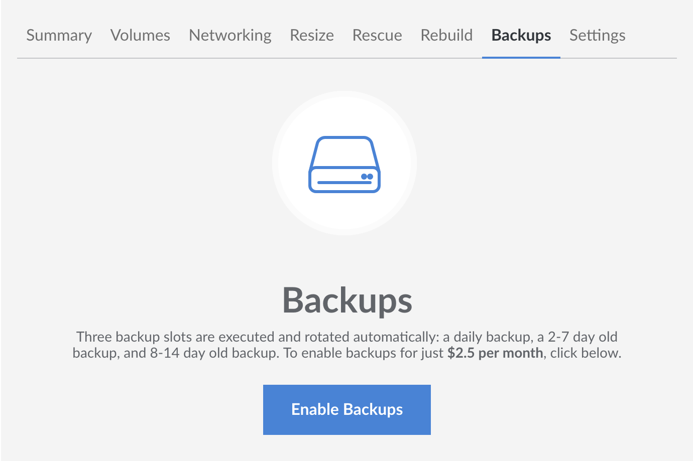

Use the Linode Cloud Manager to enable the Backup Service on a Linode. Here's how:

1.  Log in to the [Linode Cloud Manager](https://cloud.linode.com).

1.  From the **Linodes** page, select the Linode you want to back up.

1.  Click the **Backups** tab.

    

1.  Click **Enable Backups**.

The Linode Backup Service is now enabled for the selected Linode.
