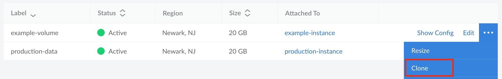

## Can I create more than one manual backup?

The Backup service allows for one manual snapshot in addition to the three automatically generated scheduled backups. There are no additional manual snapshot slots available. If you have an existing snapshot and you attempt to create a new one, the new snapshot will replace the old one.

If you require additional manual backups of your data, consider using [alternative methods of backing up your data](/docs/guides/backing-up-your-data/) or use our Images service to [capture an image](/docs/products/tools/images/guides/capture-an-image/) of your Compute Instance's disk.

## Can I use the Backup service to backup Block Storage Volumes?

No, the Backup service does not take backups of Block Storage volumes, even if a volume is attached to a Compute Instance. If you wish to create a backup of your volume, consider cloning your volume or using [alternative methods of backing up your data](/docs/guides/backing-up-your-data/). Cloning a volume creates a new Block Storage volume of the same size and copies over all existing data. To clone your volume, navigate to the Volumes page in Cloud Manager, open the ellipsis menu of the corresponding Volume you wish to clone, and select the **Clone** link.

## Where are backups physically stored?

Backups created by the Backup service are stored on separate dedicated hardware located in the same data center as the associated Compute Instance. This means that existing backups are not affected by isolated incidents with the Compute Instance or the underlying hardware of that instance.

## How do I download a backup to my local computer?

Existing backups are not able to be downloaded directly, though you can restore a backup to a Compute Instance and download any files or disks you require.

- If you need a local backup of your Compute Instance as it exists in that moment, you do not need to restore from a backup. Instead, you can use tools like [rsync](/docs/guides/backing-up-your-data/#manual-backup-via-rsync), FTP, and SCP to download files directly from your instance. For more details, see [Download Files from Your Compute Instance](/docs/guides/download-files-from-a-compute-instance/).

- If you wish to download files as they were on a previous backup, you can restore that backup to a Compute Instance and then access that instance to download files. For instructions, see [Download a Local Copy of your Linode Backup](/docs/products/storage/backups/guides/download-backups-locally/).

## Is the Backup service compatible with an encrypted or partitioned disk?

No. Our Backup service must be able to mount your disk. This is not currently possible if your disk is encrypted or if it has multiple partitions. See [Limits and Considerations](/docs/products/storage/backups/#limits-and-considerations) for more details about this and other requirements.

## Why does it take such a long time to create a backup or restore from a backup?

In many cases, slow backup operations (including creating a new backup and restoring from a backup) are due to a large number of files stored on your Compute Instance. The more files on your system, the longer it takes to perform backup operations and the greater the chance for a backup failure.

If your system generates a large number of files (such as log files), consider configuring your system to automatically archive (or delete) these files. Alternatively, you can also store these files on a disk that is *not* subscribed to our Backup service or store them on a [Block Storage](https://www.linode.com/products/block-storage/) volume. If any of these solutions do not work for you, review the [Backing Up Your Data](/docs/guides/backing-up-your-data/) guide for to learn about other backup tools and strategies.

## What do I do if my backup restoration fails?

When restoring a backup to a Compute Instance, you may see a message that your backup restoration has failed. If you receive this message, we first recommend that you attempt to boot that Compute Instance. It's possible that only a small number of files failed to be properly restored (such as socket files and other temporary files). In this case, it's likely that your Compute Instance will still successfully boot and contain all of the data you required. If booting the instance does not work, review the [Troubleshooting Backups](/docs/products/storage/backups/guides/troubleshooting/) guide.

## Why do I keep receiving "Backup Failure" tickets?

This ticket is to alert you when our Backup service isn't able to successfully backup one of your Compute Instances. These issues are often resolved automatically and, in many cases, no action is required on your end. If you have received more than one of these tickets in a short period of time, we recommend reviewing the [Troubleshooting Backups](/docs/products/storage/backups/guides/troubleshooting/) guide so that you can diagnose the issue yourself or replying to one of the tickets so that our Support team can investigate further.