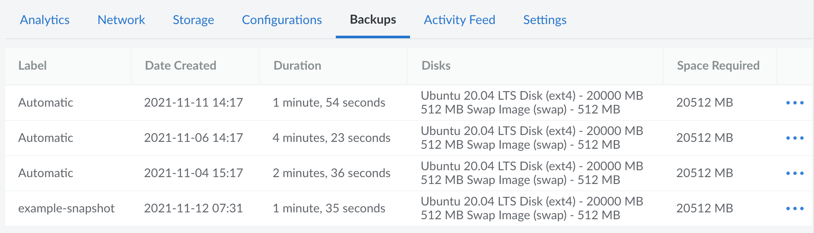

## Enabling the Backup Service

The Backup service can be enabled on existing Compute Instances by following the instructions below:

1.  Log in to the [Cloud Manager](https://cloud.linode.com).

1.  From the **Linodes** page, select the Linode you want to back up.

1.  Click the **Backups** tab.

1.  Click **Enable Backups**.

For further instructions, including details on enabling the Backup service for new Linodes, see [Enable Backups](/docs/products/storage/backups/guides/enable/).

## Managing Backups

Once enabled, the Backup service will store up to four backups, three of which are automatically generated on the date and time range you specify:

- **Daily** *(Less than 24 hours old)*
- **Weekly** *(Less than 7 days old)*
- **Biweekly** *(Between 8 and 14 days old)*
- **Manual Snapshot** *(A user-initiated snapshot that stays the same until another snapshot is initiated)*

These backups can be managed in the Cloud Manager under the **Backups** tab for your Compute Instance.

This page also provides a few other options, detailed below:

- **Manual Snaphot:** Creates a new manual snapshot, overwriting any existing one. See [Take a Manual Snapshot](/docs/products/storage/backups/guides/take-a-snapshot/).

- **Settings:** Allows you to schedule when automatic backups are generated. See [Schedule Backups](/docs/products/storage/backups/guides/schedule/).

- **Cancel Backups:** Removes the Backup service and deletes all existing backups. See [Cancel the Backup Service](/docs/products/storage/backups/guides/cancel/).

## Restoring from a Backup

To restore from a backup, locate the backup within the **Backups** tab of the Compute Instance and click the corresponding **ellipsis** menu. From here, there are a few options that can be selected:

- **Restore to Existing Linode:** Restore the backup disks to an existing Compute Instance. [Restore a Backup to an Existing Linode](/docs/products/storage/backups/guides/restore-to-an-existing-linode/)

- **Deploy New Linode:** Restore the backup disks to a new Compute Instance. See [Restore a Backup to a New Linode](/docs/products/storage/backups/guides/restore-to-a-new-linode/).