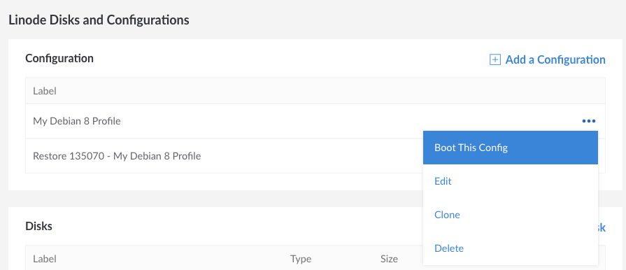

After the backup has been restored, the disks and configuration profiles will be available to the destination Linode you selected. Select the restored configuration profile and reboot your Linode to start up from the restored disks:

1.  From the **Linodes** page, select the Linode that you restored the backup to. Navigate to the **Disks/Configs** tab.

1.  Select the **more options ellipsis** next to the configuration profile that was restored and select **Boot This Config**.

    

The Linode will start from the backup disks. Monitor the notifications area for progress.
