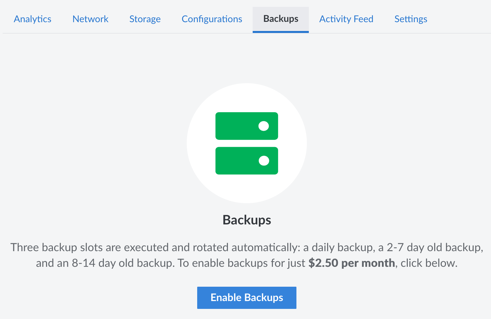
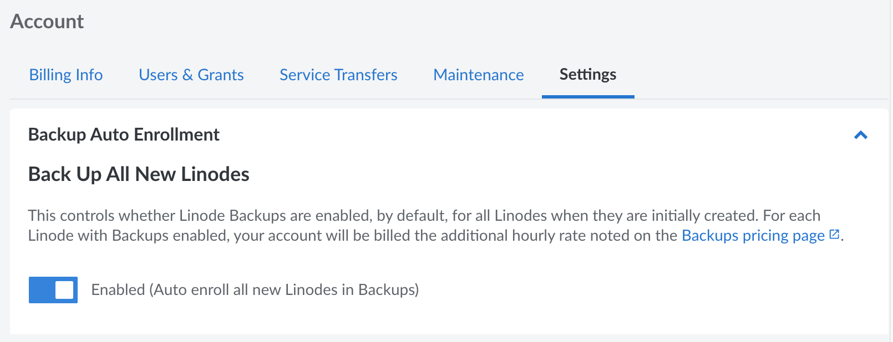

---
author:
  name: Linode
  email: docs@linode.com
title: "Enable Backups"
description: "How to enable the Linode Backup Service."
aliases: ['/quick-answers/linode-platform/enable-backups-on-a-linode/', '/guides/enable-backups-on-a-linode/']
---

The Backups service can be individually enabled on an existing Compute Instances and auto-enabled on all new Instances.

## Enable the Backups Service on an Existing Compute Instance

1.  Log in to the [Cloud Manager](https://cloud.linode.com).

1.  From the **Linodes** page, select the Linode you want to back up.

1.  Click the **Backups** tab.

1.  Click **Enable Backups**.

    

1.  A pop-up box is displayed confirming that you intend to enable backups for the specified monthly cost. Click **Enable Backups** to confirm.

The Linode Backup Service is now enabled for the selected Linode.

## Auto Enroll New Compute Instances in the Backup Service

You can automatically enroll all new Linodes in the Backup Service.

1.  Log in to the [Cloud Manager](https://cloud.linode.com).

1.  Click the **Account** link in the sidebar, then select the **Settings** tab.

1.  In the **Backup Auto Enrollment** panel, click on the switch to enable backups on all new Linodes.

    


Enabling this setting does not retroactively enroll any previously created Linodes in the Backup Service.
