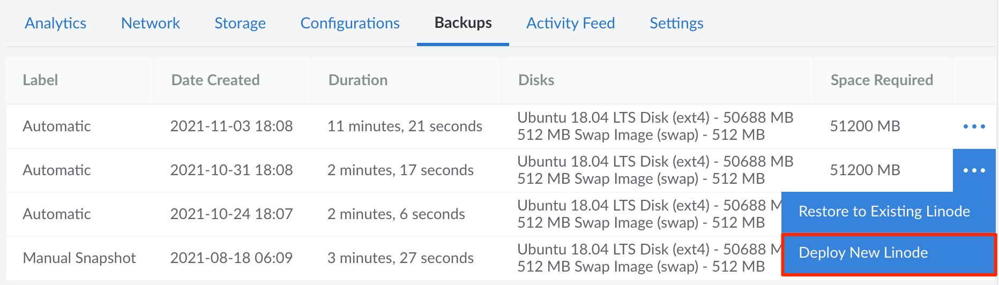

---
author:
  name: Linode
  email: docs@linode.com
title: Restore a Backup to a New Linode
description: "How to restore a backup to a new Linode."
---

These steps cover how to restore a backup to a new Linode Compute Instance. The new Compute Instance will be deployed to the same data center, though you can [migrate](/docs/guides/how-to-initiate-a-cross-data-center-migration-for-your-linode/) it to any data center you'd like after the restore is complete.

The size of the disk(s) created by the restore process will be equal to the amount of space allocated to the disk when the backup was created. In some cases, this means you may want to reallocate disk space once the restore is complete. For more information regarding this process, see [Resizing a Disk](/docs/guides/disks-and-storage/#resizing-a-disk).


This process restores all data that was stored on the disk at the time the backup was taken. It does not restore just a single files or directory. If you just need a single file or group of files, complete the normal restore, log in to the server, and then copy those needed files to your local system or any other Linode Compute Instance.


1.  From the **Linodes** page, select the Linode whose backups you intend to restore.

1.  Click the **Backups** tab.

1.  Click the **more options ellipsis** dropdown menu next to the backup you would like to restore and then select **Deploy New Linode**.

    

1.  You will be taken to the **Create New Linode** screen. The **Create from Backup** tab will already be selected for you, as will the fields corresponding to the Linode and backup that you are restoring from. Choose a Linode plan, enter a label for the new Linode, select any other options you prefer, and click **Create**. The new Linode will be created with the same password and SSH keys (if any) as the original.

The backup disks and configuration profiles will be restored to the Linode you selected. Watch the notifications area for updates on the process. Restoring from a backup can take several minutes depending on the size of your Linode and the amount of data you have stored on it.