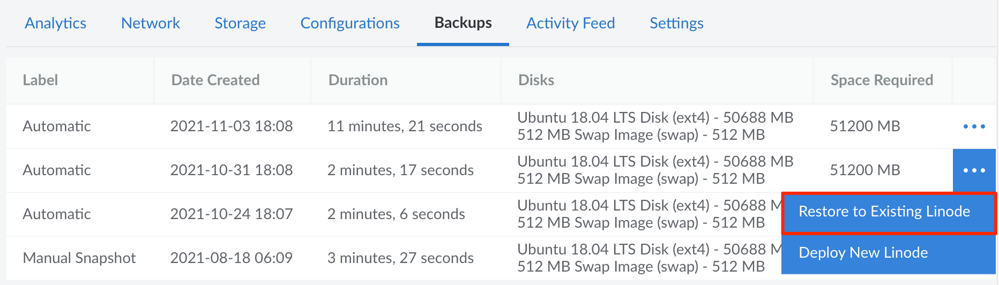
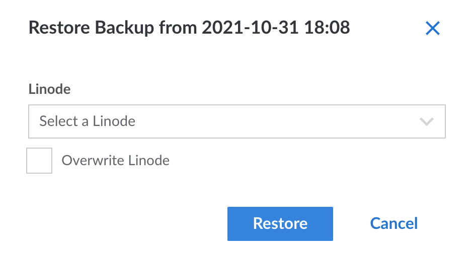

These steps cover how to restore a backup to an existing Linode Compute Instance, either by adding the restored disks alongside the existing disks or overwriting the existing disks. The target Compute Instance needs to be in the same data center that the backup is stored within, though you can [migrate](/docs/products/compute/compute-instances/guides/migrate-to-different-dc/) it to any data center you'd like after the restore is complete. The target also needs to have enough free storage space to accommodate the restored disks.

Restoring a backup creates a new [configuration profile](/docs/products/compute/compute-instances/guides/configuration-profiles/) and a new set of [disks](/docs/products/compute/compute-instances/guides/disks-and-storage/) on the existing Compute Instance. The size of the disk(s) created by the restore process will be equal to the amount of space allocated to the disk when the backup was created. In some cases, this means you may want to reallocate disk space once the restore is complete. For more information regarding this process, see our [Resizing a Disk](/docs/products/compute/compute-instances/guides/disks-and-storage/#resizing-a-disk) guide.


This process restores *all data* that was stored on the disk at the time the backup was taken. It does not restore just a single files or directory. If you just need a single file or group of files, complete the normal restore, log in to the server, and then copy those needed files to your local system or any other Linode Compute Instance.


1.  From the **Linodes** page, select the Compute Instance whose backups you intend to restore.

1.  Click the **Backups** tab.

1.  Find the backup you'd like to restore and observe the disk space that's required, which is visible in the **Space Required** column. You will need at least this amount of unallocated disk space on the target instance to complete the restore.

1.  Click the **more options ellipsis** dropdown menu next to the backup you would like to restore and then select **Restore to Existing Linode**.

    

1.  A menu will open with the Compute Instances that you can restore to. Select an instance and click **Restore**.

    

    You will be notified if you do not have enough space on your instance to restore your backup. Optionally, you can choose to overwrite the instance you are restoring to.

1.  If the amount of unallocated space available is greater than the size of the backup, you can proceed with restoring. If the amount of unallocated space is less than the size of the backup, you can stop the restoration workflow, [resize your existing disks](/docs/products/compute/compute-instances/guides/disks-and-storage/#resizing-a-disk) on the target instance to make room for it, and then come back to the restore page after the disk resize operation has finished.

    Depending on your available disk space, you may not be able to shrink your disks enough to fit the restored backup. As an alternative, you can [change your Compute Instance's plan](/docs/products/compute/compute-instances/guides/resize/) to a higher tier that offers more disk space.

1.  From the **Restore to Existing Linode** menu, click **Restore**. Your backup will begin restoring to your Compute Instance, and you can monitor its progress in the notifications area. Note that the time it takes to restore your backup will vary depending upon the restore size and the number of files being restored.

    
    If you are attempting to restore a disk to the same Compute Instance the backup was created from, the restoration process will not delete the original disk for you. Manually delete the original disk to make room for the backup, if desired.
    

1.  Once your backup has been restored, you can optionally power up or restart your Compute Instance using that backup. To do so, navigate to the target Compute Instance in the Cloud Manager, go to the **Configurations** tab, locate the configuration profile created during the restore process, and click the corresponding **Boot** button. For full instructions, review [Manage Configuration Profiles on a Compute Instance > Boot from a Configuration Profile](/docs/products/compute/compute-instances/guides/configuration-profiles/#boot-from-a-configuration-profile).

    
    When you restore a backup, the restored disk is assigned the same [UUID](https://en.wikipedia.org/wiki/Universally_unique_identifier) as the original disk.

    If you assign a backup-restored *root disk* in the original Configuration Profile's **Block Device Assignment** alongside your original root disk, mounting the disk will result in a UUID "collision". This is due to multiple disks sharing the same UUID.

    When booting a configuration with multiple disks sharing the same UUID, your instance *may fail to boot* since it will not be clear which disk is root.

    To learn more about block device assignments and viewing your disks' UUIDs, see [Configuration Profiles](/docs/products/compute/compute-instances/guides/configuration-profiles/#block-device-assignment).
    