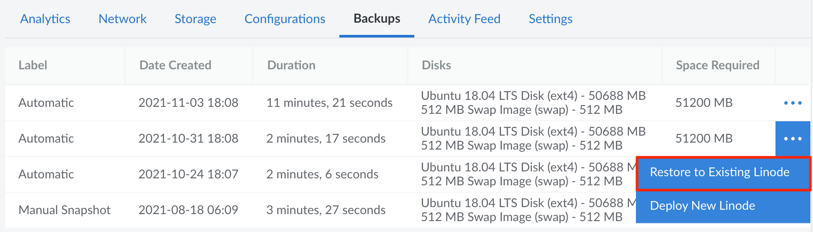
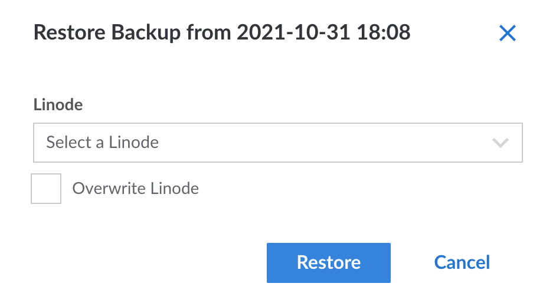

---
author:
  name: Linode
  email: docs@linode.com
title: Restore a Backup to an Existing Linode
description: "How to restore a backup to an existing Linode."
---

These steps cover how to restore a backup to an existing Linode Compute Instance, either by adding the restored disks alongside the existing disks or overwriting the existing disks. The target Compute Instance needs to the same data center that the backup is stored within, though you can [migrate](/docs/guides/how-to-initiate-a-cross-data-center-migration-for-your-linode/) it to any data center you'd like after the restore is complete. The target also needs to have enough free storage space to accommodate the restored disks.

Restoring a backup creates a new [configuration profile](/docs/guides/linode-configuration-profiles/) and a new set of [disks](/docs/guides/disks-and-storage/) on the existing Compute Instance. The size of the disk(s) created by the restore process will be equal to the amount of space allocated to the disk when the backup was created. In some cases, this means you may want to reallocate disk space once the restore is complete. For more information regarding this process, see our [Resizing a Disk](/docs/guides/disks-and-storage/#resizing-a-disk) guide.


This process restores all data that was stored on the disk at the time the backup was taken. It does not restore just a single files or directory. If you just need a single file or group of files, complete the normal restore, log in to the server, and then copy those needed files to your local system or any other Linode Compute Instance.


1.  From the **Linodes** page, select the Linode whose backups you intend to restore.

1.  Click the **Backups** tab.

1.  Find the backup you'd like to restore and observe the size of the backup you would like to restore, which is visible in the **Space Required** column. You will need at least this amount of unallocated disk space on the target Linode to complete the restore.

1.  Click the **more options ellipsis** dropdown menu next to the backup you would like to restore and then select **Restore to Existing Linode**.

    

1.  A menu will open with the Linodes that you can restore to. Select a Linode and click **Restore**.

    

    You will be notified if you do not have enough space on your Linode to restore your backup. Optionally, you can choose to overwrite the Linode you are restoring to.

1.  If the amount of unallocated space available is greater than the size of the backup, you can proceed with restoring. If the amount of unallocated space is less than the size of the backup, you can stop the restoration workflow, [resize your existing disks](/docs/guides/disks-and-storage/#resizing-a-disk) on the target Linode to make room for it, and then come back to the restore page after the disk resize operation has finished.

    
In some cases, you will not be able to shrink your disks enough to fit the restored backup. As an alternative, you can [change your Linode's plan](/docs/guides/resizing-a-linode/) to a higher tier that offers more disk space.


1.  From the **Restore to Existing Linode** menu, click **Restore**.

Your backup will begin restoring to your Linode, and you can monitor its progress in the notifications area. Note that the time it takes to restore your backup will vary depending upon the restore size and the number of files being restored.


If you are attempting to restore a disk to the same Linode the backup was created from, the restoration process will not delete the original disk for you. Manually delete the original disk to make room for the backup, if desired.
