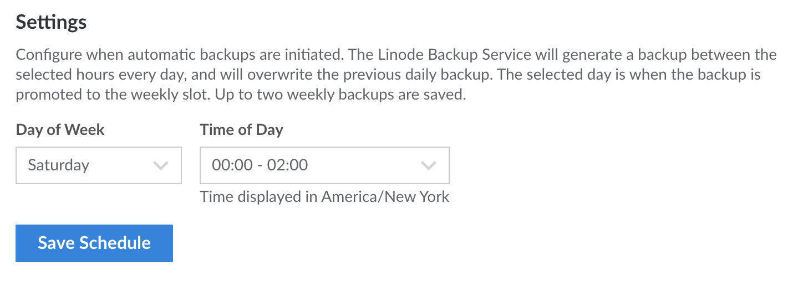

The Backup service will generate automatic backups according to the schedule that you specify.

1.  From the **Linodes** page, select the Linode.

1.  Click the **Backups** tab.

1.  Under **Settings**, select a time interval from the **Time of Day** dropdown menu. The Backup Service will prioritize *starting* the automated daily backup between these hours.

1.  Select a day from the **Day of Week** menu. On this day, the daily backup will also be saved to the weekly backup slot and the weekly backup will be promoted to the biweekly slot.

1.  Click **Save Schedule** to make any changes.

