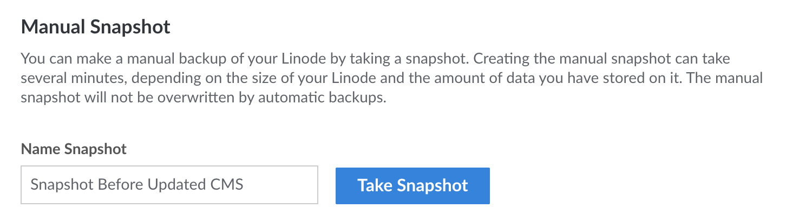

---
author:
  name: Linode
  email: docs@linode.com
title: Take a Manual Snapshot
description: "How to use the Backups Sevice to take a manual backup of a Linode Compute Instance."
---

As part of the Backups service, you can store a manual backup of your Compute Instance through the *manual snapshot* feature. This can be useful to save a restore point before a major system upgrade or prior to significant changes to software or configuration within your Compute Instance.


The manual snapshot feature is part of the paid Backups service and, as such, the Backups service must be enabled. See [Enable Backups](/docs/products/storage/backups/guides/enable/).



Only a *single* manual snapshot can be stored for a Compute Instance. Taking a new snapshot overwrites any previously saved manual snapshot.


1.  Log in to the [Cloud Manager](https://cloud.linode.com) and click the **Linodes** link in the left navigation menu.

1.  On the **Linodes** page, select the Linode Compute Instance from the list.

1.  Navigate to the **Backups** tab.

1.  Under **Manual Snapshot**, enter a label for this new snapshot and click **Take Snapshot**.

    

1.  A pop-up box is displayed confirming that you intend to take a new manual snapshot and that any previous snapshot will be overwritten. Click **Take Snapshot** to proceed.

Creating the manual snapshot can take several minutes, depending on the size of your Linode and the amount of data you have stored on it. Other Cloud Manager jobs for this Linode will not run until the snapshot job has been completed.
