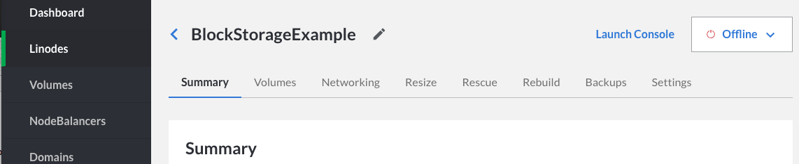
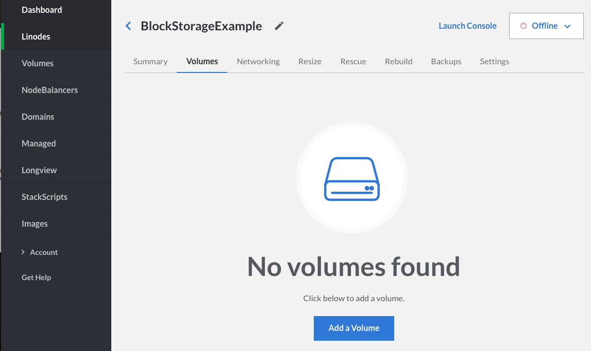
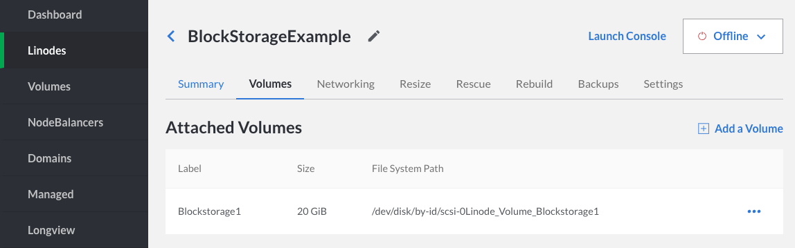

Follow these steps to create a new Block Storage Volume, attach it to your Linode, create a filesystem, and mount your Volume:

1.  Click on the **Linodes** link in the sidebar.

1.  Select the Linode to which you want to attach a Block Storage Volume. The detail page for the Linode will appear.

    

1.  Click on the **Volumes** tab, then click **Add a Volume**:

    

1.  Assign the Block Storage Volume a label and size. The label can be up to 32 characters long and consist only of ASCII characters `a-z; 0-9.-_`. The maximum Volume size is 10,000 GiB. When finished, click *Submit*:

    

    
There is currently a soft limit of 100 TB of Block Storage Volume per account.


1.  Once you add a Volume it will appear under Attached Volumes with the new Volume's label, size, and file system path.

    

1.  You'll need to create a filesystem in your new Volume. If your Linode is not already running, boot then SSH into your Linode and execute the following command, where `FILE_SYSTEM_PATH` is your Volume's file system path:

        mkfs.ext4 FILE_SYSTEM_PATH

    
If a new filesystem is created on a Block Storage Volume that is already using a filesystem, the above command will result in data loss. You can safely check for the filesystem of an unmounted volume with the following command:

    blkid FILE_SYSTEM_PATH

If you do not receive output, there is currently no filesystem on this volume.


1.  Once the Volume has a filesystem, you can create a mountpoint for it:

        mkdir /mnt/BlockStorage1

1.  You can then mount the new Volume:

        mount FILE_SYSTEM_PATH /mnt/BlockStorage1

1.  If you want to mount the new Volume automatically every time your Linode boots, you'll want to add the following line to your **/etc/fstab** file:

        FILE_SYSTEM_PATH /mnt/BlockStorage1 ext4 defaults 0 2

    
If you plan on detaching the volume regularly or moving it between other Linodes, you may want to consider adding the flags `noatime` and `nofail` to the **/etc/fstab** entry.

* `noatime` - This will save space and time by preventing writes made to the filesystem for data being read on the volume.
*  `nofail`  - If the volume is not attached, this will allow your server to boot/reboot normally without hanging at dependency failures if the volume is not attached.

Example:

    FILE_SYSTEM_PATH /mnt/BlockStorage1 ext4 defaults,noatime,nofail 0 2

    
