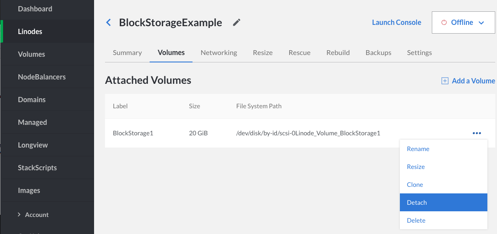
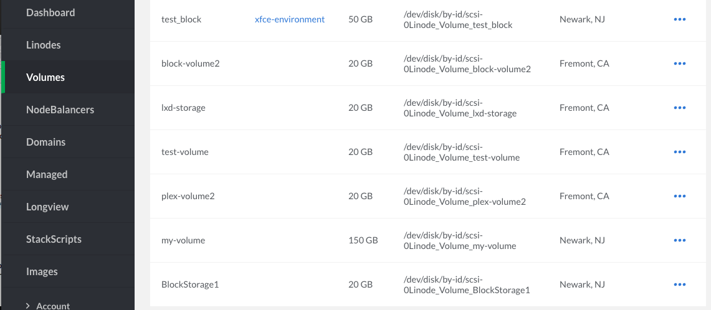

Follow these steps to safely detach a Block Storage Volume from a Linode. A Volume should be detached before it is reattached to a different Linode:

1.  Go to the detail page page of the Linode which the Volume is attached to. Shut down the Linode.

1.  When the Linode is powered off, click on the **Volumes** tab, click the **more options ellipsis** next to the Volume you would like to detach, then click **Detach**.

    

1.  A confirmation screen appears and explains that the Volume will be detached from the Linode. Click **Detach** to confirm:

    

    The Linode's dashboard does not show the Volume present anymore:

    

    The Volume still exists on your account and you can see it if you view the **Volumes** page:

    


If a volume is currently mounted, detaching it while the Linode is powered on could cause data loss or an unexpected reboot. You can unmount the volume for safe live-detaching using the `umount` command:

    umount /dev/disk/by-id/scsi-0Linode_Volume_BlockStorage1

To avoid additional issues with your Linode, remove the detached volume's line from your `/etc/fstab/` configuration:

`FILE_SYSTEM_PATH /mnt/BlockStorage1 ext4 defaults 0 2`


