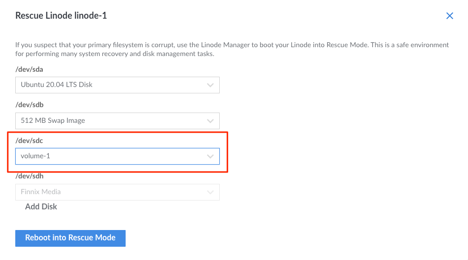
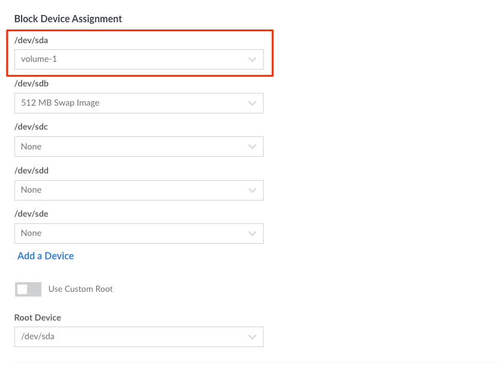

---
author:
  name: Linode
  email: docs@linode.com
description: "This guide provides you with instructions for booting a Compute Instance from a Block Storage Volume for use in an emergency or disaster recovery situation."
og_description: "This guide shows how to boot a Linode from a Block Storage Volume."
keywords: ["block storage","volume","media","storage","disk", "boot", "boot disk"]
license: '[CC BY-ND 4.0](https://creativecommons.org/licenses/by-nd/4.0)'
modified: 2022-08-24
modified_by:
  name: Linode
published: 2018-05-04
title: "Boot from a Block Storage Volume"
tags: ["linode platform"]
aliases: ['/platform/block-storage/boot-from-block-storage-volume/','/guides/boot-from-block-storage-volume/']
image: block-storage-title-graphic.png
---

Linode’s Block Storage service allows you to attach additional storage volumes to your Compute Instances. In addition to storing files and media, you can also use a Volume as a boot disk. This can provide a low-cost way to maintain an image that can be quickly attached to a Compute Instance and booted up when needed.

This guide outlines the steps needed to boot your Compute Instance from a Block Storage Volume. These steps include creating a new Volume, copying the primary disk to that new Volume, and configuring the instance to boot from that Volume. The process may be reversed in order to restore the primary disk from the Volume.

## Create the Volume

Create a Block Storage Volume and attach it to the desired target Compute Instance. Verify that the Volume is the same size as (or larger than) the primary disk and is in the same data center as the instance. Review the [View, Create, and Delete Volumes](/docs/products/storage/block-storage/guides/manage-volumes/) for instructions on creating a new Volume.

## Copy the Primary Disk onto the Volume

1.  Boot the Compute Instance into Rescue Mode and assign the Volume to `/dev/sdc` (shown below). The primary disk should remain assigned to `/dev/sda`. If your device assignments are different, you may need to adjust the commands or steps in this guide accordingly. Review the [Rescue and Rebuild guide](/docs/troubleshooting/rescue-and-rebuild/#booting-into-rescue-mode) for more information on booting into Rescue Mode.

    

1.  Connect to the Linode via [Lish](/docs/guides/using-the-lish-console/).

1.  Run `fdisk -l` to confirm the Compute Instance's primary disk and Block Storage Volume are available as `dev/sda` and `dev/sdc`, respectively.

1.  Run the following `pv` command to copy the contents of the primary disk to the Block Storage Volume. Respectively, the options `-pte` output a progress meter, the elapsed time, and the estimated time remaining.

        pv -pte < /dev/sda > /dev/sdc

## Set the Block Storage Volume as the Primary Disk and Reboot

1.  Power off the Compute Instance.

2.  Edit the Compute Instance's **Configuration Profile**. Under the **Block Device Assignments** section, assign the `/dev/sda` device to your Block Storage Volume (shown below). Confirm that the root device is set to `/dev/sda` (this is the default setting). If your Volume was previously assigned to any other device, such as `/dev/sdc`, set the device to `None`. Save these changes. Review the [Managing Configuration Profiles on a Linode](/docs/guides/linode-configuration-profiles/) guide for more information on editing configuration profiles.

    

3.  Power on the Compute Instance.

The Compute Instance should boot normally from the Block Storage Volume. Keep in mind that Block Storage may not be as fast as the instance's local storage and, as such, performance may be different.