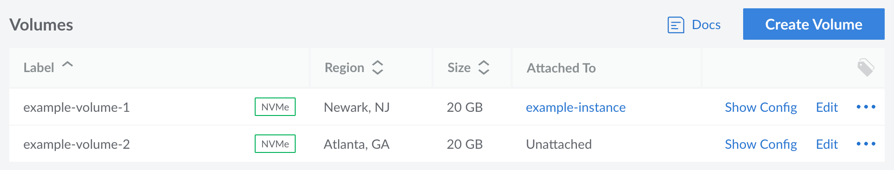
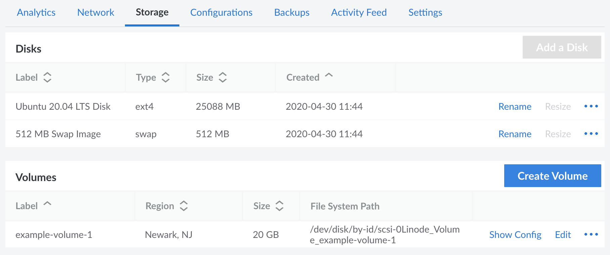
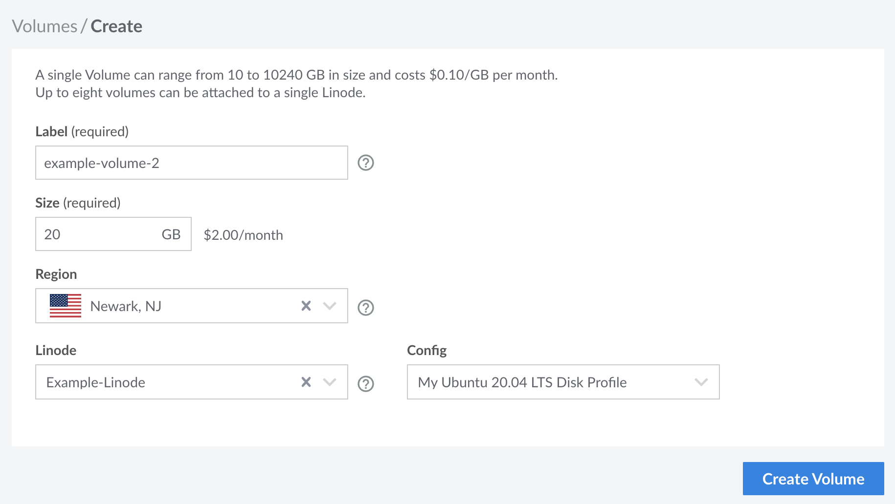

What is block storage? Block Storage is a scalable, high-speed, and fault tolerant network storage service used to add additional storage capacity to a Linode Compute Instance.

The Block Storage cloud service allows you to create Volumes, which can be attached to Compute Instances and used to easily store your data. This guide covers how to view, add, manage, and delete Block Storage Volumes.

## View Volumes

### View All Volumes

Log in to the [Cloud Manager](https://cloud.linode.com/volumes) and click the **Volumes** link in the sidebar. All Block Storage Volumes on your account are listed here, including their region, size, and their attachment status.

### View Block Storage Volumes Attached to a Specific Compute Instance

1.  Log in to the [Cloud Manager](https://cloud.linode.com/linodes) and click the **Linodes** link in the sidebar.

1.  Select the Compute Instance for which you'd like to view all attached Volumes. The detail page for that instance should appear.

1.  Navigate to the **Storage** tab and find the *Volumes* section, as shown below. All Volumes that are currently attached to this Compute Instance should appear in a list, along with the region, size, and the file system path.

## Add Volumes


If your Compute Instance was deployed prior to August 24th, 2021 and hasn't been rebooted since your data center was upgraded to NVMe Block Storage, you may need to reboot the instance for it to properly work with a Block Storage Volume.


1. Navigate to the **Volumes** page in the Cloud Manager. Alternatively, if you know which Compute Instance you wish to attach the new Volume to, navigate to the **Storage** tab for that instance. See [View Volumes](#view-volumes).

1. Click the **Create Volume** button to open the creation form. This form may have slightly different options, depending on the page you were on in the previous step. If creating a Volume directly from a Compute Instance's Storage tab, select the **Create and Attach Volume** option to create a new Volume.

    

1. Enter the **Label** and **Size** of the Volume.

    - **Label:** A string up to 32 characters long and consisting only of ASCII characters `a-z; 0-9.-_`.
    - **Size:** The desired size for the new Volume. See the [Limits and Considerations](/docs/products/storage/block-storage/#limits-and-considerations) section for the minimum and maximum size.

1. Select the **Region** and **Linode**. These fields only appear when creating a Volume from the main Volume page (not on a specific Compute Instance). If the **Linode** field is left blank, the Volume is created in a *detached* state, meaning it is not attached to any Compute Instance.

1. If a Compute Instance has been selected, select a Configuration Profile within the **Config** field to attach the Volume to the next available Block Device Assignment (such as `/dev/sdc`).

1.  Click **Create Volume** to create the new Block Storage Volume.

1.  A **Volume Configuration** panel appears, which contains the instructions needed to access the new Volume with your Compute Instance. These instructions include commands for creating the file system, mounting the Volume, and configuring your instance to automatically mount the Volume at boot. For help with these commands, see [Configuring and Mounting a Volume](/docs/products/storage/block-storage/guides/configure-volume/).

1.  Once created, the Volume is listed under the *Volumes* table.

## Delete Volume


Once a Block Storage Volume has been deleted, the data contained on that Volume will be permanently erased. This action cannot be reversed,  so it’s always best to verify or backup the data in the block storage volume beforehand.


1.  Log in to the [Cloud Manager](https://cloud.linode.com/linodes).

1.  If the Volume is attached to a Compute Instance, power off that instance and detach the Volume. To do so, follow the instructions within the [Detach the Volume](/docs/products/storage/block-storage/guides/attach-and-detach/#detach-a-volume) guide.

1.  Click on the **Volumes** link in the sidebar.

1.  Locate the desired Volume within the list, click the **more options ellipsis** dropdown menu, and select **Delete**.

1.  In the configuration dialog, click **Delete** once again.
