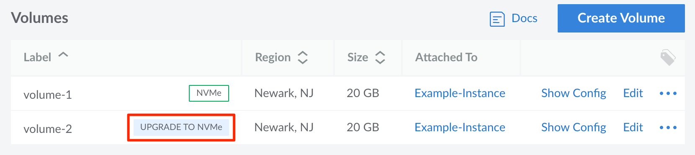
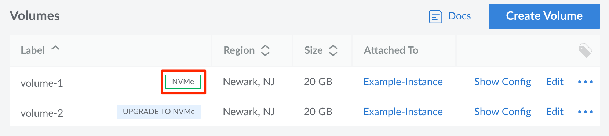

---
author:
  name: Linode
  email: docs@linode.com
title: "NVMe Block Storage Upgrade"
description: "Information about the new NVMe Block Storage product and how to upgrade a Volume."
---

## What is NVMe-backed Block Storage?

We’re rolling out an ultra-fast, better-performing, and more reliable NVMe-backed Block Storage service across all 11 of our global data centers. NVMe (nonvolatile memory express) is the hardware interface for next-generation SSDs (solid-state drives). The technology is a significant improvement over traditional spinning hard disk drives, with a 10-20x increase in throughput and up to 2000x improvement in IOPS. With NVMe-backed Block Storage, you can experience a significant performance upgrade for database storage and other tasks where high storage speeds and consistency are critical.

To learn more about Block Storage, visit the [Block Storage Overview](/docs/products/storage/block-storage/) page.

## Availability

**NVMe Block Storage** has already been deployed to most of our data centers, as indicated in the table below. NVMe Block Storage infrastructure upgrades will soon be deployed across the remaining data centers in our fleet.

| Data Center | NVMe Block Storage |
| -- | -- |
| **Atlanta (Georgia, USA)** | **Deployed** |
| **Dallas (Texas, USA)** | **Deployed** |
| **Frankfurt (Germany)** | **Deployed** |
| Fremont (California, USA) | *Coming in Q2 2022* |
| **London (United Kingdom)** | **Deployed** |
| **Mumbai (India)** | **Deployed** |
| **Newark (New Jersey, USA)** | **Deployed** |
| **Singapore** | **Deployed** |
| **Sydney (Australia)** | **Deployed** |
| **Tokyo (Japan)** | **Deployed** |
| **Toronto (Canada)** | **Deployed** |

Once NVMe Block Storage has been deployed in a data center, all *new* Volumes created after will use the new NVMe architecture.


Any of the above estimated launch dates are subject to change. To be emailed when Block Storage NVMe is available in a particular data center, [sign up for notifications](https://www.linode.com/products/block-storage/#nvme-block-storage).


## Upgrading a Volume to NVMe Block Storage

Existing Volumes can be upgraded to NVMe soon after NVMe Block Storage has been deployed within a data center. Once NVMe upgrades are available, our team will schedule a migration for each eligible Volume on your account. You will receive a notification detailing the Volumes scheduled to be upgraded along with their migration schedule. You can view your scheduled upgrades on the [Account > Maintenance](https://cloud.linode.com/account/maintenance/) page of the Cloud Manager under the *Volumes* section. You can also choose to immediately enter the upgrade queue *after* the migration has been scheduled by following the instructions below:

1.  Log in to the Cloud Manager and navigate to the [Volumes](https://cloud.linode.com/volumes) page.

1.  Click the **Upgrade to NVMe** button next to the Volume you wish to upgrade. If this button does not appear next to your desired *non-NVMe* Volume, the Volume is not yet eligible for an upgrade.

    

1.  A confirmation pop-up is displayed notifying you of the upgrade details. Click the **Enter Upgrade Queue** button to continue. The Volume will be upgraded shortly, though the length of time the upgrade process takes depends on the number of other Volumes that are also in the upgrade queue as well as the size of your Volume.


If the Volume is attached to a Linode Compute Instance during the upgrade process, the Compute Instance may be rebooted to complete the upgrade. If this occurs, it will return to its last known power state.


## Manually Upgrading a Volume to NVMe Block Storage

If a scheduled upgrade is available for your Volume, follow the steps above in the [Upgrading a Volume to NVMe Block Storage](#upgrading-a-volume-to-nvme-block-storage) section. Otherwise, if this automated upgrade is not yet available for your Volume, you can manually upgrade to NVMe by following the procedure below.

1.  Create a new Volume within the same data center as your existing Volume. Provided that NVMe Block Storage has already launched in your data center, all new Volumes use the new NVMe architecture. Make sure the new Volume is large enough to accommodate your data and that you attach it to the same Compute Instance and configuration profile. See [View, Create, and Delete Block Storage Volumes](/docs/products/storage/block-storage/guides/manage-volumes/).

1.  Log in to your Compute Instance over SSH. See [Connecting to a Remote Server Over SSH](/docs/guides/connect-to-server-over-ssh/) for assistance.

1.  Perform any configuration steps necessary to create a file system on the new Volume and mount it to your system. See [Configure and Mount a Block Storage Volume](/docs/products/storage/block-storage/guides/configure-volume/).

1.  Run the following command to copy your data, replacing `[path-to-original-volume]` with the file system path to your original Volume and `[path-to-nvme-volume]` with the path to the new Volume you just created. These paths are likely under the `/mnt/` directory.

        sudo rsync -rah --progress [path-to-original-volume]/* [path-to-nvme-volume]/

1.  After the transfer has completed, you can modify any applications using your original Volume to point to the mount directory of the new NVMe Volume. Then, follow the [Attach and Detach a Volume](/docs/products/storage/block-storage/guides/attach-and-detach/#detach-a-volume) guide to unmount and detach your original Volume.

    If you prefer not to modify any applications to use a new directory, you can rename your NVMe Volume to the use the same name as your original Volume (first renaming or deleting your original Volume). Then reboot your Compute Instance. Provided you original Volume was configured to automatically mount upon boot, the new Volume will be mounted instead.

1.  Once your verify that your new Volume is working as expected, you can delete the original Volume by following the [View, Create, and Delete Block Storage Volumes](/docs/products/storage/block-storage/guides/manage-volumes/) guide. If you decide not to delete it, you will be billed for both Volumes going forward.

## Frequently Asked Questions

### What are the performance benefits of NVMe Block Storage?

The table below displays the performance you can expect from NVMe-backed Block Storage. Performance is automatically increased in 60 second bursts for even faster real-world speeds.

| | IOPS | Throughput |
| -- | -- | -- |
| **Standard** | 8,000 | 350 MB/s |
| **Burst** | 12,000 | 525 MB/s |

For detailed benchmarks along with comparisons to other Cloud providers, review the [Cloud Block Storage Benchmark Report](https://www.linode.com/content/cloud-block-storage-benchmarks/) prepared by Cloud Spectator.

### How much extra will NVMe-backed Block Storage cost?

We were able to provide a tremendous performance boost with NVMe Block Storage at **no additional charge.** Block Storage will remain priced at $0.10/GB per month.

### How can I determine if my Volume uses NVMe storage?

All Volumes using the newer NVMe-backed Block Storage will display an *NVMe* label next to the Volume on the [Volumes](https://cloud.linode.com/volumes) page of the Cloud Manager. This should look similar to the following:

### When will my Volume receive an upgrade to NVMe?

Soon after NVMe-backed Block Storage becomes available in your Volume's data center, you will be notified how to upgrade your existing Volumes. We do not yet have a definitive timeline.