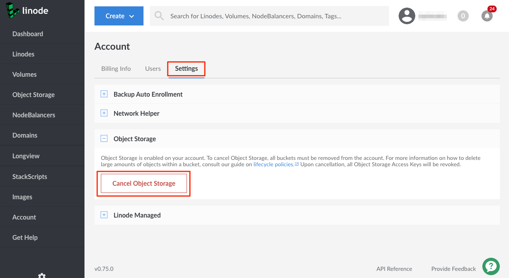

Follow these steps to cancel the Object Storage service from the Cloud Manager:

1.  To cancel Object Storage, you must first delete all the buckets. To delete a bucket, the bucket must be empty. For buckets that contain large amounts of objects, consider employing [lifecycle policies](/docs/platform/object-storage/lifecycle-policies/) to delete the objects.

    
If you have removed all of the buckets, but you have not also cancelled the Object Storage service, the account is billed at a flat rate of $5 per month (prorated) for the service. Make sure that you complete each step of this section to fully cancel the Object Storage service and to stop billing for it. For more information, see our [Pricing and Limitations](/docs/platform/object-storage/pricing-and-limitations/) guide.


1.  After you've deleted all the buckets, navigate to the **Account** page in the left-hand navigation. Click the *Settings* tab. In the menu, you should see a setting for Object Storage:

    

1.  Click **Cancel Object Storage**. A prompt appears asking you to confirm the cancellation. If you still have active buckets, you are prompted to delete them.
