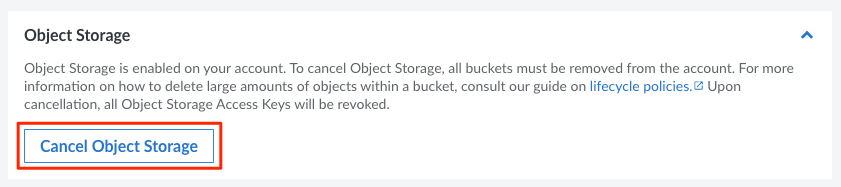

The following steps outline how to cancel the Object Storage service from the Cloud Manager.


Cancelling Object Storage deletes all objects and buckets from your account. Consider downloading any important files before continuing.


1.  Log in to the [Cloud Manager](https://cloud.linode.com/), select **Account** from the left menu, and navigate to the **Settings** tab.

1.  Find the section labeled *Object Storage* and click the **Cancel Object Storage** button.

    

1. A prompt appears asking you to confirm the cancellation. Click **Confirm cancellation** to proceed. Any remaining buckets and objects on your account are deleted and you will no longer be billed for Object Storage.