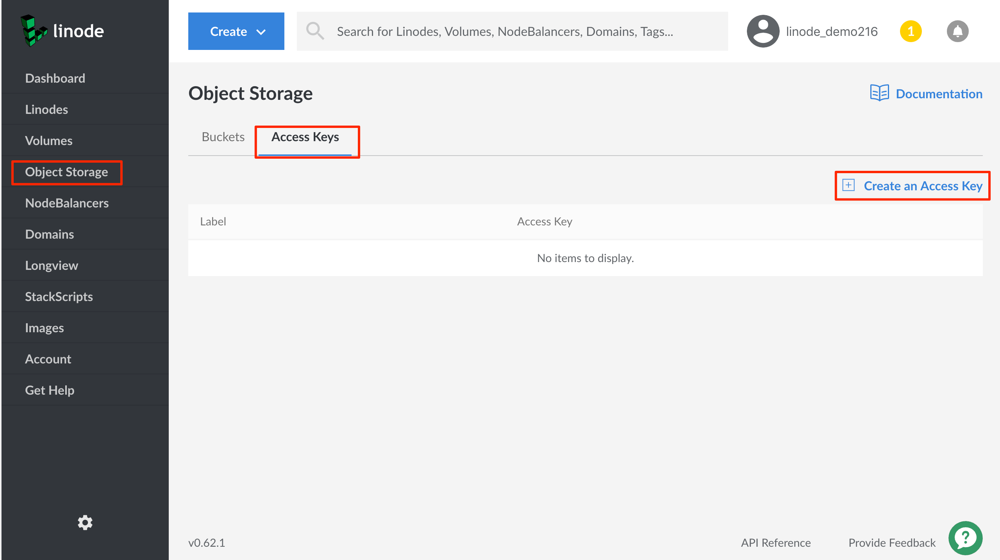
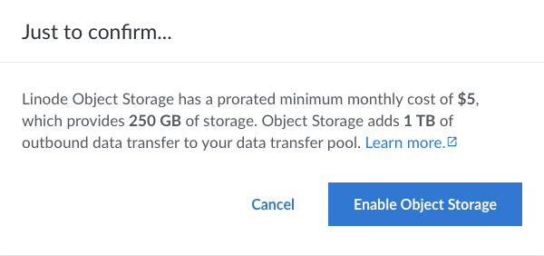

You need a pair of keys to use Object Storage: an access key and a secret key. You can generate them from the Cloud Manager by following these steps:

1.  Log into the [Linode Cloud Manager](https://cloud.linode.com).

1.  Click the **Object Storage** link in the sidebar, click the **Access Keys** tab, and then click the **Create an Access Key** link.

    

1.  If this is your first bucket and you have not enabled Object Storage previously, a prompt appears asking you to confirm that you'd like to enable Object Storage. Click **Enable Object Storage**.

    

1.  The **Create an Access Key** menu appears.

    

1.  Enter a label for the key pair.

  - This label is how you reference the key pair in the Linode Cloud Manager.

  - You can also toggle the **Limited Access** switch on this panel. This allows you to limit certain permissions on a per bucket level for this access key.

    

    
Regardless of access, all keys can create new buckets and list all buckets. However, after creating a bucket, depending on what you select here, a limited access key may not be able to access those buckets, add items, remove items, and other actions.


1.  When you have entered the Label, and optionally selected the desired permissions, click the **Submit** button.

1.  A window appears displaying the Access Key and the Secret Key. Write these down somewhere secure. The access key is visible in the Linode Cloud Manager, but **you can not retrieve the secret key again after you close the window!**

    

    You now have the credentials needed to connect to Linode Object Storage.

1.  Check the permissions you gave this key by clicking on the **more options elipsis** link to the right of the key in the Access Keys list. Then, select **View Permissions** from the menu.

    

    An access key with limited permissions displays all the buckets and their selected permissions.

    

    An access key that has full permissions displays a statement about unlimited access.

    