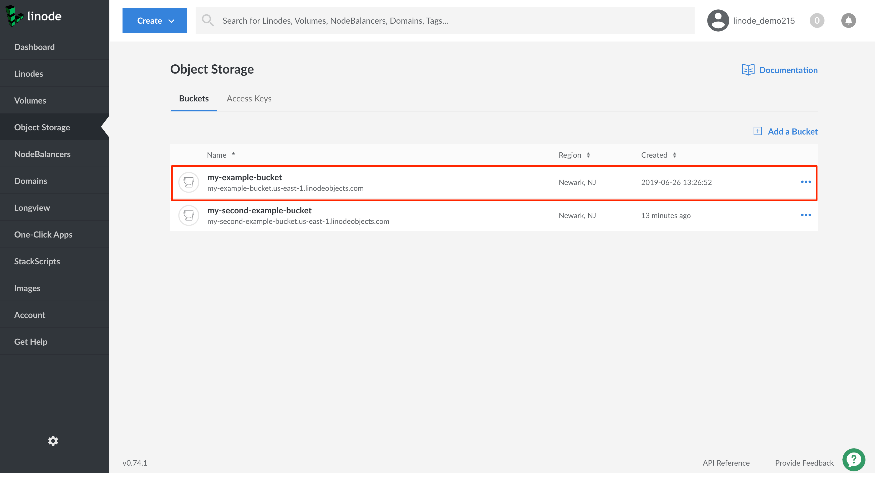
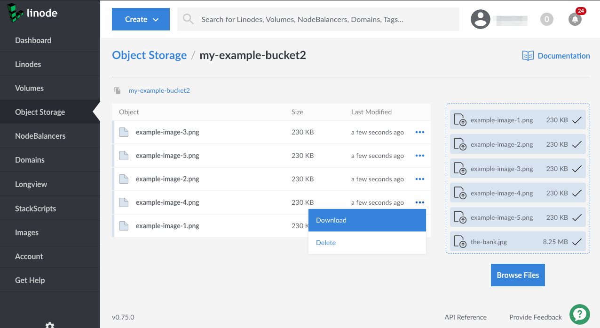

Follow these steps to view your objects from the Cloud Manager:

1.  If you have not already, log into the [Linode Cloud Manager](https://cloud.linode.com).

1.  Click the **Object Storage** link in the sidebar. A list of all the buckets appears. Click the bucket whose objects you'd like to view.

    

1. The bucket's **Objects Listing Page** appears, which displays all the objects in the bucket.

    

1. Click the ellipsis menu corresponding to the object you'd like to view. Then, select **Download**.

    

1. The object is downloaded to the local computer.
