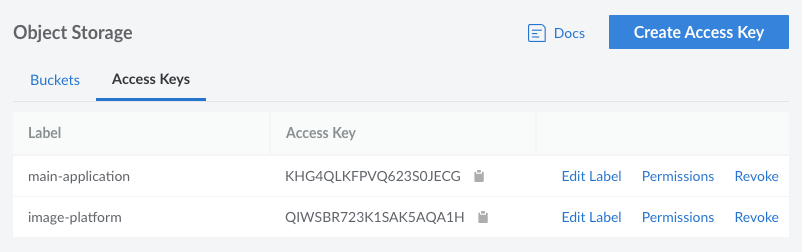
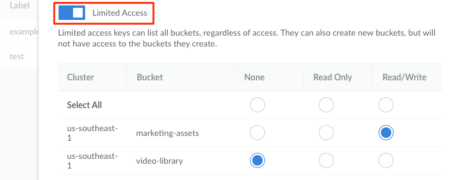
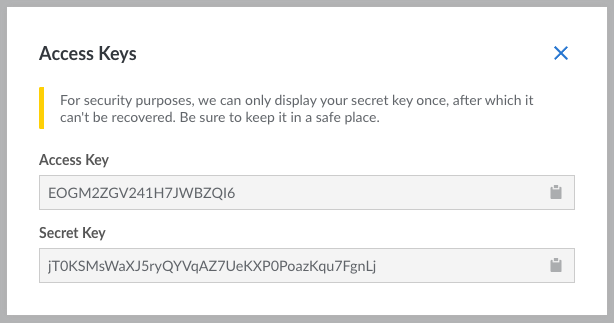
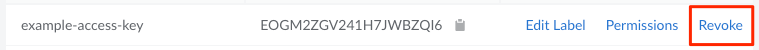

To start integrating Object Storage with your own applications, you need to create an *access key*. The access key provides access to buckets (and objects stored within those buckets). You can create many access keys, allowing you to create a unique one for each application or user. When an application or user no longer requires access, you can revoke that access key without affecting any other application.

When an access key is generated, a corresponding *secret key* is also created. This secret key is used in tandem with the access key to authenticate connections. The secret key should not be shared.

## View Access Keys

1.  Log in to the [Cloud Manager](https://cloud.linode.com).

1.  Select the **Object Storage** link in the sidebar and navigate to the **Access Keys** tab.

This page displays a list of all access keys added to your Object Storage account. From here, you can create a new access key, edit the labels on the existing keys, view the permissions, or revoke access (which deletes the access key).

## Create an Access Key

To use Object Storage with any compatible client or command-line tool, you'll need to generate an Access Key. This can be done directly in the Cloud Manager.

1.  Navigate to the **Access Keys** page in the Cloud Manager (see [View Access Keys](#view-access-keys)).

1.  Click the **Create Access Key** button, which displays the **Create Access Key** panel.

1.  Enter a label for the access key. This label is how you reference the access key in the Cloud Manager and any S3 compatible client.

1.  Toggle the **Limited Access** switch if you wish to only provide access to certain buckets. This allows you to limit the permissions for the new access key on a per-bucket level. See [Access Key Permissions](#permissions) for more details.

    

1.  Click the **Submit** button to create the access key. A dialog box appears that displays the new access key and its secret key. While the access key is always visible within the Cloud Manager, its corresponding secrete key is only visible once and cannot be retrieved again after this window is closed. Store this secret key somewhere secure, such as a password manager.

    

You now have the credentials needed to connect to Object Storage.

## Revoke Access Key

Revoking an access key removes it from your account and no longer provides access to applications that may have used it. You may wish to do this when decommissioning an application, ending a project with a third party developer, or any other situation where an access key is no longer needed.

1.  Navigate to the **Access Keys** page in the Cloud Manager (see [View Access Keys](#view-access-keys)).

1.  Locate the access key you wish to remove and click the corresponding **Revoke** button.

    

1. A confirmation dialog appears. Click the **Revoke** button to immediately revoke the access key.

## Permissions

By default, an Access Key is unrestricted and has full access to all Buckets on an account. When creating an Access Key, you can enable **Limited Access** and set more granular permissions for each Bucket. These permissions include **None**, **Read**, and **Read/Write**:


Regardless of permissions, all access keys can create new buckets and list all buckets. However, after creating a bucket, depending on what you select here, a limited access key may not be able to access those buckets, add items, remove items, and other actions.


- **None**: Restricts all access to the specified Bucket. This Access Key will still be able to view the Bucket in the list of all Buckets, but will otherwise be unable to access any objects stored within it.

- **Read** *(read_only)*: Access keys with **Read** permissions are able to list and retrieve most information about the specified Bucket and objects stored in that Bucket. Technically, **read** permissions provide access to the following s3 actions (which are used by all s3-compatible clients and tools):

    > *GetBucketAcl, GetBucketCORS, GetBucketLocation, GetBucketLogging, GetBucketNotification, GetBucketPolicy, GetBucketTagging, GetBucketVersioning, GetBucketWebsite, GetLifecycleConfiguration, GetObjectAcl, GetObject, GetObjectTorrent, GetReplicationConfiguration, GetObjectVersionAcl, GetObjectVersion, GetObjectVersionTorrent, ListBucketMultipartUploads, ListBucket, ListBucketVersions, ListMultipartUploadParts*

- **Read/Write** *(read_write)*: Access keys with **Read/Write** permissions can list, retrieve, add, delete, and modify most information and objects stored within the specified Bucket. Technically, **read/write** permissions provide access to all of the same s3 actions as **read** permissions, as well as the following:

    > *AbortMultipartUpload, DeleteBucketWebsite, DeleteObject, DeleteObjectVersion, DeleteReplicationConfiguration, PutBucketCORS, PutBucketLogging, PutBucketNotification, PutBucketTagging, PutBucketVersioning, PutBucketWebsite, PutLifecycleConfiguration, PutObject, PutObjectAcl, PutObjectVersionAcl, PutReplicationConfiguration, RestoreObject*

A full list of s3 actions is available on [Amazon's S3 API Reference](https://docs.aws.amazon.com/AmazonS3/latest/API/API_Operations_Amazon_Simple_Storage_Service.html) documentation.
