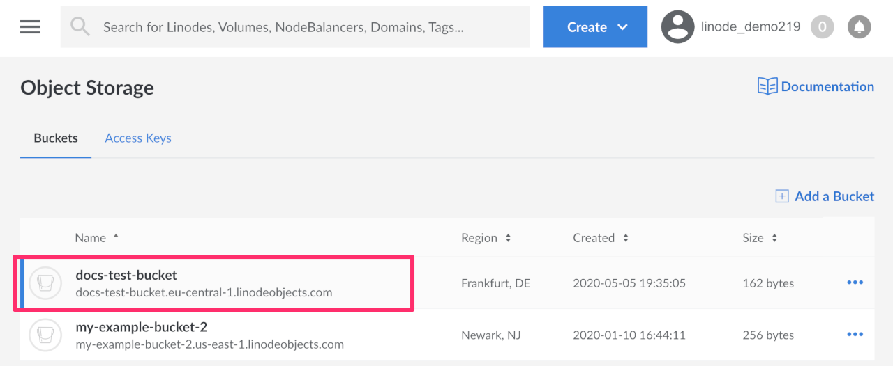
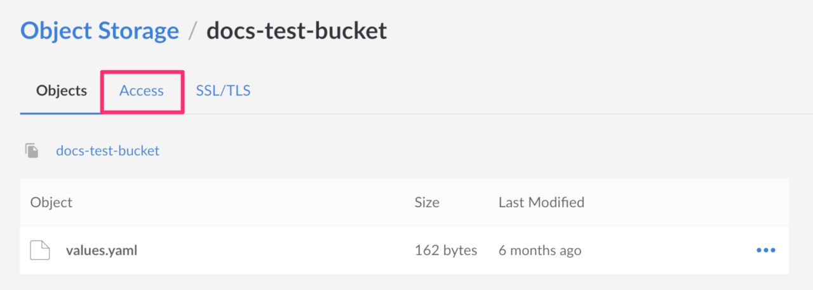
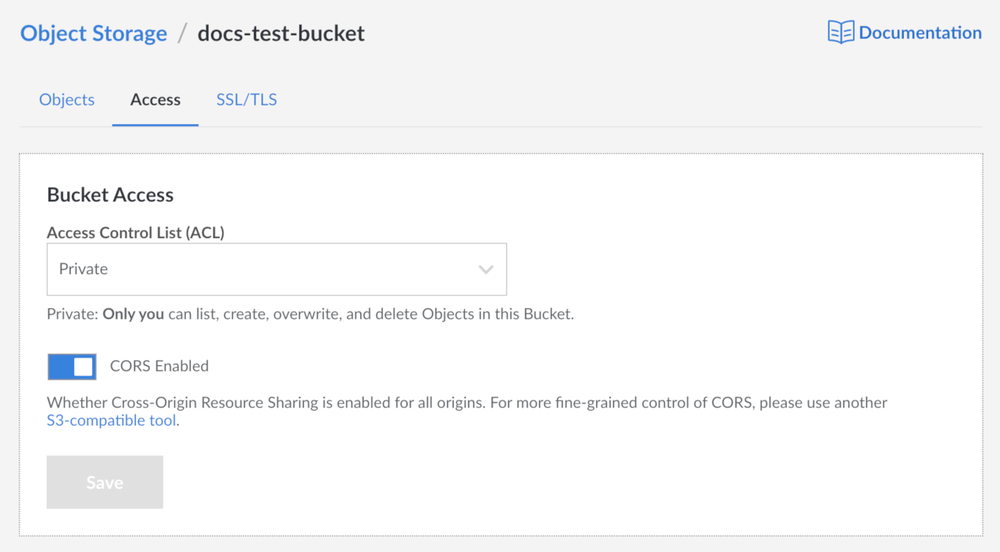
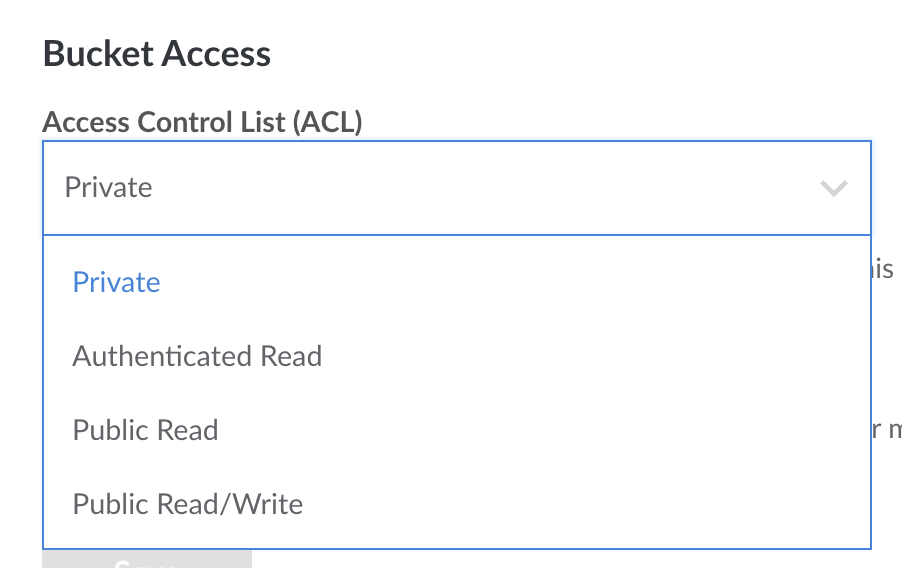
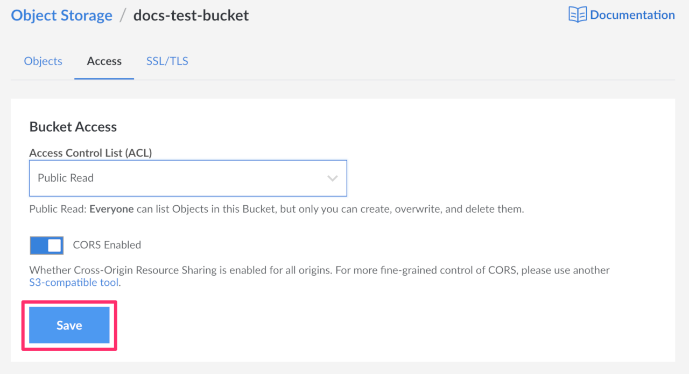
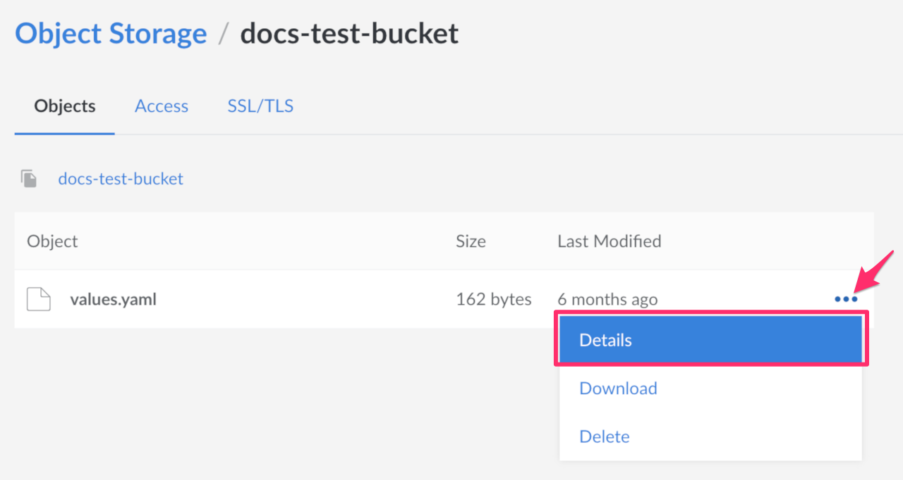
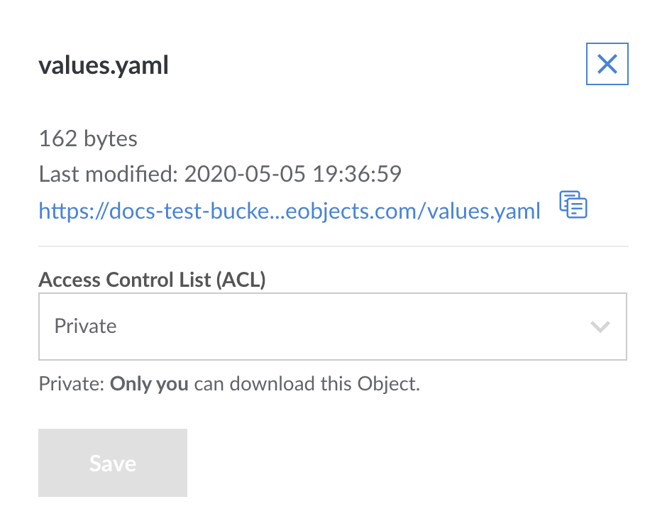
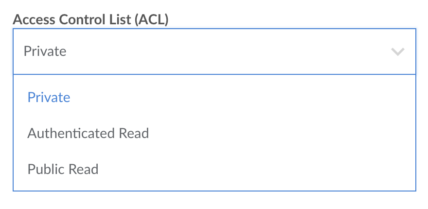
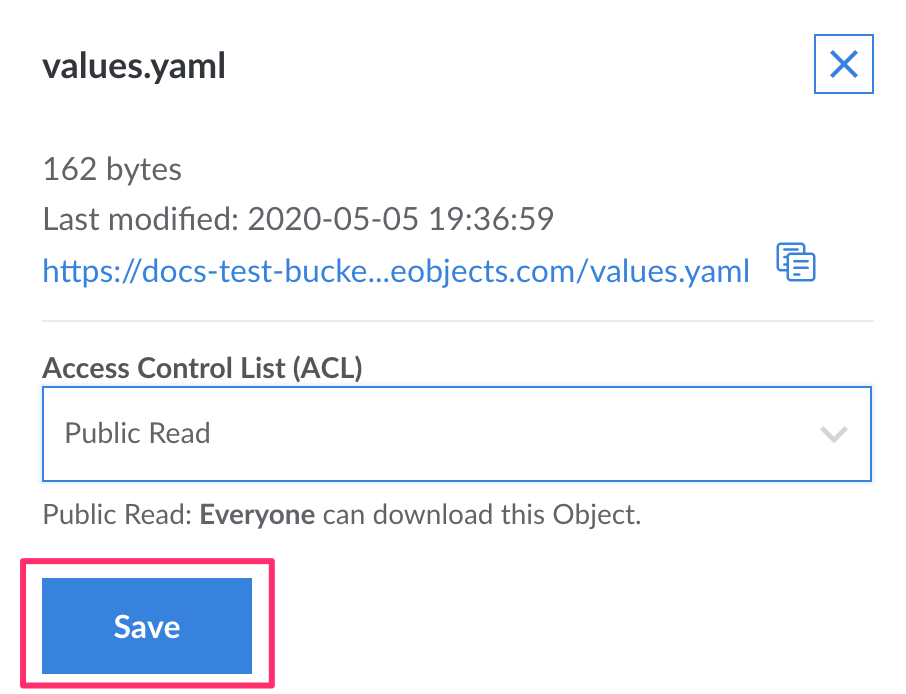
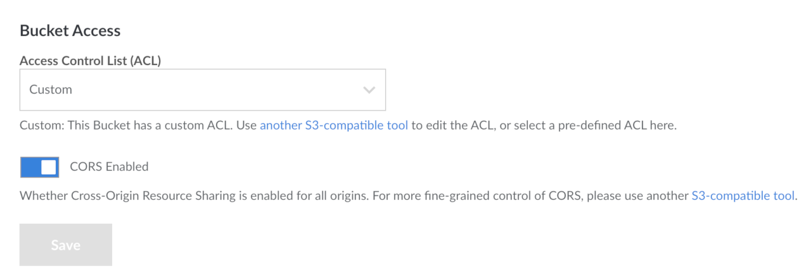

Access Control Lists (ACLs) are a method of defining access to Object Storage resources. You can apply ACLs to both buckets and objects, giving users access and controlling their permission level. There are two generalized modes of access: setting buckets and/or objects to be private or public. A few other more granular settings are also available; the [Cloud Manager](#granular-permissions-for-cloud-manager) and [s3cmd](#granular-permissions-for-s3cmd) sections provide information on these respective settings.

## ACLs in the Cloud Manager

### Granular Permissions for Cloud Manager

| Level | Permission | Description |
| ----- | ---------- | ----------- |
| Bucket | Private | Only you can list, create, overwrite, and delete Objects in this Bucket. *Default* |
| Bucket | Authenticated Read | All authenticated Object Storage users can list Objects in this Bucket, but only you can create, overwrite, and delete them. |
| Bucket | Public Read | Everyone can list Objects in this Bucket, but only you can create, overwrite, and delete them. |
| Bucket | Public Read/Write | Everyone can list, create, overwrite, and delete Objects in this Bucket. *This is not recommended.* |
| Object | Private | Only you can download this Object. *Default* |
| Object | Authenticated Read | All authenticated Object Storage users can download this Object. |
| Object | Public Read | Everyone can download this Object. |

### Bucket Level ACLs in Cloud Manager


Existing buckets and any new bucket created in the Cloud Manager have a default ACL permission setting of Private.


1.  If you have not already, log into the [Linode Cloud Manager](https://cloud.linode.com).

1.  Click the **Object Storage** link in the sidebar, and then click on the bucket you wish to edit the ACLs for.

    

1.  The Object Storage Bucket detail page appears. Click the **Access** tab.

    

1.  The Object Storage Bucket Access Page appears.

    

1.  On this page you can select the ACL for this bucket as well as enable CORS.

    
    CORS is enabled by default on all existing buckets and on all new buckets.
    

1.  Select the ACL for this bucket from the dropdown menu.

    

1.  Click the **Save** button to save these settings to the bucket.

    

### Object Level ACLs in Cloud Manager


Existing objects and any new objects created in the Cloud Manager have a default ACL permission setting of Private.


1.  If you have not already, log into the [Linode Cloud Manager](https://cloud.linode.com).

1.  Click the **Object Storage** link in the sidebar, and then click on the bucket that holds the objects that you wish to edit the ACLs for.

    

1.  The Object Storage Bucket detail page appears and displays all the objects in your bucket.

1.  Next to the object you wish to edit the ACL settings for, click the ***more options ellipsis*** and select **Details** from the drop down menu that appears.

    

1.  The Object ACL panel opens.

    

1.  Select the ACL you wish to set for this object from the dropdown menu.

    

1.  Click the **Save** button. The panel closes and the ACL is applied to the object.

    

## ACLs with s3cmd

With s3cmd, you can set a bucket to be public with the `setacl` command and the `--acl-public` flag:

    s3cmd setacl s3://acl-example --acl-public

This causes the bucket and its contents to be downloadable over the public Internet.

To set an object or bucket to private, you can use the `setacl` command and the `--acl-private` flag:

    s3cmd setacl s3://acl-example --acl-private

This prevents users from accessing the bucket's contents over the public Internet.

### Granular Permissions for s3cmd

The more granular permissions are:

|Permission|Description|
|-----|-----------|
|**read**| Users with can list objects within a bucket|
|**write**| Users can upload objects to a bucket and delete objects from a bucket.|
|**read_acp**| Users can read the ACL currently applied to a bucket.|
|**write_acp**| Users can change the ACL applied to the bucket.|
|**full_control**| Users have read and write access over both objects and ACLs.|

**Setting a permission:** To apply granular permissions for a specific user with s3cmd, use the following `setacl` command with the `--acl-grant` flag:

    s3cmd setacl s3://acl-example --acl-grant=PERMISSION:CANONICAL_ID

Substitute `acl-example` with the name of the bucket (and the object, if necessary), `PERMISSION` with a permission from the above table, and `CANONICAL_ID` with the canonical ID of the user to which you would like to grant permissions. See [Find the Canonical User ID for an Account](/docs/products/storage/object-storage/guides/find-canonical-id/) for details on finding the canonical ID.

**Revoking a permission:** To revoke a specific permission, you can use the `setacl` command with the `acl-revoke` flag:

    s3cmd setacl s3://acl-example --acl-revoke=PERMISSION:CANONICAL_ID

Substitute the bucket name (and optional object), `PERMISSION`, and `CANONICAL_ID` with your relevant values.

**View current ACLs:** To view the current ACLs applied to a bucket or object, use the `info` command, replacing `acl-example` with the name of your bucket (and object, if necessary):

    s3cmd info s3://acl-example

You should see output like the following:

```output
s3://acl-bucket-example/ (bucket):
   Location:  default
   Payer:     BucketOwner
   Expiration Rule: none
   Policy:    none
   CORS:      b'&lt;CORSConfiguration xmlns="http://s3.amazonaws.com/doc/2006-03-01/"&gt;&lt;CORSRule&gt;&lt;AllowedMethod&gt;GET&lt;/AllowedMethod&gt;&lt;AllowedMethod&gt;PUT&lt;/AllowedMethod&gt;&lt;AllowedMethod&gt;DELETE&lt;/AllowedMethod&gt;&lt;AllowedMethod&gt;HEAD&lt;/AllowedMethod&gt;&lt;AllowedMethod&gt;POST&lt;/AllowedMethod&gt;&lt;AllowedOrigin&gt;*&lt;/AllowedOrigin&gt;&lt;AllowedHeader&gt;*&lt;/AllowedHeader&gt;&lt;/CORSRule&gt;&lt;/CORSConfiguration&gt;'
   ACL:       *anon*: READ
   ACL:       a0000000-000a-0000-0000-00d0ff0f0000: FULL_CONTROL
   URL:       http://us-east-1.linodeobjects.com/acl-example/
```


The owner of the bucket always has the `full_control` permission.



If you set an ACL that does not map to an ACL in the Cloud Manager, the Cloud Manager displays this as `Custom`.


