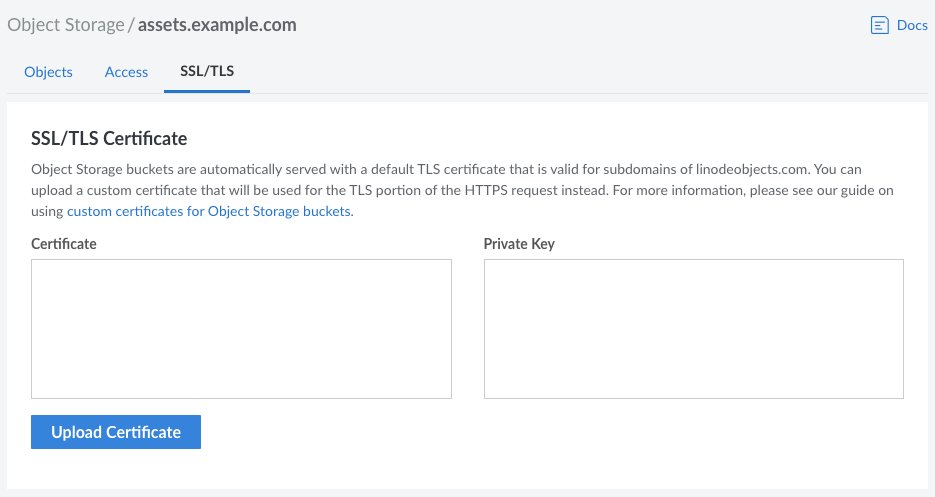

---
author:
  name: Linode
  email: docs@linode.com
description: "Learn how to upload a custom SSL/TLS certificate to enable SSL on a bucket on Linode Object Storage."
keywords: ['object','storage','object storage','s3','bucket']
tags: ["linode platform","cloud manager"]
license: '[CC BY-ND 4.0](https://creativecommons.org/licenses/by-nd/4.0)'
published: 2022-02-07
modified: 2022-02-07
modified_by:
  name: Linode
title: "Configure a Custom Domain (with a TLS/SSL Certificate)"
contributor:
  name: Linode
aliases: ['/platform/object-storage/enable-ssl-for-object-storage/','/guides/enable-ssl-for-object-storage/']
---

Linode's Object Storage service supports both shared and custom domain names. By default, files can be accessed through secured (HTTPS) URLs within the shared domain *\*.linodeobjects.com*. If you prefer, you can use a custom domain, such as a subdomain of *\*.example.com*. This guide walks you through the configuration of a custom domain and adding a TLS certificate to secure that custom domain. When configuring Linode services, this guide uses the Cloud Manager, though the [Linode CLI](/docs/products/tools/cli/get-started/) and the [Linode API](/docs/api/object-storage/) can be used instead.

## Before you Begin

- **Obtain a domain name:** Before starting this guide, consider what domain name you'd like to use with your Object Storage bucket. It should be a fully qualified domain name (FQDN), such as *assets.example.com* or any subdomain of *\*.your-domain.tld*. If you do not already own the domain, purchase it from a trusted registrar.

## Create a Bucket

If you have not already done so, [create a bucket](/docs/products/storage/object-storage/guides/manage-buckets/). Since the intention is to use this bucket with a custom domain, the bucket must be labeled as your fully qualified domain name, such as `assets.example.com`. If your files already exist in a bucket that doesn't have this label, create a new bucket with this label and copy your files into it.

## Configure DNS

To connect your custom domain, you must create a CNAME DNS record within the name server for the domain you intend to use. This can be done through your DNS provider, such as one operated by your domain registrar or a service like Linode's Domain Manager. The CNAME record should be created using the following values:

- **Hostname/Name:** This is the custom domain you wish to use. Each DNS provider may require slightly different formatting. In many cases, enter just the *subdomain* value. For example, if you plan to use *assets.example.com*, enter `assets`. Some DNS providers support CNAME flattening, which allows you to enter `@` to simply use *example.com* with no subdomain.
- **Alias To/Target:** This is the full URL on the shared domain (excluding the `https://` part of the URL) for your object storage bucket. See [Access Buckets and Files through URLs](/docs/products/storage/object-storage/guides/urls/#bucket-url) for details on obtaining the bucket's URL. The URL can either be for the default file host functionality of Object Storage or the URL used to host a static website.

    - File URL: `[bucket-label].[cluster-id].linodeobjects.com`
    - Website URL: `[bucket-label].website-[cluster-id].linodeobjects.com`

For more information on DNS records and CNAME records, see our [Introduction to DNS Records](/docs/guides/dns-records-an-introduction/#cname) guide.

## Obtain a TLS/SSL Certificate

Once your DNS has been configured, create (or purchase) a TLS/SSL certificate through a trusted certificate authority. For this guide, the free [certbot](https://certbot.eff.org/) tool will be used, which creates free certificates through the Let's Encrypt CA. You can skip this section if you have already obtained a certificate.

1.  Install certbot on whichever system you wish to use to obtain the certificate. You can use your local machine, a Compute Instance on Linode's platform, or any other compatible virtual machine. Here are links to the instructions on certbot's website:

    - [macOS](https://certbot.eff.org/instructions?ws=other&os=osx)
    - [Windows](https://certbot.eff.org/instructions?ws=other&os=windows)
    - Any compatible Linux system listed on the [certbot instructions](https://certbot.eff.org/instructions) page within the **System** dropdown.

1.  Run the following certbot command to generate a certificate manually:

        sudo certbot certonly --manual

1.  When prompted, enter the custom domain that you intend to use and have already configured (such as `assets.example.com`)

1.  You are then requested to create a specific file with specific contents and make it accessible on your custom domain within a certain directory. If you've followed the previous steps in this guide, your custom domain now points to your bucket. This means you can create this file directly within your Object Storage account. To do this, you can use Cyberduck, the Linode CLI, s3cmd, s4cmd, or any other tool or application that integrates with Object Storage and as the ability to create folders and files.

1.  Once the file has been created and is accessible, press enter within the certbot command line to continue. If certbot is able to successfully access that file, it generates the certificate along with its private key and saves them to your system:

    
Successfully received certificate.
Certificate is saved at: /etc/letsencrypt/live/assets.example.com/fullchain.pem
Key is saved at:         /etc/letsencrypt/live/assets.example.com/privkey.pem
This certificate expires on 2022-05-11.
These files will be updated when the certificate renews.


You can view the saved certificate using whichever plaintext file viewer or editor you have on your system. For instance, on a Linux system you can use `sudo cat [file-location]` to output the file or `sudo nano [file-location]` to open the file.

## Upload Your SSL Certificate

To upload your new SSL certificate to an Object Storage Bucket:

1.  Log in to the [Cloud Manager](https://cloud.linode.com/) and select **Object Storage** from the left menu.

1.  Open the bucket you wish to use and navigate to the **SSL/TLS** tab. This opens the *SSL/TLS Certificate* page.

    

1. In the **Certificate** field, enter the contents of the certificate file you just created or obtained.

1. In the **Private Key** field, enter the contents of the corresponding private key file.

1. Click the **Upload Certificate** button to submit the certificate and attach it to your bucket.

## Upload Your Files or Static Website

Before you can test your custom domain, you need to have files hosted on your Object Storage bucket. Upload your files or your static website. After they are uploaded, set the permissions so the files can be read by the public. If the permissions are not set, you will not be able to view the files through any URL (either shared or custom).

If you currently don't have any files, you can create a test file called `index.html`, edit it to include the following text, upload it to your bucket's main directory, and make sure the permissions are set so it can be read by the public.

    <html>
        <body>
            <h1>Hello world...</h1>
        </body>
    </html>

## Access Your Secured Custom Domain

You can now access your files or static website using your secured custom domain. Open a web browser and enter your custom domain. If you are using Object Storage just to store and access files, include the file path of the file you wish to access. If you are using Object Storage to host a website, you do not need to enter any additional file path assuming you have uploaded an `index.html` file (or have set a different file as the default).