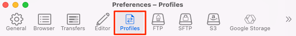
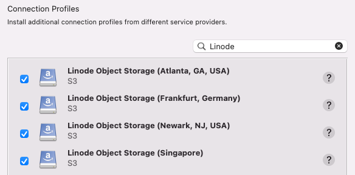
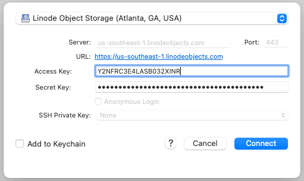
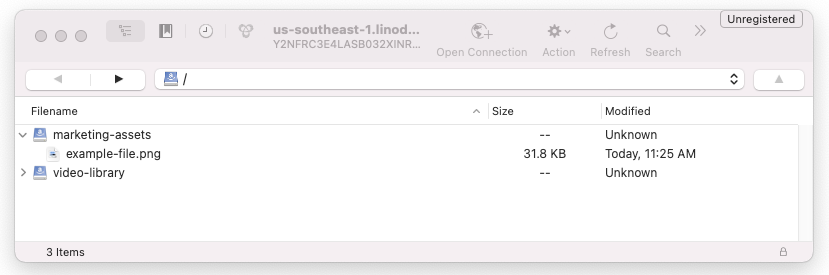
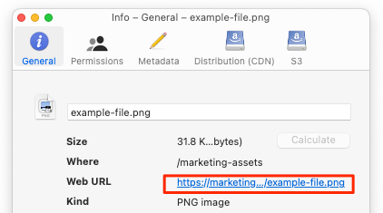
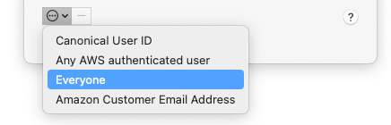
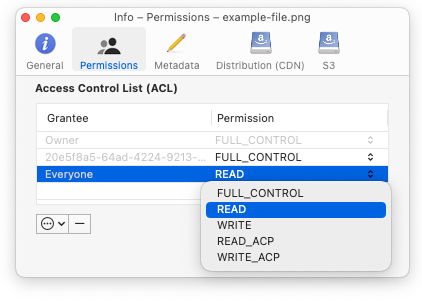

---
author:
  name: Linode
  email: docs@linode.com
title: "Using Cyberduck with Object Storage"
description: "Learn how to use the Cyberduck desktop file transfer program to interact with Linode's Object Storage."
---

Cyberduck is a desktop application that facilitates file transfer over FTP, SFTP, and a number of other protocols, including S3.

## Install and Configure Cyberduck

1.  Navigate to Cyberduck's [Download](https://cyberduck.io/download/) webpage and download the latest version of Cyberduck for your operating system. After downloading, run the file to install the application.

    
If you already have Cyberduck installed, be sure to update to version 8.2.1 or newer. Some of the steps within this guide do not work properly on earlier versions.


1.  Open Cyberduck and then select *Cyberduck* > *Preferences* from the menu bar.

1.  Navigate to the **Profiles** tab to open the *Connection Profiles* page.

    

1.  Search for "Linode" or scroll down to see the connection profiles designed for Linode's Object Storage service.

    

1.  Select the checkbox next to connection profile for each data center you wish to use with Object Storage.

1.  Close the *Preferences* window and restart Cyberduck to install the selected connection profiles.

## Open a Connection

1.  Open Cyberduck and then select *File* > *Open Connection...* from the menu bar. This displays the connection dialog.

1.  At the top of the Open Connection dialog, click the dropdown menu and select the **Linode Object Storage** profile that corresponds with the data center you wish to use.

1.  Enter your access key in the **Access Key** field and your secret key in the **Secret Key** field. If you do not yet have an access key, create one now by following the instructions within the [Manage Access Keys](/docs/products/storage/object-storage/guides/access-keys/) guide. If you intend to create new buckets, the access key must not be limited. Otherwise, the access key must have permissions to read or read/write on the bucket you intend to use.

    

1.  Click **Connect** to open the connection.

## View Your Buckets and Files

Once the connection is successful, a list appears of all the buckets that your access key has permissions to view within the selected data center. You can view the files stored within the buckets by clicking the chevron icon to the left of the bucket label or double clicking the bucket to open it.


To create additional buckets, use the Cloud Manager, Linode CLI, s3cmd, or s4cmd. Cyberduck is not able to create new buckets.


## Upload and Manage Files

To upload a file, drag it into the Cyberduck window at the location where you'd like the file to be stored. For instance, if you see multiple buckets or folders, drag the file to whichever one you wish. This process also works for multiple files and even entire directories. Alternatively, you can click the **Action** button and select **Upload** from the menu.

If you wish to perform an action on a particular file, right click that file to open up a context menu with additional options. These options include:

- [Info](https://docs.cyberduck.io/cyberduck/info/): Get additional details about the file, folder, or bucket, change permissions, view and update metadata, edit the domain, set versioning, and much more.
- [Download](https://docs.cyberduck.io/cyberduck/download/): Download a copy of the file.
- [Edit](https://docs.cyberduck.io/cyberduck/edit/): Useful for editing plaintext files.
- Rename, Duplicate, and much more.



## Obtain the URL of a File

In most cases, URLs are used to share and display files. While you can always manually determine the URL (see [Access Buckets and Files through URLs](/docs/products/storage/object-storage/guides/urls/#file-urls)), you can get this information quickly using Cyberduck.

1. Right click on the file, select **Info**, and navigate to the *General* tab.

1. Locate the **Web URL** field. The URL for the file is displayed here.

    

1. Click on the URL to open it in a web browser or right click it and select **Copy Link** to copy the URL.

## Make Files Public

It's common to make a file, folder, or even an entire bucket publicly accessible so they can be accessed through the file's URL without any additional authentication needed. To do this through Cyberduck, update the permissions on the file using the instructions below.

1. Right click on the file, select **Info**, and navigate to the *Permissions* tab.

1.  Click the ellipsis icon at the bottom left of the window and select **Everyone**.

    

1.  A new entry for *Everyone* appears in the Access Control List. Next to *Everyone*, under the *Permissions* column heading, select **READ** from the drop down menu.

    

The object is now accessible through the internet. See [Obtain the URL of a File](#obtain-the-url-of-a-file) to get the URL.

## Host a Website

Object Storage can be used to host static website files, such as html, css, and client-side javascript. Once you've uploaded your files to a particular bucket, follow the instructions below to enable your website.

1.  Locate your bucket within Cyberduck

1.  Highlight all of the website files within your bucket, right click on them, and select **Info**. Follow the instructions within [Make Files Public](#make-files-public) so that your files can be accessed by everyone with the URL.

1.  Right click the bucket itself, select **Info**, and navigate to the **Distribution (CDN)** tab.

1.  Check the box that reads **Enable Website Configuration (HTTP) Distribution**.

    

1.  Make sure the root of your bucket contains an "index.html" file. If not, you can select a different file to act as the index by modifying the **Index File** field within the same window as the previous step.

1.  The static site is accessed from a different URL than can be found in the [Obtain the URL of a File](#obtain-the-url-of-a-file) section. Review the [Access Buckets and Files through URLs](/docs/products/storage/object-storage/guides/urls/#website-urls) guide for information on obtaining the website URL.

For more information on hosting a static website with Object Storage, read the [Host a Static Site using Linode Object Storage](/docs/guides/host-static-site-object-storage/) guide.