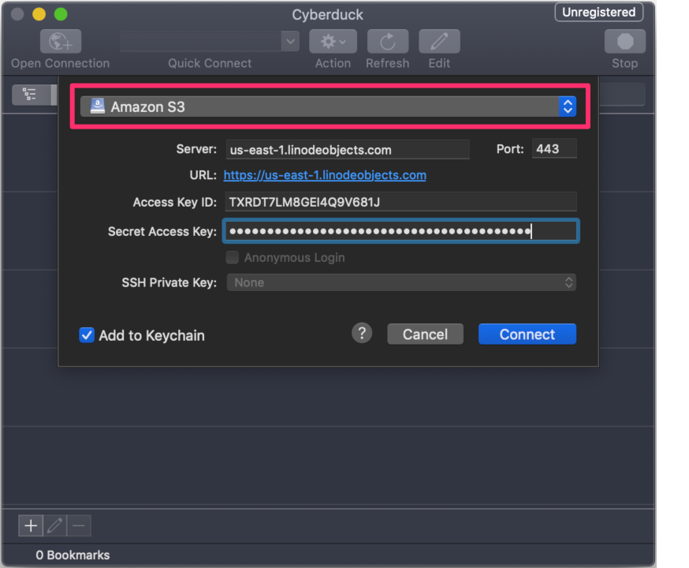
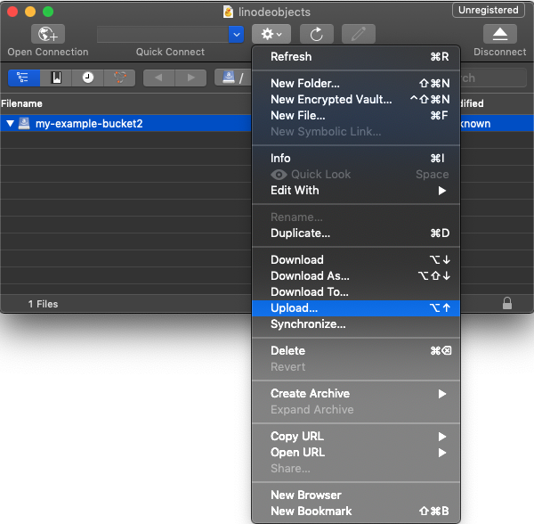
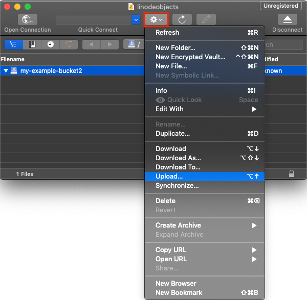
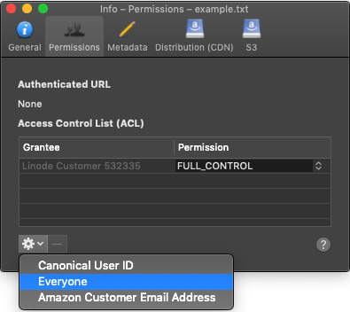
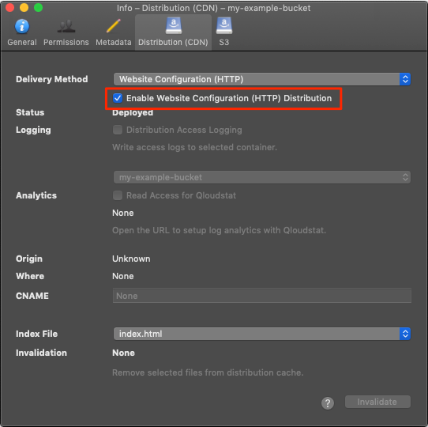

---
author:
  name: Linode
  email: docs@linode.com
title: "Using Cyberduck with Object Storage"
description: "Learn how to use the Cyberduck desktop file transfer program to interact with Linode's Object Storage."
---

Cyberduck is a desktop application that facilitates file transfer over FTP, SFTP, and a number of other protocols, including S3.

## Install and Configure Cyberduck

1.  Download Cyberduck by [visiting their website](https://cyberduck.io/).

1.  After you have Cyberduck installed, open the program and click **Open Connection**.

1.  At the top of the Open Connection dialog, select **Amazon S3** from the dropdown menu.

    

1.  For the Server address, enter either `us-east-1.linodeobjects.com` if the bucket is in the Newark data center, `eu-central-1.linodeobjects.com` if the bucket is in the Frankfurt data center, or `ap-south-1.linodeobjects.com` if the bucket is in the Singapore data center.

1.  Enter the access key in the **Access Key ID** field, and the secret key in the **Secret Access Key** field.

1.  Click **Connect**.

You are now ready to create a bucket in Object Storage.

## Create a Bucket with Cyberduck

To create a bucket in Cyberduck:

1. Right click within the window frame, or click **Action**, then click **New Folder**:

    

1.  Enter the bucket's label and then click **Create**. See the [Bucket Name](#bucket-names) section for rules on naming the bucket.

1.  To delete the bucket using Cyberduck, right click the bucket and select **Delete**.

## Upload, Download, and Delete an Object with Cyberduck

1.  To upload objects with Cyberduck, you can simply drag and drop the object, or directory of objects, to the bucket you'd like to upload them to, and Cyberduck does the rest. Alternatively, you can click the **Action** button and select **Upload** from the menu:

    

1.  To make the objects publicly accessible, meaning that you can access them from the object's URL, you need to set the proper READ permissions. Right click the object and select **Info**.

1.  Click the **Permissions** tab.

1.  Click the gear icon at the bottom of the window and select **Everyone**.

    

1.  A new entry for *Everyone* appears in the Access Control List. Next to *Everyone*, under *Permissions* column heading, select **READ** from the drop down menu.

    

    The object is now accessible through the internet, at the URL `http://my-example-bucket.us-east-1.linodeobjects.com/example.txt`, where `my-example-bucket` is the label of the bucket, `us-east-1.linodeobjects.com` is the cluster where the bucket is hosted, and `example.txt` is the name of the object.

1.  To download an object, right click the object and select **Download**, or click **Download As** if you'd like to specify the location of the download.

1.  To delete an object, right click the object name and select **Delete**.

## Create a Static Site with Cyberduck

To create a static site from the bucket:

1.  Select a bucket, then right click the bucket or select the **Action** button at the top of the menu.

1.  Click **Info**, and then select the **Distribution (CDN)** tab.

1.  Check the box that reads **Enable Website Configuration (HTTP) Distribution**:

    

1.  You need to separately upload the `index.html` and `404.html` files (or however you have named the index and error pages) to the bucket. Follow the instructions from the [Upload, Download, and Delete an Object with Cyberduck](#upload-download-and-delete-an-object-with-cyberduck) section to upload these files.

1.  The static site is accessed from a different URL than the generic URL for the Object Storage bucket. Static sites are available at the `website-us-east-1` subdomain for the Newark data center, the `website-eu-central-1` subdomain for the Frankfurt data center, and the `website-ap-south-1` subdomain for the Singapore data center. Using `my-example-bucket` as an example, you would navigate to either:

    - `http://my-example-bucket.website-us-east-1.linodeobjects.com` or
    - `http://my-example-bucket.website-eu-central-1.linodeobjects.com` or
    - `https://my-example-bucket.website-ap-south-1.linodeobjects.com`

    For more information on hosting a static website with Object Storage, read the [Host a Static Site using Linode Object Storage](/docs/platform/object-storage/host-static-site-object-storage/) guide.