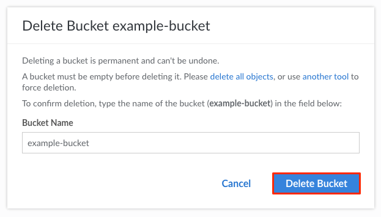

---
author:
  name: Linode
  email: docs@linode.com
title: Delete a Bucket
description: "How to delete a Linode Object Storage bucket."
---

Follow these steps to delete an Object Storage bucket from the Cloud Manager:


You can only delete an empty Object Storage bucket. See the [Delete Objects from a Bucket](/docs/products/storage/object-storage/guides/delete-objects/) how-to for information on deleting a bucket's objects using the Cloud Manager.


1.  If you have not already, log into the [Linode Cloud Manager](https://cloud.linode.com).

1.  Click the **Object Storage** link in the sidebar. A list of all the buckets appears.

1. Click the ellipsis menu corresponding to the bucket you'd like to delete. Then, select **Delete**.

    

1. A dialog box appears that prompts you to enter the bucket's name as a way to confirm that you'd like to delete the bucket. Type the bucket's name into the text entry field and click **Delete**.

    

    After the bucket has been deleted, it is no longer be visible on the **Buckets Listing Page**.