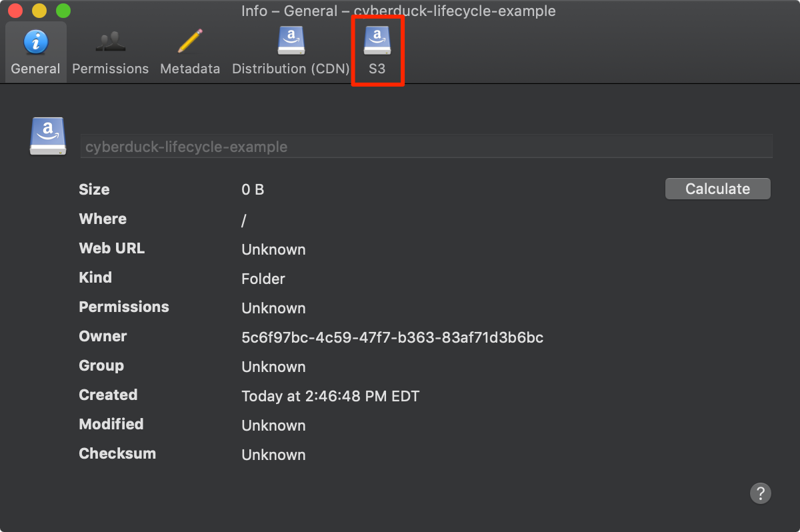
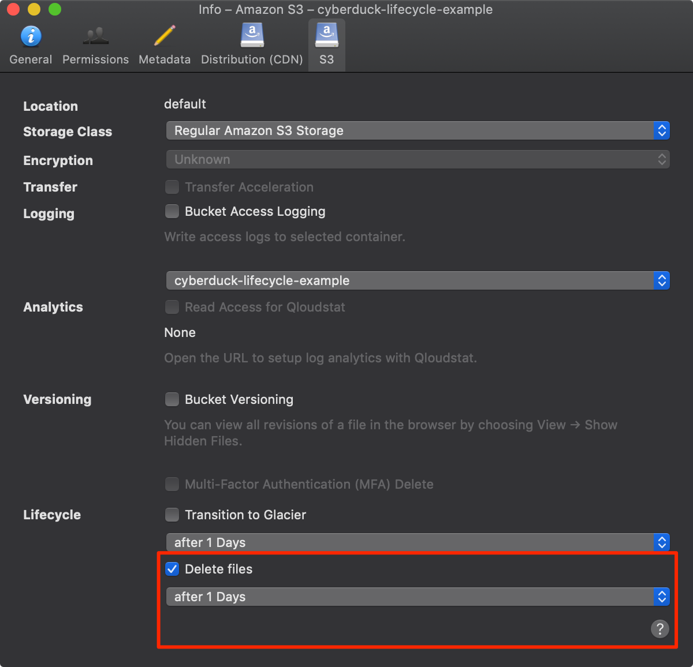

---
author:
  name: Linode Community
  email: docs@linode.com
description: "Use lifecycle policies to manage deleting objects in Linode Object Storage."
keywords: ['object','storage','lifecycle','policy','policies','delete','bucket','version','multipart']
license: '[CC BY-ND 4.0](https://creativecommons.org/licenses/by-nd/4.0)'
published: 2019-10-18
modified: 2022-03-11
modified_by:
  name: Linode
title: "Lifecycle Policies"
contributor:
  name: Linode
aliases: ['/platform/object-storage/how-to-manage-objects-with-lifecycle-policies/','/platform/object-storage/lifecycle-policies/','/guides/lifecycle-policies/','/guides/how-to-manage-objects-with-lifecycle-policies/']
tags: ["linode platform"]
---





While deleting a few objects in an Object Storage bucket might not take that long, when the objects number in the thousands or even millions the time required to complete the delete operations can easily become unmanageable. When deleting a substantial amount of objects, it's best to use *lifecycle policies*. These policies can be represented in XML; here's an (incomplete) snippet of an action that will delete objects after 1 day:


<Expiration>
    <Days>1</Days>
</Expiration>


A lifecycle policy is applied to a bucket. Policies are sets of rules that govern the management of objects after they have aged for a certain amount of time. For instance, you can create a lifecycle policy that deletes objects every thirty days, or once a week. This is useful for cases where the data in a bucket becomes outdated, such as when collecting activity logs.

## In This Guide

This guide will first describe [when policies are enforced](#when-policies-are-enforced) and will then explain how to create and delete lifecycle policies with two tools:

-   [s3cmd command line interface](#s3cmd) (CLI): In addition to deleting objects, more complicated policies can be managed with s3cmd, including deleting old versions of objects that have been retained, and failed multipart uploads.

-   [Cyberduck desktop application](#cyberduck) (GUI): Cyberduck does not feature as many policy options, but they can be managed through a point-and-click interface.

## Before You Begin

* Familiarize yourself with the basics of Linode Object Storage by reviewing the [Get Started with Object Storage](/docs/products/storage/object-storage/get-started/) guide or taking a look through the available [Object Storage guides](/docs/products/storage/object-storage/guides/).
* For demonstration purposes, you can create an Object Storage bucket with a few objects that you will later delete.

## When Policies are Enforced

Lifecycle policies are triggered starting at midnight of the Object Storage cluster's local time. This means that if you set a lifecycle policy of **one day**, the objects will be deleted **the midnight after they become 24 hours old**.



For example, if an object is created at 5PM on January 1, it will reach 24 hours in age at 5PM on January 2. The policy will then be enforced on the object at 12AM on January 3.


There is a chance that a lifecycle policy will not delete all of the files in a bucket the first time the lifecycle policy is triggered. This is especially true for buckets with upwards of a million objects. In cases like these, *most* of the objects are deleted, and any remaining objects are typically deleted during the next iteration of the lifecycle policy's rules.


## Create and Delete Lifecycle Policies

### s3cmd

[s3cmd](https://s3tools.org/s3cmd) allows users to set and manage lifecycle policies from the command line. In this section, you will find instructions on how to create and manage lifecycle policies to delete objects, previous versions of objects, and failed multipart uploads using s3cmd.


If you don't have s3cmd set up on your computer, visit the [Using s3cmd with Object Storage](/docs/products/storage/object-storage/guides/s3cmd/) guide.


#### Creating a Lifecycle Policy File

In S3-compatible Object Storage, a lifecycle policy is represented by an XML file. You can use your preferred text editor to create this XML file. Consider the following lifecycle policy file:


<LifecycleConfiguration>
    <Rule>
        <ID>delete-all-objects</ID>
        <Filter>
        <Prefix></Prefix>
        </Filter>
        <Status>Enabled</Status>
        <Expiration>
            <Days>1</Days>
        </Expiration>
    </Rule>
</LifecycleConfiguration>


The above lifecycle policy deletes all objects in the bucket after one day. Each lifecycle policy file needs a `LifecycleConfiguration` block and a nested `Rule` block. The `Rule` block must contain `Prefix` and `Status`, and at least one action, like the `Expiration` block. It's also a good idea to include an `ID` block:

| Block | Description |
|-------|-------------|
| `ID` | Defines a name for the lifecycle policy rule. If your lifecycle policy contains multiple rules, then the ID for each should be unique. If one is not specified in your policy file, then a random alphanumeric ID will be assigned to your policy when the policy is applied to a bucket. |
| `Filter` |A Lifecycle rule can apply to all or a subset of objects in a bucket based on the <Filter> element that you specify in the Lifecycle rule.You can filter objects by key prefix, object tags, or a combination of both.|
| `Prefix` | This string is used to select objects for deletion with the same matching prefix. For example, objects that begin with `error_report-` could be targeted for deletion by providing this prefix. This Prefix can be empty if you want a rule to apply to all files in a bucket. |
| `Status` | A string value describing the status of the lifecycle policy. To enable the policy, set this value to `Enabled`. To disable the policy set the value to `Disabled`. |
| `Expiration` | Contains the `Days` block. The `Days` block is the number of days before this rule will be enforced. In the above example, the `Days` is set to `1`, meaning that the objects in the bucket will be deleted after one day. |

#### Additional Actions

Other actions can also be specified in a rule:

- `NoncurrentVersionExpiration` block, and its child, `NoncurrentDays`. These are used to control the lifecycle of objects with multiple older versions, and should only be used with buckets that have [bucket versioning](/docs/products/storage/object-storage/guides/versioning/) enabled. Using this option will delete objects that are not the newest, most current version. Below is an example of how to use `NoncurrentVersionExpiration`:

    
<LifecycleConfiguration>
    <Rule>
        <ID>delete-prior-versions</ID>
        <Filter><Prefix></Prefix></Filter>
        <Status>Enabled</Status>
        <NoncurrentVersionExpiration>
            <NoncurrentDays>1</NoncurrentDays>
        </NoncurrentVersionExpiration>
    </Rule>
</LifecycleConfiguration>



If a versioned object is deleted in a bucket with the `NoncurrentVersionExpiration` policy, only the DeleteMarker for that object (not the actual object itself) will be retained after the number of days specified by `NoncurrentDays` have passed since the object was deleted.


- `AbortIncompleteMultipartUpload`, and its child, `DaysAfterInitiation`. These work similarly to `NoncurrentVersionExpiration`, but instead of deleting previous versions of objects, they will delete failed multipart uploads. The following will delete failed multipart uploads three days after they were initiated:

    
<LifecycleConfiguration>
    <Rule>
        <ID>delete-incomplete-multipart-uploads</ID>
        <Filter><Prefix></Prefix></Filter>
        <Status>Enabled</Status>
        <AbortIncompleteMultipartUpload>
            <DaysAfterInitiation>3</DaysAfterInitiation>
        </AbortIncompleteMultipartUpload>
    </Rule>
</LifecycleConfiguration>


    
Objects that are part of failed multipart uploads (the mechanism by which large files are uploaded) stay within Object Storage buckets, counting towards your total Object Storage costs. s3cmd will automatically initiate a multipart upload when a file is larger than 15MB. Lifecycle policies are a great way to clear out stale multipart uploads.



Linode Object Storage does not support the `NewerNoncurrentVersions` policy.


#### Multiple Actions in One Rule

More than one action can be specified in a single rule. For example, you may want to both expire the current version of an object after a set number of days and also remove old versions of it after another period of time. The following policy will delete the current version of an object after 10 days and remove any noncurrent versions of an object 3 days after they are demoted from the current version:


<LifecycleConfiguration>
    <Rule>
        <ID>delete-prior-versions</ID>
        <Filter><Prefix></Prefix></Filter>
        <Status>Enabled</Status>
        <Expiration>
            <Days>10</Days>
        </Expiration>
        <NoncurrentVersionExpiration>
            <NoncurrentDays>3</NoncurrentDays>
        </NoncurrentVersionExpiration>
    </Rule>
</LifecycleConfiguration>



As a reminder, if a versioned object is deleted, only the current version of the object will be deleted and all older versions will be preserved in the bucket. For this reason, the above rule has the effect of deleting any objects if they are not updated within 10 days, and then removing the remaining object versions after 3 days.


#### Multiple Rules

A lifecycle policy file can only contain one `LifecycleConfiguration` block, but the `LifecycleConfiguration` block can contain more than one `Rule`. For instance, if you had a bucket that contained both error and general output logs, you could set a lifecycle policy that saves error logs for a week but deletes standard logs at the end of every day:


<LifecycleConfiguration>
    <Rule>
        <ID>delete-error-logs</ID>
        <Filter><Prefix>error</Prefix></Filter>
        <Status>Enabled</Status>
        <Expiration>
            <Days>7</Days>
        </Expiration>
    </Rule>
    <Rule>
        <ID>delete-standard-logs</ID>
        <Prefix>logs</Prefix>
        <Status>Enabled</Status>
        <Expiration>
            <Days>1</Days>
        </Expiration>
    </Rule>
</LifecycleConfiguration>


#### Uploading the Lifecycle Policy to a Bucket

In order to apply a lifecycle policy to a bucket with s3cmd, you need to upload the lifecycle file to the bucket. This operation is not a normal PUT operation. Instead, the command to use is `setlifecycle`, followed by the name of the lifecycle policy file and the name of the bucket. In the example below, replace *example-bucket* with the name of your bucket.

    s3cmd setlifecycle lifecycle_policy.xml s3://example-bucket

You should see output like the following:


s3://example-bucket/: Lifecycle Policy updated


Once the lifecycle policy has been uploaded, objects will be deleted according to the policy set in place.

#### Viewing a Bucket's Lifecycle Policy

To view a lifecycle policy after it has been uploaded to a bucket, use the `getlifecycle` command. Replace *example-bucket* with the name of your bucket:

    s3cmd getlifecycle s3://example-bucket

You should see the contents of the XML file that was uploaded:


<?xml version="1.0" ?>
<LifecycleConfiguration xmlns="http://s3.amazonaws.com/doc/2006-03-01/">
  <Rule>
    <ID>delete-all</ID>
    <Prefix/>
    <Status>Enabled</Status>
    <Expiration>
      <Days>1</Days>
    </Expiration>
  </Rule>
</LifecycleConfiguration>


#### Deleting a Lifecycle Policy

To delete a lifecycle policy that you've uploaded, effectively disabling it, use the `dellifecycle` command. Replace *example-bucket* with the name of your bucket:

    s3cmd dellifecycle s3://example-bucket

You'll see a confirmation that the lifecycle policy was deleted:


s3://example-bucket: Lifecycle Policy deleted


### Cyberduck

[Cyberduck](https://cyberduck.io/) allows less control over lifecycle polices than the s3cmd CLI. In particular, Cyberduck does not allow you to set a lifecycle policy that removes outdated versions of objects stored in buckets where [versioning](/docs/products/storage/object-storage/guides/versioning/) is enabled, nor does it allow you to delete multipart uploads. Cyberduck also limits the length of a lifecycle policy to commonly used time spans. Below you will learn how to set a lifecycle policy using Cyberduck.


If you don't have Cyberduck set up on your computer, visit the [Using Cyberduck with Object Storage](/docs/products/storage/object-storage/guides/cyberduck/) guide.


#### Enable a Lifecycle Policy

1.  **Right click** or **control +** click on the bucket for which you would like to set a lifecycle policy. This will bring up the bucket info menu.

1.  Click on the **S3** tab to open the S3 bucket settings.

    

1.  Click on the checkbox labeled **Delete files** and select a time interval from the drop-down menu below it.

    

This will enable the lifecycle policy and the objects within the bucket will be deleted after the designated time.

#### Disable a Lifecycle Policy

To disable a lifecycle policy, uncheck the box entitled **Delete Files** that you checked in the previous section.