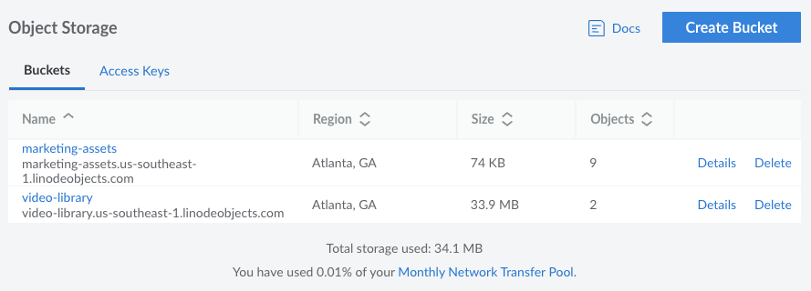
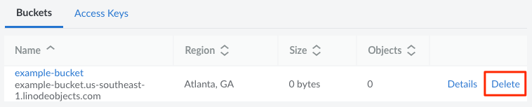
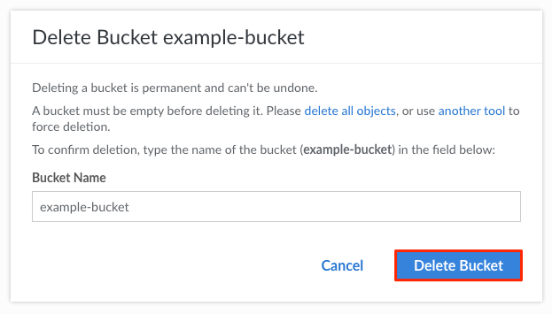

Buckets are the primary containers within Object Storage. Each bucket stores your files (objects) and allows you to access or share those files.

## View Buckets

Log in to the [Cloud Manager](https://cloud.linode.com/) and select **Object Storage** from the left menu. If you currently have buckets on your account, they are listed on this page, along with their URL, region, size, and the number of objects (files) they contain.

You can also view your bucket through the [Linode CLI](/docs/products/storage/object-storage/guides/linode-cli/), [Cyberduck](/docs/products/storage/object-storage/guides/cyberduck/#view-your-buckets-and-files), [s3cmd](/docs/products/storage/object-storage/guides/s3cmd/#list-buckets), and [s4cmd](/docs/products/storage/object-storage/guides/s4cmd/#list-buckets).

## Create a Bucket

One of the first steps to using Object Storage is to create a bucket. Here's how to create a bucket using the Cloud Manager, though you can also use the [Linode CLI](/docs/products/storage/object-storage/guides/linode-cli/#create-a-bucket-with-the-cli), [s3cmd](/docs/products/storage/object-storage/guides/s3cmd/#create-a-bucket), and [s4cmd](/docs/products/storage/object-storage/guides/s4cmd/#create-a-bucket).

1.  Navigate to the **Object Storage** page in the Cloud Manager (see [View Buckets](#view-buckets)).

1.  Click the **Create Bucket** button to open the *Create Bucket* panel. If you have not created an access key or a bucket on this account, you are prompted to enable Object Storage.

    
    Billing for Object Storage starts as soon as it is enabled on the account. See [Object Storage Pricing](/docs/products/storage/object-storage/#pricing) for more detail on the minimum flat-rate and per GB charge. See [Cancel Object Storage](/docs/products/storage/object-storage/guides/cancel/) for instructions on cancelling this service.
    

1.  Within the *Create Bucket* form, add a **Label** for the new bucket. This label must be unique and should not be used by any other bucket (from any customer) in the selected data center. Keep the following formatting requirements in mind:
    - Must be between 3 and 63 characters in length.
    - Can only contain lower-case characters, numbers, periods, and dashes.
    - Must start with a lowercase letter or number.
    - Cannot contain underscores (_), end with a dash (-) or period (.), have consecutive periods (.), or use dashes (-) adjacent to periods (.).
    - Cannot be formatted as IP addresses.

    
    If you intend to use this bucket with a custom domain, the bucket must be labeled as your fully qualified domain name, such as `assets.example.com` or any subdomain of `*.your-domain.tld`.
    

1.  Choose a **Region** for the bucket to reside. See the Availability section on the [Object Storage Overview](/docs/products/storage/object-storage/#availability) page for a list of available regions.

1.  Click **Submit** to create the bucket.

You are now ready to [upload files to the bucket](/docs/products/storage/object-storage/guides/manage-files/).

## Delete a Bucket

Follow these steps to delete an Object Storage bucket from the Cloud Manager. You can also use the [Linode CLI](/docs/products/storage/object-storage/guides/linode-cli/), [s3cmd](/docs/products/storage/object-storage/guides/s3cmd/#delete-a-bucket), and [s4cmd](/docs/products/storage/object-storage/guides/s4cmd/#delete-a-bucket).


Only empty buckets are able to be deleted through the Cloud Manager. To delete objects, see [Delete a File/Object](/docs/products/storage/object-storage/guides/manage-files/#delete-a-file). Alternatively, you can use the following S3cmd command, which deletes a non-empty bucket. See [S3cmd > Delete a Bucket](/docs/products/storage/object-storage/guides/s3cmd/#delete-a-bucket) for more details.

    s3cmd rb -r -f s3://example-bucket/


1.  Navigate to the **Object Storage** page in the Cloud Manager (see [View Buckets](#view-buckets)).

1.  Locate the bucket you wish to delete and click the corresponding **Delete** button.

    

1. A dialog box appears that prompts you to enter the bucket's name as a way to confirm that you'd like to delete the bucket. Type the bucket's name into the text entry field and click **Delete**.

    