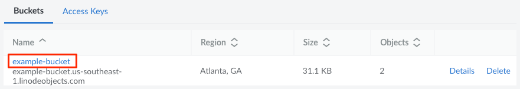
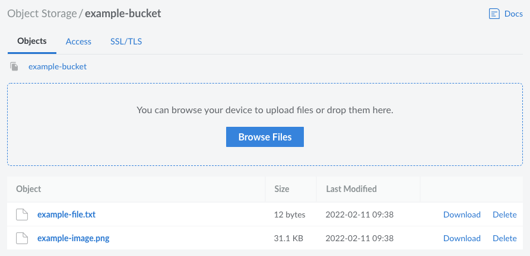
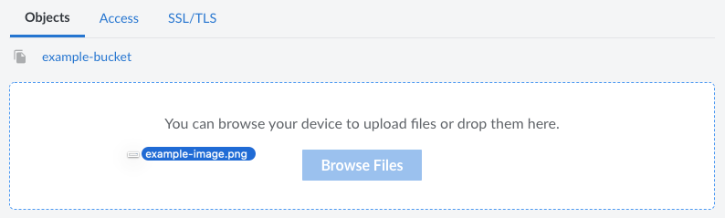
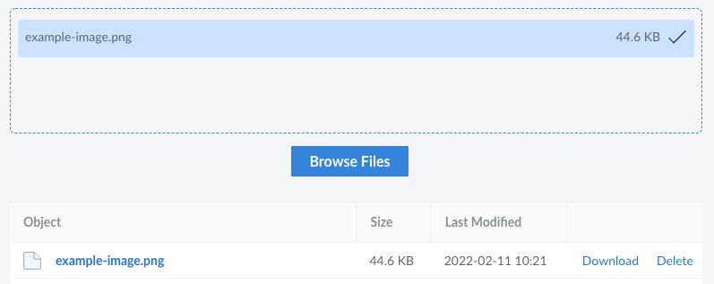
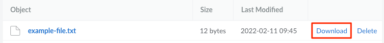
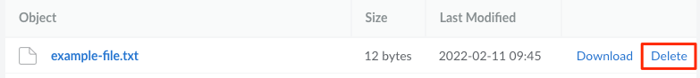
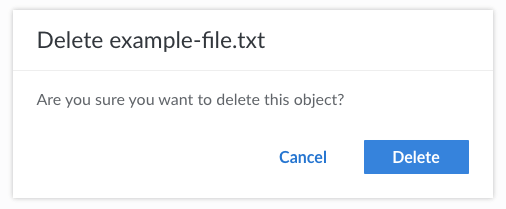

The primary function of Object Storage is to allow you to host files, also called objects. This guide walks you through using the Cloud Manager to view, upload, download, and delete files.

## View Files Stored within a Bucket

1. Log in to the [Cloud Manager](https://cloud.linode.com/) and select **Object Storage** from the left menu.

1.  Locate the bucket you wish to view and click its label/name to open it.

    

1.  This opens the bucket's details page and displays a list of all the files (objects) stored within it.

    

## Upload Files

Follow these steps to upload objects to a bucket using the Cloud Manager:



1.  Navigate to the **Bucket** page in the Cloud Manager (see [View Files](#view-files-stored-within-a-bucket)).

1. Files can be uploaded through either the dragging and dropping them into the file upload pane or by browsing for the files.

    - **Drag and drop:** Select any files or folders you wish to upload (either on your desktop or within your own file explorer / finder window). Drag those files into the file upload pane on your web browser, as shown below:

        

    - **Browse for files:** Click the **Browse Files** button to bring up your local computer's file browser and select a file or group of files to upload. This method does not allow you to upload a folder.

1.  Each file that's being upload appears within the upload pane, along with its size and a progress meter. Once the file has been uploaded, a checkmark appears to the right of the file and its visible within the list of objects.

    

    
    Individual object uploads are limited to a size of 5GB each, though larger object uploads can be facilitated with multipart uploads. [s3cmd](/docs/products/storage/object-storage/guides/s3cmd/) and [Cyberduck](/docs/products/storage/object-storage/guides/cyberduck/) do this for you automatically if a file exceeds this limit as part of the uploading process.
    

## Download a File

1.  Navigate to the **Bucket** page in the Cloud Manager (see [View Files](#view-files-stored-within-a-bucket)).

1. Locate the file you wish to download and click the **Download** button.

    

1. The object is downloaded to your local computer, typically within the *Downloads* directory for your user.

## Delete a File

Follow these steps to delete objects in a bucket from the Cloud Manager:

1.  Navigate to the **Bucket** page in the Cloud Manager (see [View Files](#view-files-stored-within-a-bucket)).

1. Locate the file you wish to delete and click the **Delete** button.

    

1. A dialog box appears prompting you to confirm if you'd like to delete the object. Click **Delete** to proceed.

    