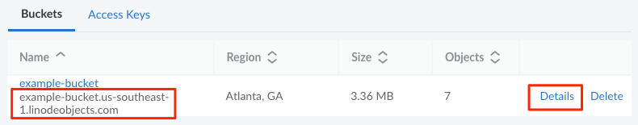
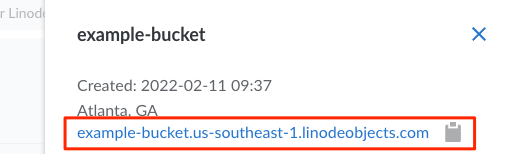
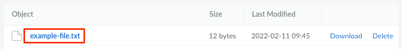
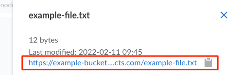

---
author:
  name: Linode Community
  email: docs@linode.com
description: "Learn how to obtain URLs to objects within Linode's Object Storage service."
keywords: ['object','storage','bucket']
published: 2020-01-22
modified: 2022-02-24
modified_by:
  name: Linode
image: AccessingObjectswithLinodeObjectStorage.png
title: "Access Buckets and Files through URLs"
contributor:
  name: Linode
tags: ["linode platform"]
aliases: ['/platform/object-storage/how-to-access-objects-with-linode-object-storage/','/guides/how-to-access-objects-with-linode-object-storage/','/products/storage/object-storage/guides/access-objects/']
---

Linode's Object Storage service gives each bucket and file a unique URL. This URL is managed through the shared domain *\*.linodeobjects.com* and your files are encrypted through the use of HTTPS. By default, files are only visible by you (the owner) through the Cloud Manager or through other tools and applications using an access key with permissions to read (or read/write) the bucket.

You're also able to make these files accessible to anyone through their URLs by setting up ACLs so the files are public. This makes Object Storage great for sharing and storing unstructured data like images, documents, archives, streaming media assets, and file backups, and the amount of data you store can range from small collections of files up to massive libraries of information.

Here are the types of URLs you can use to access buckets and files:

- [Cluster URL](#cluster-url-s3-endpoint)
- [Bucket URL](#bucket-url)
- [File URL](#file-urls)
- [Signed URL](#signed-urls)
- [Website URL](#website-urls)
- [Custom URL](#custom-urls)

## Cluster URL (S3 Endpoint)

The cluster URL for Object Storage is unique to each data center. This URL can be used for accessing all of your Object Storage resources within a certain region. When used with third party tools, this URL might also be referred to as the *S3 endpoint*.

**Cluster URL:** `https://[cluster-id].linodeobjects.com/`, replacing *[cluster-id]* with the id of your data center. The cluster URLs for each of the available data centers are listed below:

| Data Center | Cluster ID | Cluster URL |
| --| -- | -- |
| Atlanta, GA, USA | us-southeast-1 | https://us-southeast-1.linodeobjects.com |
| Frankfurt, Germany | eu-central-1 | https://eu-central-1.linodeobjects.com |
| Newark, NJ, USA | us-east-1 | https://us-east-1.linodeobjects.com |
| Singapore | ap-south-1 | https://ap-south-1.linodeobjects.com |

## Bucket URL

Each bucket has its own unique URL. This URL is useful when configuring a third party application to use a specific bucket for file storage.

**Bucket URL:** `https://[bucket-label].[cluster-id].linodeobjects.com/`, replacing *[bucket-label]* with the label of your bucket and *[cluster-id]* with the id of your data center (listed in the [Cluster URL](#cluster-url-s3-endpoint) section).

For example, a bucket labeled *example-bucket* within the Atlanta data center would have the following URL:

    https://example-bucket.us-southeast-1.linodeobjects.com

### View a Bucket's URL through the Cloud Manager

You can build this URL manually or you can view the bucket URL through the Cloud Manager (as shown below) or a tool like [Cyberduck](/docs/products/storage/object-storage/guides/cyberduck/#obtain-the-url-of-a-file)

1. Log in to the [Cloud Manager](https://cloud.linode.com/) and select **Object Storage** from the left menu.

1.  Locate the bucket you wish to use. The URL for the bucket is printed underneath the bucket label/name.

    

1. You can also click the details link to view *and copy* the URL.

    

## File URLs

The URLs for files (objects) within a bucket are very similar to the bucket's own URL, simply with the filename and path appended to the end. This URL is useful when sharing the file with someone or accessing it from your website.

**File (Object) URL:** `https://[bucket-label].[cluster-id].linodeobjects.com/[file]`, replacing *[bucket-label]* with the label of your bucket, *[cluster-id]* with the id of your data center (listed in the [Cluster URL](#cluster-url-s3-endpoint) section, and *[file]* with the full path, name, and extension of your file.

For example, a file named *example-file.txt* stored on a bucket labeled *example-bucket* within the Atlanta data center would have the following URL:

    https://example-bucket.us-southeast-1.linodeobjects.com/example-file.txt

### View a File's URL through the Cloud Manager

You can build this URL manually or you can view the file URL through the Cloud Manager (as shown below) or a tool like [Cyberduck](/docs/products/storage/object-storage/guides/cyberduck/#obtain-the-url-of-a-file)

1. Log in to the [Cloud Manager](https://cloud.linode.com/) and select **Object Storage** from the left menu.

1. Locate the bucket you wish to view and click its label/name to open it.

    

1. This opens the bucket's details page and displays a list of all the files (objects) stored within it. Locate the file you want to use and click the filename.

    

1. The URL for the file is listed at the top of the details panel, as shown below:

    

## Signed URLs

A **signed URL** gives anyone with the URL access to a file for a certain period of time. This is very useful when you want to share a document or file with someone, but don't wish to make the URL permanently accessible or able to be guessed by others. You can generate a signed URL through the [Linode CLI](/docs/products/storage/object-storage/guides/linode-cli/#create-a-signed-url-with-the-cli) or [s3cmd](/docs/products/storage/object-storage/guides/s3cmd/#create-a-signed-url-with-s3cmd).

Here's an example of a signed URL:

    https://us-southeast-1.linodeobjects.com:443/example-bucket/example-file.txt?Signature=NUXLA378K28nMKgnaIcYjGroMXw%3D&Expires=1644600958&AWSAccessKeyId=YFULT4UZZULG82GFPQE2&x-amz-meta-mtime=1644590299284&x-amz-meta-storage-class=STANDARD

## Website URLs

You can configure a bucket to serve a static website (a website only containing static files like html, css, client-side javascript, images, and other non-dynamic resources).

**Website URL:** `https://[bucket-label].website-[cluster-id].linodeobjects.com/`, replacing *[bucket-label]* with the label of your bucket and *[cluster-id]* with the id of your data center (listed in the [Cluster URL](#cluster-url-s3-endpoint) section.

For example, if you have configured a website on a bucket labeled *example-bucket* within the Atlanta data center would have the following URL:

    https://example-bucket.website-us-southeast-1.linodeobjects.com

For more information on hosting a static website with Object Storage, read our [Host a Static Site using Linode Object Storage](/docs/guides/host-static-site-object-storage/) guide.

## Custom URLs

So far, this guide has covered obtaining URLs that use the shared domain *\*.linodeobjects.com*. You can also configure a bucket to use a custom domain, such as `assets.example.com`. To do this, see [Configure a Custom Domain (with a TLS/SSL Certificate)](/docs/products/storage/object-storage/guides/custom-domain/).