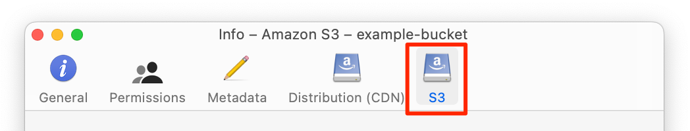
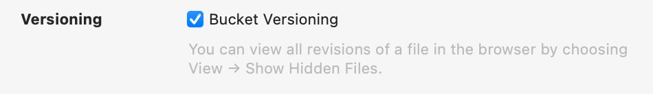

---
author:
  name: Linode
  email: docs@linode.com
title: "Retaining Version History"
description: "Learn how to use the s4cmd command-line tool with Linode's Object Storage."
published: 2022-02-25
---

Versioning in Object Storage (also called *bucket versioning*, *object versioning*, and *S3 versioning*) is a method of retaining historical versions of files/objects. When this feature is enabled, objects are not overwritten or deleted. Instead, the new *current* version of an object is stored alongside each older *noncurrent* version. In the event that you need to recover old data, you can restore/retrieve previous versions of each object.

This works by automatically assigning a *version ID* to each object. When new versions are uploaded, they receive a new version ID and are stored alongside older versions. When viewing or retrieving objects, the latest version of the object is returned *unless a version ID has been specified in the request*. If you delete an object with bucket versioning enabled, a delete marker is inserted into the bucket to report that the object has been deleted, but the bucket will retain all previous versions of the object.


Every version of an object counts towards the monthly billable storage quota. While saving a few revisions is probably not something to worry about, large version controlled buckets with many thousands of objects will see a noticeable increase in storage space demands, and should be monitored carefully.


## Using Versioning within Linode's Object Storage Service

While versioining is natively supported within our Object Storage service, none of our first party tooling (such as the Cloud Manager, the Linode CLI, or the Linode API) can manage this feature. Currently, object versioning can only be enabled, disabled, and otherwise managed through third party tools like Cyberduck and the AWS CLI.

## Enable Versioning

Versioning is enabled on the bucket level. This means that every object in a bucket will be versioned, not just a single object.

### Cyberduck

1. Review the [Using Cyberduck with Object Storage](/docs/products/storage/object-storage/guides/cyberduck/) guide for instructions on installing Cyberduck, connecting to your Object Storage cluster, and viewing your buckets.

1. Right click on the bucket on which you wish to enable versioning, select **Info**, and navigate to the *S3* tab.

    

1. Locate the *Versioning* section and check the **Bucket Versioning** checkbox to enable it.

    

### AWS CLI

1.  Install and configure 

1.  Enable bucket versioning with the `put-bucket-versioning` command, replacing *[cluster-url]* with the cluster URL that corresonds with the data center you're using (see [Cluster URL (S3 endpoint)](/docs/products/storage/object-storage/guides/urls/#cluster-url-s3-endpoint)) and *[bucket-label]* with the label/name of your bucket.

        aws s3api put-bucket-versioning --endpoint=[cluster-url] --bucket=[bucket-label] --versioning-configuration Status=Enabled

1.  To verify that versioning has been enabled, run the `get-bucket-versioning` command, again replacing *[cluster-url]* and *[bucket-label]* accordingly.

        aws s3api get-bucket-versioning --endpoint=[cluster-url] --bucket=[bucket-label]

    You should see output like the following:

    
{
    "Status": "Enabled",
    "MFADelete": "Disabled"
}


    Here you can see that bucket versioning has been successfully app