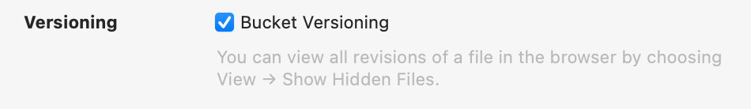
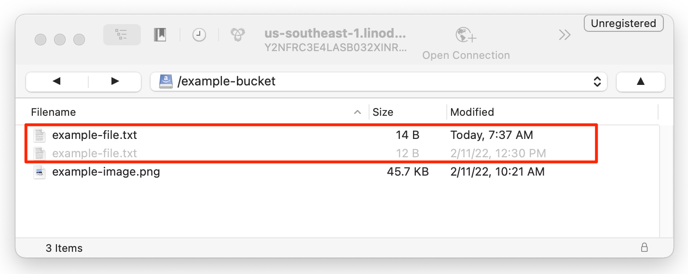

Versioning in Object Storage (also called *bucket versioning*, *object versioning*, and *S3 versioning*) is a method of retaining historical versions of files/objects. When this feature is enabled, objects are not overwritten or deleted. Instead, the new *current* version of an object is stored alongside each older *noncurrent* version. In the event that you need to recover old data, you can restore/retrieve previous versions of each object.

This works by automatically assigning a *version ID* to each object. When new versions are uploaded, they receive a new version ID and are stored alongside older versions. When viewing or retrieving objects, the latest version of the object is returned *unless a version ID has been specified in the request*. If you delete an object with bucket versioning enabled, a delete marker is inserted into the bucket to report that the object has been deleted, but the bucket will retain all previous versions of the object.


Every version of an object counts towards the monthly billable storage quota. While saving a few revisions is probably not something to worry about, large version controlled buckets with many thousands of objects will see a noticeable increase in storage space demands, and should be monitored carefully.


## Using Versioning within Linode's Object Storage Service

While versioning is natively supported within our Object Storage service, none of our first party tooling (such as the Cloud Manager, the Linode CLI, or the Linode API) can manage this feature. Currently, object versioning can only be enabled, disabled, and otherwise managed through third party tools like Cyberduck and the AWS CLI.

## Enable Versioning

Versioning is enabled on the bucket level. This means that every object in a bucket will be versioned, not just a single object.

### Cyberduck

1. Review the [Using Cyberduck with Object Storage](/docs/products/storage/object-storage/guides/cyberduck/) guide for instructions on installing Cyberduck, connecting to your Object Storage cluster, and viewing your buckets.

1. Right click on the bucket on which you wish to enable versioning, select **Info**, and navigate to the *S3* tab.

    

1. Locate the *Versioning* section and check the **Bucket Versioning** checkbox to enable it.

    

### AWS CLI

1.  Install and configure the AWS CLI to work with your Object Storage account. See the [AWS CLI](/docs/products/storage/object-storage/guides/aws-cli/) guide.

1.  Enable bucket versioning with the `put-bucket-versioning` command, replacing *[cluster-url]* with the cluster URL that corresponds with the data center you're using (see [Cluster URL (S3 endpoint)](/docs/products/storage/object-storage/guides/urls/#cluster-url-s3-endpoint)) and *[bucket-label]* with the label/name of your bucket.

        aws s3api put-bucket-versioning --endpoint=[cluster-url] --bucket=[bucket-label] --versioning-configuration Status=Enabled

1.  To verify that versioning has been enabled, run the `get-bucket-versioning` command, again replacing *[cluster-url]* and *[bucket-label]* accordingly.

        aws s3api get-bucket-versioning --endpoint=[cluster-url] --bucket=[bucket-label]

    The output of that command should display a **Status** of *Enabled*:

    ```output
    {
        "Status": "Enabled",
        "MFADelete": "Disabled"
    }
    ```

## Test Versioning

Now that versioning is enabled, you can test this feature by uploading an example file and then replacing it.

1.  Create a text file (called `example-file.txt` or similar) on your local computer with the following contents:

        This is version 1.

1.  Now, upload that file through any tool you wish to use, including the Cloud Manager, Cyberduck, S3cmd, or the AWS CLI.

1.  On your local machine, edit that same text file. In our example, we'll edit it to use the following contents:

        This is version 2.

1.  Upload that text file again to the same location that you used for the previous upload. Depending on the tool you are using, you may receive a warning that the file will be overwritten. Since versioning is enabled, previous versions will be retained so you can safely continue.

1.  Follow the instructions within [View Versioned Objects](#view-versioned-objects) to verify that you have retained the original and new versions of the file.

## View Versioned Objects

### Cyberduck

Open the **View** menu and click **Show Hidden Files**. The previous versions of the file should be displayed in gray. Click the **Refresh** button if previous versions do not automatically appear.



### AWS CLI

Run the `list-object-versions` command, replacing *[cluster-url]* with the cluster URL that corresponds with the data center you're using (see [Cluster URL (S3 endpoint)](/docs/products/storage/object-storage/guides/urls/#cluster-url-s3-endpoint)), *[bucket-label]* with the label/name of your bucket, and *[object]* with the object key (full path and filename) of the object. If you omit the `--prefix=[object]` option, the command outputs all objects.

    aws s3api list-object-versions --endpoint=[cluster-url] --bucket=[bucket-label] --prefix=[object]

If running this command with the prefix option set to the `example-file.txt` file with two versions, the output is similar to the following:


{
    "Versions": [
        {
            "ETag": "\"8f8d4ab37dcdd3728feecd08c7601112\"",
            "Size": 14,
            "StorageClass": "STANDARD",
            "Key": "example-file.txt",
            "VersionId": "wPI0FSbJRWD4xIvr7y8LxtEhDhm0ntO",
            "IsLatest": true,
            "LastModified": "2022-03-11T12:37:19.722000+00:00",
            "Owner": {
                "DisplayName": "a0000000-000a-0000-0000-00d0ff0f0000",
                "ID": "a0000000-000a-0000-0000-00d0ff0f0000"
            }
        },
        {
            "ETag": "\"764569e58f53ea8b6404f6fa7fc0247f\"",
            "Size": 12,
            "StorageClass": "STANDARD",
            "Key": "example-file.txt",
            "VersionId": "null",
            "IsLatest": false,
            "LastModified": "2022-02-11T17:30:24.612000+00:00",
            "Owner": {
                "DisplayName": "a0000000-000a-0000-0000-00d0ff0f0000",
                "ID": "a0000000-000a-0000-0000-00d0ff0f0000"
            }
        }
    ]
}


Each version is listed, along with its individual object metadata.

## Download and Restore a Previous Version

### Cyberduck

To download a previous version, you can right click on the version you wish to save and select **Download**. Alternatively, you can drag and drop the file to your desktop or file explorer window.

To restore that version of the file, re-upload it. Another method is to delete all newer versions of the file.

### AWS CLI

To download a previous version of an object, run the `get-object` command, replacing *[cluster-url]* with the cluster URL that corresponds with the data center you're using (see [Cluster URL (S3 endpoint)](/docs/products/storage/object-storage/guides/urls/#cluster-url-s3-endpoint)), *[bucket-label]* with the label/name of your bucket, *[object]* with the object key (full path and filename) of the object, *[version-id]* with the **VersionId** value of whichever object you wish to download, *[output-file]* with whatever you wish to call the file on your local system.

    aws s3api get-object --endpoint=[cluster-url] --bucket=[bucket-label] --key=[object] --version-id=[version-id] [output-file]

You should see output like the following:

```output
{
    "AcceptRanges": "bytes",
    "LastModified": "2022-03-11T12:37:19+00:00",
    "ContentLength": 14,
    "ETag": "\"8f8d4ab37dcdd3728feecd08c7601112\"",
    "VersionId": "wPI0FSbJRWD4xIvr7y8LxtEhDhm0ntO",
    "ContentType": "text/plain",
    "Metadata": {
        "mtime": "1644590299284",
        "storage-class": "STANDARD"
    },
    "StorageClass": "STANDARD"
}
```

To restore this version, you can re-upload it. Alternatively, you can delete all newer versions.