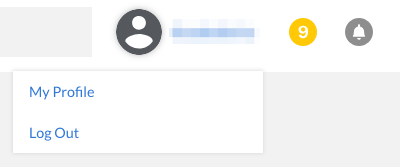
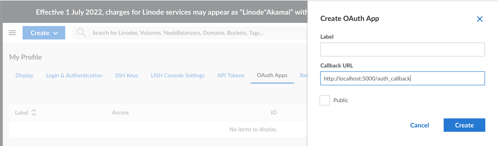
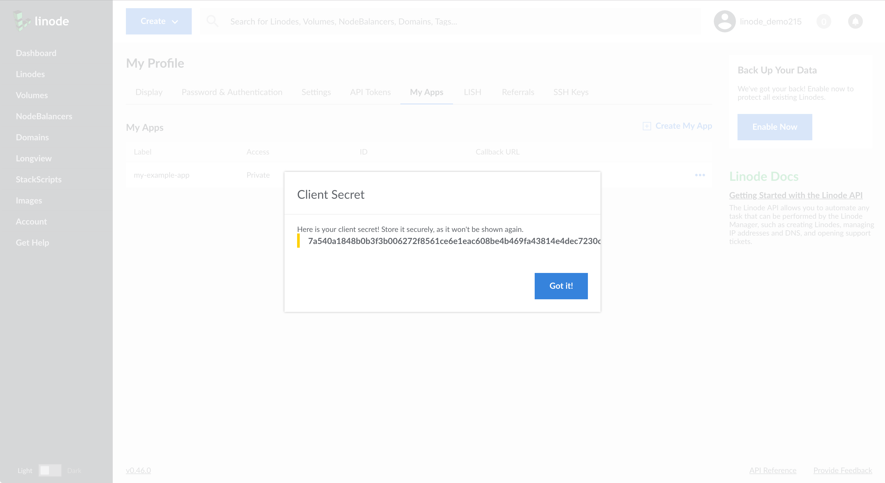
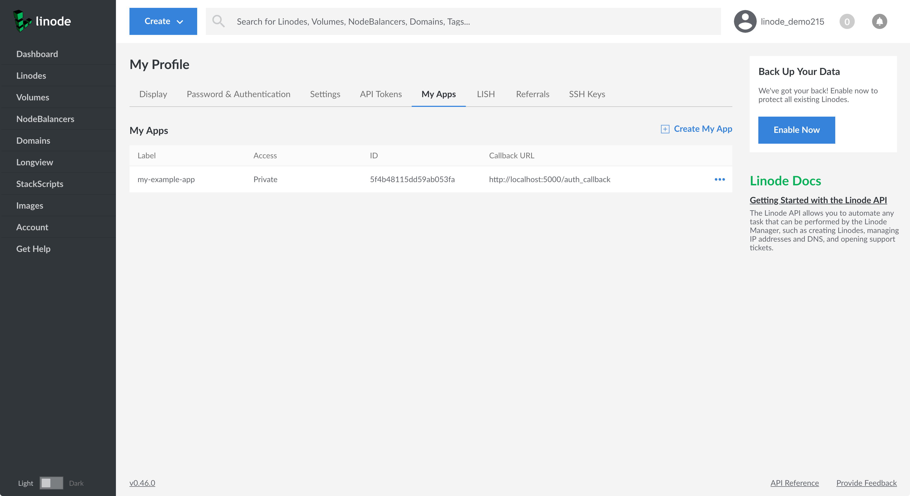
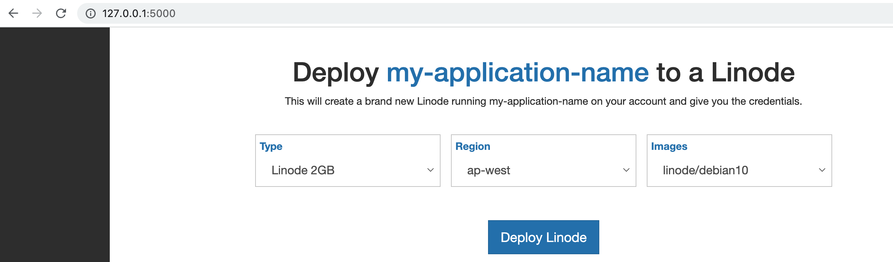

Linode supports the OAuth 2 authorization protocol. OAuth 2 allows a user to safely grant a third-party app permission to act on their behalf. This means that a user could authorize an app to access data and / or make changes to their Linode account and services that are exposed by the [Linode APIv4](/docs/api/). For example, an app could create or destroy Linodes, manage a NodeBalancer, or alter a domain.

This guide will show you how to create a simple OAuth application using [Flask](http://flask.pocoo.org/) and the [Linode Python API library](https://linode-api4.readthedocs.io/en/latest/index.html). This app allows a user to log in with their Linode account and create a Linode with a StackScript. The complete code for this example is available in the [Linode APIv4 Python library example](https://github.com/linode/linode_api4-python/tree/master/examples/install-on-linode) repository.

## Before You Begin

1. Normally, in order to create an OAuth app with Linode your server must have HTTPS enabled. The only exceptions to this rule are `localhost` addresses, which can use HTTP. As this guide is just a primer and is not intended to supply production ready code, we will be working with a local workstation, using `localhost`. If you choose to create an app for production, you will need to generate SSL certificates for HTTPS access.

1. Ensure that Python 3 is installed on your workstation.

## Obtaining a Client ID and a Client Secret

In order for Linode to verify the identity of your app, called a *client*, you will need to generate a set of credentials, specifically a client ID and a client secret.

1.  Log in to the [Cloud Manager](https://cloud.linode.com).

2.  Click on your username at the top of the screen and select **My Profile**.

    

3.  Select the **OAuth Apps** tab:
1. From there, click on the **Add an OAuth App**. You will be prompted to supply a label for your app and a callback URL. We will discuss the role of the callback URL in depth [later in this guide](#manage-the-oauth-2-callback-url). For now you can supply the following URL:

        http://localhost:5000/auth_callback

    Leave *Public* unchecked and click **Create**.

    

1. A window will appear with your client secret. Copy this down somewhere secure, as once you exit this window you will not be able to retrieve the client secret again, and will be forced to generate a new one.

      

1. Once you exit the client secret window your app will appear as part of a list of apps. Note your client ID, as this is the last piece of information you will need to verify your app's identity.

    

In summary, you should have these three bits of information, with values similar to the ones provided here:

- **Client ID**: ce571a8cdad1ba4a0a7d
- **Client Secret**: fab8e2222e83b9b2f50a76012122ec20a5acb005ed088f3fccda2c9c2c4e1cbd
- **Callback URL**: http://localhost:5000/auth_callback

## OAuth 2 Authentication Exchange

The OAuth 2 workflow is a series of exchanges between your third-party app and Linode. Below is an explanation of these exchanges.

1.  The end user visits your client application's website and attempts to login.
1.  Your client application redirects the end user to the authentication server ([https://login.linode.com](https://login.linode.com/login)) with your client application’s client ID and requested OAuth scopes, which appear in the URL of the login page.
1.  The end user inputs their username and password to the authorization server and authorizes the login.
1.  The authorization server redirects the end user back to your client application with a temporary authorization code (sometimes called an exchange code) in the URL.
1.  The client application issues a POST request to the authentication server containing the authorization code and the client application’s client secret.
1.  The authentication server responds to the client application with a newly issued OAuth access token.

In the following sections you will write the code to perform each one of these steps, using the Linode Python API library.

## Setup Your Development Environment

1. Create a project folder and move into that folder.

        mkdir ~/linode-oauth-project && cd ~/linode-oauth-project

1. For this project, you will need to use pip to download and install the required Python libraries. Install pip if you do not already have it:

        apt install python-pip

1. Install the required Python libraries:

        pip install flask flask-session linode_api4


## Configure Your App

In a text editor, create a file named `config.py`. Add the following variables and values, being sure to change the values to your own.

The StackScript used in this example is for demo purposes. To explore other available StackScripts, visit the [Linode StackScript Library](https://www.linode.com/stackscripts). Note that the `stackscript_id` does not have quotation marks around it. The `secret key` is used for serializing session data, and should be a value only you know.

```file {title="config.py"}
client_id = 'ce571a8cdad1ba4a0a7d'
client_secret = 'fab8e2222e83b9b2f50a76012122ec20a5acb005ed088f3fccda2c9c2c4e1cbd'
stackscript_id = 320826
application_name = 'my-application-name'
secret_key = 'my-secret-key'
```

## Author an OAuth2 App

In this section, you will write the code for the app.

### Include Imports

Ensure you are in the `linode-oauth-project` directory and create and open a file called `app.py` in the text editor of your choice. Include the following libraries:

```file {title="app.py" lang="python"}
import re
from flask import Flask, redirect, request, render_template, session, send_from_directory
from flask_session import Session
from linode_api4 import (LinodeClient, LinodeLoginClient, StackScript, Image, Region, Type, OAuthScopes)

import config
```

### Set Up Flask and Session Key

Copy in the following code to set up Flask and the session secret key:

```file {title="app.py" lang="python"}
...

app=Flask(__name__)
app.config['SECRET_KEY'] = config.secret_key
```

### Create a Function to Return the Linode Login Client

In `app.py` add the following function to return the [LinodeLoginClient class](https://linode-api4.readthedocs.io/en/latest/linode_api4/login_client.html?highlight=linode_login_client). The LinodeLoginClient class is the library's OAuth interface. Note that we are passing the `client_id` and `client_secret` parameters from our `config.py` file to the class:

```file {title="~/linode-oauth-project/app.py" lang="python"}
...

def get_login_client():
    return LinodeLoginClient(config.client_id, config.client_secret)
```

### Create an Index Route
In Flask you can create HTTP endpoints with *routes*. The index route, defined in the code below at the document root `/`, will be the route the user will see when they navigate to `http://localhost:5000/`. This route will be responsible for displaying the available Linode plan types, the available regions, and the StackScript-compatible images that a user will choose from when creating their new Linode.

To query a list of available plan types and regions you can use the [LinodeClient class](https://linode-api4.readthedocs.io/en/latest/linode_api4/linode_client.html?highlight=LinodeClient#linodeclient-class), which is an interface for Linode's APIv4. Viewing the Linode plan types and regions does not require any sort of authorization, so you can provide a dummy value of `no-token` to instantiate the class:

```file {title="~/linode-oauth-project/app.py" lang="python"}
...

@app.route('/')
def index():
    client = LinodeClient('no-token')
    types = client.linode.types(Type.label.contains("Linode"))
    regions = client.regions()
    stackscript = StackScript(client, config.stackscript_id)
    return render_template('configure.html',
        types=types,
        regions=regions,
        application_name=config.application_name,
        stackscript=stackscript
    )
```

It is important to note that the two API queries in the above code are slightly different from one another. The `client.regions` method is a top-level method, just as it appears in the [Linode API](/docs/api/regions/#regions-list). The `client.linode.types` method, on the other hand, is part of the Linode group, which is a collection of methods that deal with Linodes. Again, this is because Linode endpoints are grouped that way in the [API](/docs/api/linode-types/#types-list). Some methods in the Linode Python library are top level, such as `domain_create`, while others, like `networking.ip_assign`, are part of a group. For more information on the top-level methods and groupings, consult the [library documentation](https://linode-api4.readthedocs.io/en/latest/linode_api4/linode_client.html#grouping).

In addition to querying the API, the above route also renders the `configure.html` template by passing it the types, regions, application name, and StackScript object. The StackScript object contains a list of StackScript compatible images. We will cover templating in a later section.

### Create a Login Route

Next, create a login route in `app.py`. This route will perform two functions. First, it will serialize the user's plan type, region, and image selections into the session.

Second, this route will redirect the user to Linode's login page where they will be prompted to authorize your client app and the *scopes* you have requested for it. Scopes are sets of permissions that define the access level of your client app. For instance, to create a Linode, your end user must authorize the `OAuthScopes.Linodes.create` scope.

```file {title="~/linode-oauth-project/app.py" lang="python"}
...

@app.route('/', methods=["POST"])
def start_auth():
    login_client = get_login_client()
    session['dc'] = request.form['region']
    session['distro'] = request.form['distribution']
    session['type'] = request.form['type']
    return redirect(login_client.generate_login_url(scopes=OAuthScopes.Linodes.create))
```

When the user returns to your app from the Linode login page, they will be directed to the callback URL.


Below is a list of available scopes:

- OAuthScopes.Linodes
- OAuthScopes.Domains
- OAuthScopes.StackScripts
- OAuthScopes.Users
- OAuthScopes.NodeBalancers
- OAuthScopes.Tokens
- OAuthScopes.IPs
- OAuthScopes.Tickets
- OAuthScopes.Clients
- OAuthScopes.Account
- OAuthScopes.Events
- OAuthScopes.Volumes

Each scope is broken into five permissions: `view`, `create`, `modify`, `delete`, and `all`. The `all` permission encompasses the other four permissions.


### Manage the OAuth 2 Callback URL

The OAuth 2 callback URL has two main responsibilities. Its first responsibility is to help prove the identity of the client application. When a user attempts to log in to Linode through OAuth, instead of redirecting the user back to the page they came from, Linode's OAuth implementation matches the client ID to the callback URL you have registered with your app on Linode's system. This ensures that a nefarious third party can't just steal the client ID, which is public, and attempt to authorize their own app with it.

The callback URL's second responsibility is to kick off the process of exchanging an authorization code for an access token. This second process is done over POST, and so it doesn't require the user to physically leave the page they are returned to after they log in to Linode. Now you will write the code that satisfies this second responsibility.

In `app.py`, add the following lines:

```file {title="~/linode-oauth-project/app.py" lang="python"}
...

@app.route('/auth_callback_test')
def auth_callback_test():
    code = request.args.get('code')
    login_client = get_login_client()
    token, scopes, _, _ = login_client.finish_oauth(code)

    # ensure we have sufficient scopes
    if not OAuthScopes.Linodes.create in scopes:
        return render_template('error.html', error='Insufficient scopes granted to deploy {}'\
                .format(config.application_name))

    (linode, password) = make_instance(token, session['type'], session['dc'], session['distro'])

    get_login_client().expire_token(token)
    return render_template('success.html',
        password=password,
        linode=linode,
        application_name=config.application_name
    )
```

Let's take a look at what each of the parts of this section does.

First, a route is defined for the callback with `@app.route()`, then a function called `auth_callback` is defined that will run whenever this route is accessed:

```file {title="~/linode-oauth-project/app.py" lang="python"}
...
@app.route('/auth_callback')
def auth_callback():
...
```

When the user is returned to the callback URL, an authorization code is appended to the URL. The variable `code` is set to retrieve this value from the URL's request arguments:

```file {title="~/linode-oauth-project/app.py" lang="python"}
...
    code = request.args.get('code')
...
```

Then you retrieve an instance of the LinodeLoginClient class:

```file {title="~/linode-oauth-project/app.py" lang="python"}
...
    login_client = get_login_client()
...
```

Once you have the LinodeLoginClient class, you can pass the authorization code to the `finish_oauth` method, which is a helper method that will manage the authorization code to OAuth token exchange. This method returns an OAuth token, and the scopes the user has agreed upon.

```file {title="~/linode-oauth-project/app.py" lang="python"}
...
    token, scopes, _, _ = login_client.finish_oauth(code)
...
```

The next section compares the scopes your app requested from the user to the scopes returned by Linode's OAuth login page. If the returned scopes do not include the correct scopes, in this case the `OAuthScopes.Linode.create` scope, then an error template is rendered and an error message is displayed:

```file {title="~/linode-oauth-project/app.py" lang="python"}
...
    # ensure we have sufficient scopes
    if not OAuthScopes.Linodes.create in scopes:
        return render_template('error.html', error='Insufficient scopes granted to deploy {}'\
                .format(config.application_name))
...
```

Once your app has determined that it has the correct permissions, it creates the Linode using the Linode plan type, the region, and the image that the app serialized into session storage. You will create the `make_instance` function in [the next step](#create-a-function-to-deploy-a-linode). The `make_instance` function returns the `linode` object, which contains the Linode's label, group, and IP address, and the function also returns a randomly generated password:

```file {title="~/linode-oauth-project/app.py" lang="python"}
...
    (linode, password) = make_instance(token, session['type'], session['dc'], session['distro'])
...
```

Once the Linode has been created, the app expires the OAuth access token. Expiring tokens after use is a strong security measure but if your app is performing many actions on behalf of the user, you might find that time-based expiration scheme is more suitable to your needs. The app then renders the success template by passing it the `linode` object, the password, and application name:

```file {title="~/linode-oauth-project/app.py" lang="python"}
...
    get_login_client().expire_token(token)
    return render_template('success.html',
        password=password,
        linode=linode,
        application_name=config.application_name
    )
```

### Create a Function to Deploy a Linode

Now, create the `make_instance` function that you referenced above:

```file {title="~/linode-oauth-project/app.py" lang="python"}
...

def make_instance(token, type_id, region_id, distribution_id):
    client = LinodeClient('{}'.format(token))
    stackscript = StackScript(client, config.stackscript_id)
    (linode, password) = client.linode.instance_create(type_id, region_id,
            group=config.application_name,
            image=distribution_id, stackscript=stackscript.id)

    if not linode:
        raise RuntimeError("it didn't work")
    return linode, password
```

The `make_instance` function takes an OAuth access token, the type ID, the region ID, and the image (Linux distribution) ID as parameters. It creates an instance of the LinodeClient class, and unlike the instance of LinodeClient used earlier in the guide, this one requires an OAuth token because you will be using it to create a Linode. The function then creates a Linode using the `linode.instance_create` method, returning the `linode` object and the password.

Finally, if there was an error with the creation of the Linode, the `if not linode` statement will raise a runtime error.

### Set the __name__ Variable

At the end of your `app.py`, paste in the following code to make sure you can run your app:

```file {title="~/linode-oauth-project/app.py" lang="python"}
if __name__ == '__main__':
    app.debug=True
    app.run()
```

## Create App Templates

Now that you have written the backend code for your app, you'll need to create a frontend user interface. Begin by creating  a `templates` directory in your project directory and moving into it:

    mkdir ~/linode-oauth-project/templates && cd ~/linode-oauth-project/templates

Using your preferred text editor, create and open `base.html`. This will be the base template from which your other templates will inherit their stylesheets and JavaScript files:

```file {title="~/linode-oauth-project/templates/base.html" lang="html"}
<html>
<head>
    <title>Install On Linode</title>
    <link rel="stylesheet" href="https://maxcdn.bootstrapcdn.com/bootstrap/3.3.6/css/bootstrap.min.css"
        integrity="sha384-1q8mTJOASx8j1Au+a5WDVnPi2lkFfwwEAa8hDDdjZlpLegxhjVME1fgjWPGmkzs7" crossorigin="anonymous">
    <style>
        body{
            text-align: center;
            background-color: #333333;
        }
        .form-group{
            display: inline-block;
            text-align: left;
            width: 250px;
            border: 1px solid #cccccc;
            margin: 5px;
            padding: 5px;
        }
        .form-group label{
            color: #337ab7;
        }
        .form-group select{
            font-size: 16px;
            outline: none;
            border: 0px solid #000000;
            box-shadow: inset 0 1px 1px rgba(0,0,0,0);
            -webkit-box-shadow: inset 0 1px 1px rgba(0,0,0,0);
        }
        .form-group select:focus{
            box-shadow: inset 0 1px 1px rgba(0,0,0,0);
            -webkit-box-shadow: inset 0 1px 1px rgba(0,0,0,0);
        }
        .btn-lg{
            border-radius: 0px;
            margin-top: 20px;
        }
        .row{
            margin-bottom: 20px
        }
        .pop{
            color: #337ab7;
            font-weight: bold
        }
        code{
            color: #337ab7;
            background-color: #eeeeee
        }
        .boxy{
            border: 1px solid #cccccc;
            width: 400px;
            background-color: #f9f9f9;
            margin: auto;
            padding: 10px;
        }
    </style>
</head>
<body>
    <div class='container' style='background-color: white; border-left: grey; border-right: grey; height: 100%; padding: 20px;'>
        
        
    </div>

    <script src="https://ajax.googleapis.com/ajax/libs/jquery/1.11.3/jquery.min.js"></script>
    <script src="https://maxcdn.bootstrapcdn.com/bootstrap/3.3.6/js/bootstrap.min.js"
        integrity="sha384-0mSbJDEHialfmuBBQP6A4Qrprq5OVfW37PRR3j5ELqxss1yVqOtnepnHVP9aJ7xS"
        crossorigin="anonymous"></script>
</body>
```

The important thing to note in the above template is the Jinja2 templating tags. They are:

    
    

As you will see, any template that extends the `base.html` template and includes code between the opening and closing `content` block, will render the code laid out by `base.html`.

Create a file called `configure.html`, which will be the UI a user will see when they reach the document root endpoint (`/`). Copy in the following code:

```file {title="templates/configure.html" lang="html"}


    <form method="POST">
        <div class='row'>
            <h1>Deploy <span style="color: #337ab7;">{{application_name}}</span> to a Linode</h1>
            <p>
                This will create a brand new Linode running {{application_name}} on your
                account and give you the credentials.
            </p>
        </div>
        <div class='row'>
            <div class='form-group'>
                <label for='type'>Type</label>
                <select name='type'i id='type' class='form-control'
                    onblur="blurring(this)" onfocus="focusing(this)">
                    
                        <option value="{{s.id}}">{{s.label}}</option>
                    
                </select>
            </div>
            <div class='form-group'>
                <label for='region'>Region</label>
                <select name='region' id='region' class='form-control'
                    onblur="blurring(this)" onfocus="focusing(this)">
                    
                        <option value="{{o.id}}">{{o.id}}</option>
                    
                </select>
            </div>
            <div class='form-group'>
                <label for='distribution'>Images</label>
                <select name='distribution' id='distribution' class='form-control'
                    onblur="blurring(this)" onfocus="focusing(this)">
                    
                        <option value="{{d.id.id}}">{{d.id.id}}</option>
                    
                </select>
            </div>
        </div>
        <div class='row'>
            <input type="submit" value="Deploy Linode" class='btn btn-primary btn-lg'/>
        </div>
    </form>
    <script>
        function focusing(ele){
            ele.parentElement.style.borderColor = "#337ab7";
        }
        function blurring(ele){
            ele.parentElement.style.borderColor = "#cccccc";
        }
    </script>

```

Here the template begins with two statements: `` and a `` statement. These two tags tell Jinja2 to extend the code within `base.html`, and to place everything within ` ... ` in `configure.html` between the corresponding ` ... ` tags in `base.html`.

`configure.html` includes Jinja2 logic, with the inclusion of `for` statements like ``. These statements are like `for` statements in other languages, and are used to iterate over an array or list. In this example, it is iterating over the regions that [we passed to the template from the index route](#create-an-index-route). `configure.html` also contains variables, which are denoted by double curly brackets: `{{ s.id }}`.

Create another file called `error.html`. This will be the template that appears whenever there is an error in the Linode deployment. Copy in the following code:

```file {title="templates/error.html" lang="html"}


    <div class='row'>
        <h1 class="pop">Error</h1>
        <p>{{error}}</p>
    </div>
    <div class='row' style='margin-top: 20px'>
        <a href='/' class='btn btn-lg btn-default'>Try Again</a>
    </div>

```

This template works the same way that `configure.html` does, by extending `base.html` and providing its own `content` block.

Lastly, create another file called `success.html`. This file follows the pattern set by `configure.html` and `error.html`, and will present the user with a confirmation message whenever a Linode is successfully created. This message includes the Linode's label, group, IP address, and password:

```file {title="templates/success.html" lang="html"}


    <div class='row'>
        <h1>Success!</h1>
        <p>{{application_name}} has been deployed to <span class="pop">{{linode.label}}</span> in the {{linode.group}} group.</p>
    </div>
    <div class='row'>
        <div class='boxy'>
            <p>You can access your Linode with the following command:</p>
            <code>ssh root@{{linode.ipv4[0]}}</code>
            <br />
            <br />
            <p>Your root password is:</p>
            <code>{{password}}</code>
        </div>
    </div>

```

## Run Your App

You are now ready to run your app. Change back to your project's main directory:

    cd ~/linode-oauth-project

Run the `app.py` script:

    python3 app.py

Open your browser to the following URL:

    http://localhost:5000/

You should be greeted with your new app. Select a plan, a region, and an image to deploy a Linode using the Linode API Python library.



## Next Steps

The app you've created shows off some of the aspects of the Linode API Python library. You can use `LinodeLoginClient` to authorize your OAuth app with the appropriate scopes, and can create Linodes through the use of `LinodeClient`.

In extending this app, you might want to add multiple functionalities, like creating NodeBalancers from a list of available Linodes, or managing domains. To achieve this goal you'll probably want to separate the login logic from the Linode creation logic. One way to do this would be store the OAuth token in the session, implementing a time-based expiration mechanism to expire your tokens instead.