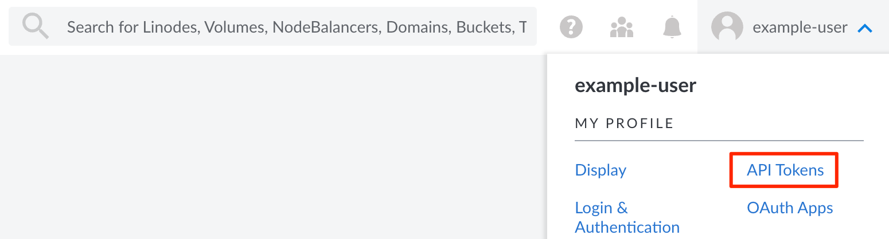
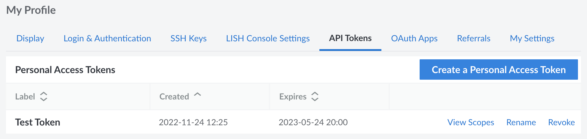
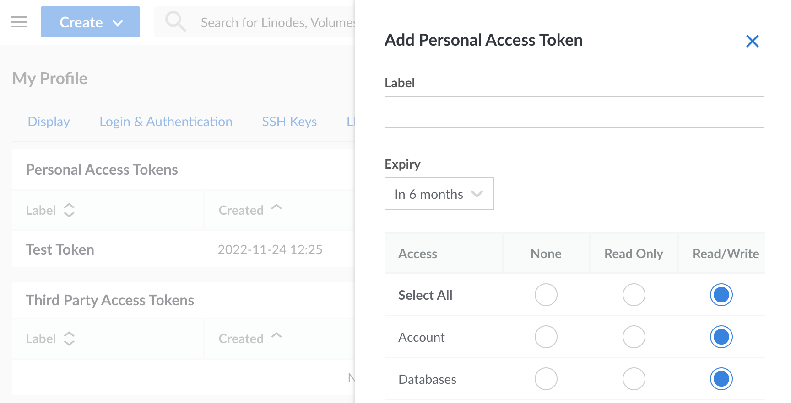
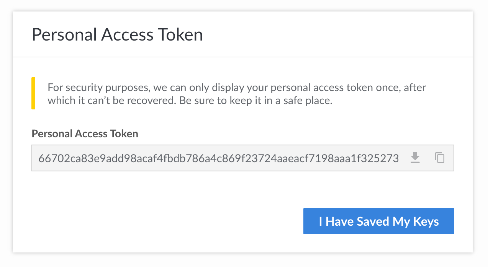
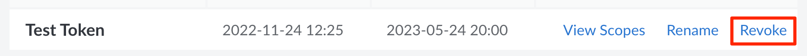

## View Personal Access Tokens

1. Log in to the [Cloud Manager](https://cloud.linode.com)

1. Click on your username at the top of the screen and select **API Tokens** under the *My Profile* section.

    

This displays the **API Tokens** tab on the **My Profile** page.

Any personal access tokens you have previously created on your Linode account are listed here. Alongside each token is the date it was created, the date it expires, and links to view the scopes, rename the token, or revoke the token.

## Create an API Token

Whenever you need to authorize API access to an application or service, you should create a new personal access token. This token should only allow the level of access needed by the application.

1. Log in to the [Cloud Manager](https://cloud.linode.com) and navigate to the API Tokens page of the My Profile section. See [View Personal Access Tokens](#view-personal-access-tokens).

1. Click the **Create a Personal Access Token** button to display the *Add Personal Access Token* panel.

    

1. Enter a **Label** for this new token. Choose a label that allows you to identify the token and understand its intended use.

1. In the **Expiry** field dropdown menu, select a timeline for when the new token expires. You can optionally allow this token to never expire. *This cannot be changed once the token is created.*

1. Select the level of access this token should have to each product or service with which the Linode API interfaces. This can be *None*, *Read Only*, or *Read/Write* (for full access to that service). *This cannot be changed once the token is created.*

1. Click the **Create Token** button to generate the new personal access token. A dialog box opens and displays your new personal access token. Save this in a safe place, such as a password manager. **After closing this prompt, you are not able to view the token string again.**

    

## Revoke a Personal Access Token

If you wish to decommission a token or think it may have been compromised, you can revoke access. Once revoked, any application using this token will no longer be authorized to access your account through the Linode API.

1. Log in to the [Cloud Manager](https://cloud.linode.com) and navigate to the API Tokens page of the My Profile section. See [View Personal Access Tokens](#view-personal-access-tokens).

1. Find the token you wish to revoke and click the corresponding **Revoke** button, which may be visible within the ***more options ellipsis*** menu.

    

1. A popup appears asking you to confirm that you wish to revoke this token. Click the **Revoke** button to delete the token and revoke access to any application using that token.