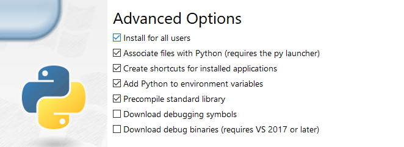

## In This Guide

At the time of this writing, the Linode CLI is currently able to be fully supported by both Python 2.x and Python 3.x depending on user preference and needs. That being said, as Python 2 has [reached it's end-of-life in early 2020](https://www.python.org/doc/sunset-python-2/#:~:text=We%20have%20decided%20that%20January,a%20security%20problem%20in%20it.), it is strongly recommended that users upgrade to the latest version of the CLI supported by python3 as soon as they are able.

In this guide, steps are provided to uninstall the version of the Linode CLI that relies on Python 2, and immediately replace it with the version of the Linode CLI built with Python 3.

## Uninstalling the Python 2 CLI

Before proceeding, users should first uninstall the Python 2 based version of the Linode CLI from their Linode using python 2's package manager `pip`:

```command
sudo pip uninstall linode-cli
```

While uninstalling, you may be prompted to agree to the removal of some configuration files. Select `Y` to proceed and complete the removal process.

## Installing the Python 3 Linode CLI

The upgrade path for the Python 3 Linode CLI depends on the Distro and package manager that you're using.

### Ubuntu/Debian

1. Ensure that all available packages are up to date:

    ```command
    sudo apt update
    ```

1. Install python3 and pip3:

    ```command
    sudo apt install python3 && sudo apt install python3-pip
    ```

1. Install the Linode CLI using pip3:

    ```command
    sudo pip3 install linode-cli
    ```

### CentOS/RHEL Stream and Fedora

1. Ensure that all available packages are up to date:

    ```command
    dnf upgrade
    ```

1. Install python3 and pip3:

    ```command
    sudo dnf install python3 && sudo dnf install python3-pip
    ```

1. Install the Linode CLI using pip3:

    ```command
    sudo pip3 install linode-cli
    ```

### CentOS 7

1. Ensure that all available packages are up to date:

    ```command
    sudo yum update
    ```

1. Install python3 and pip3:

    ```command
    sudo yum install python3 && sudo yum install python3-pip
    ```

1. Install the Linode CLI using pip3:

    ```command
    sudo pip3 install linode-cli
    ```

### Windows 10

1. Download the latest stable Windows package for python3 for your system at [Python's Downloads Page](https://www.python.org/downloads/windows/).

1. Open up the installer `.exe` to begin the python installation process using Window's GUI.

1. Before proceeding, ensure that your version of Python is added to PATH by checking the box which enables this option:

    

1. Select the **Customize Installation** option to proceed.

1. Ensure that `pip` all desired optional features are selected before proceeding to the next step. The `pip` installation is required by the Linode CLI.

1. In the next step, ensure that the **Install for all users** option is enabled. Your configuration should reflect the following:

    

1. Select `Next` to proceed with the installation. Once the installation is complete, a message will confirm Python3 was successfully installed will appear that can be safely closed.

1. Open the windows command prompt and enter the following command to complete installation of the Linode CLI:

    ```command
    pip3 install linode-cli
    ```

### Mac OSx

By default, python3 should already be installed and configured on the latest versions of Mac OSx. If for whatever reason it is not, you can use `brew` to install python3 which will additionally include `pip`:

```command
brew install python3
```

### Next Steps

To confirm the Linode CLI has successfully been installed, the following command may be entered:

```command
linode-cli --version
```

If your installation was successful, the latest version of Linode CLI will be outputted.

Once the Linode CLI is installed, no further steps should be needed for configuration as both python based versions of the CLI will use a configuration file that will persist between the change. If for whatever reason you need to reconfigure the Linode CLI, the following command may be entered:

```command
linode-cli configure
```

For more information on how to use the Linode CLI, see our [Overview Guide](/docs/products/tools/cli/get-started/)