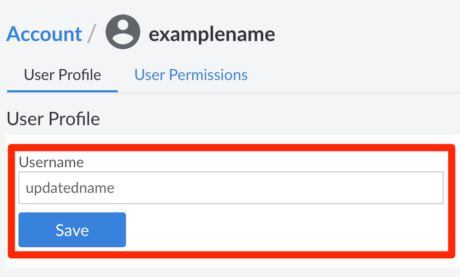

You can update a username, including your own, from the Linode Cloud Manager.

1.  Click the **Account** link in the sidebar.
1.  Click the **Users & Grants** tab.
1.  Locate the user in the list and click on their **User Profile** link.
1.  Enter a new username in the **Username** field.

    

1.  Click **Save**.
