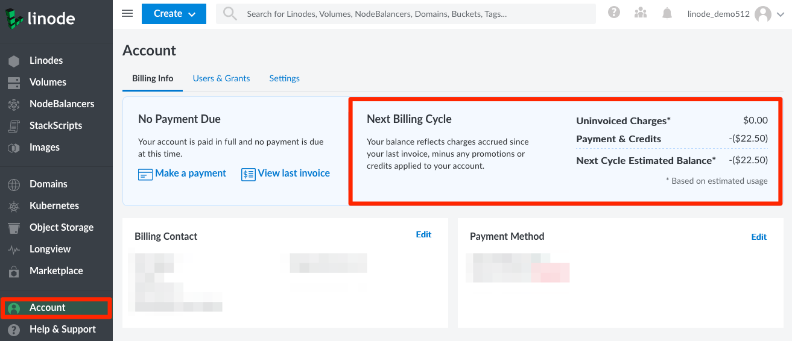

To find the amount of available credit that you have:

1. Click on the **Account** link from the sidebar menu to access the **Billing Info** page.

1. At the top of the page, the **Next Billing Cycle** section lists any remaining account credit under **Payment & Credits**.

