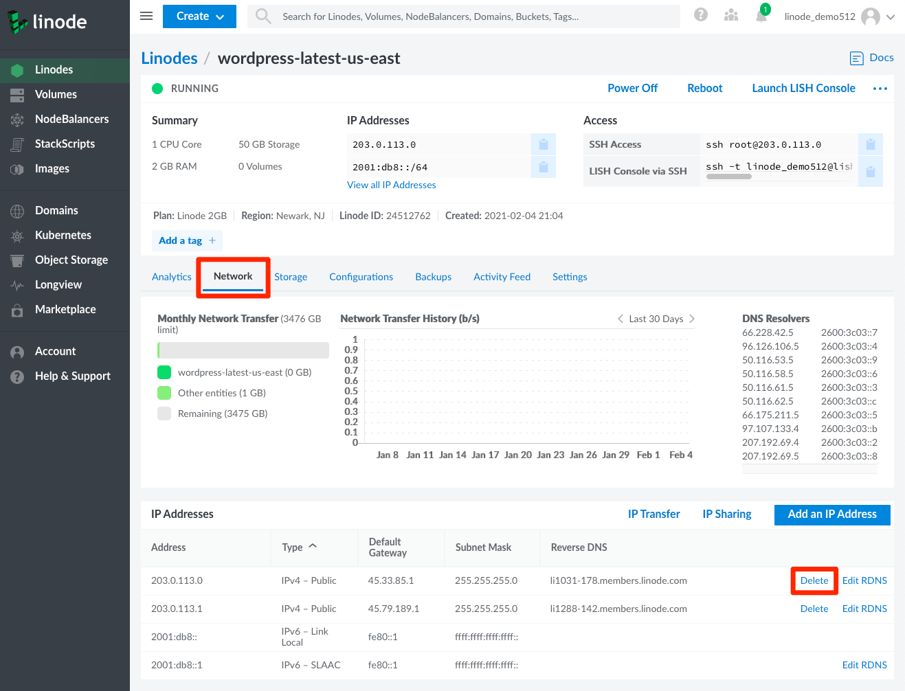

You can delete a public IP addresses within the Cloud Manager from the **Network** tab in a Linode's details page.

1.  Click **Linodes** from the sidebar menu.

1.  Choose the Linode you wish to modify to enter the Linode detail screen. Then, click on the **Network** tab. Your IPv4 and IPv6 addresses are listed here.

1.  In the **IP Addresses** section, next to the public IPv4 address you want to delete, click **Delete**.

    

1.  A confirmation popup appears where you can confirm or cancel the operation.

    
You must have at least one public IP on a Linode. If you attempt to delete the last public IP on a Linode, an error message appears *after* you confirm the deletion.

