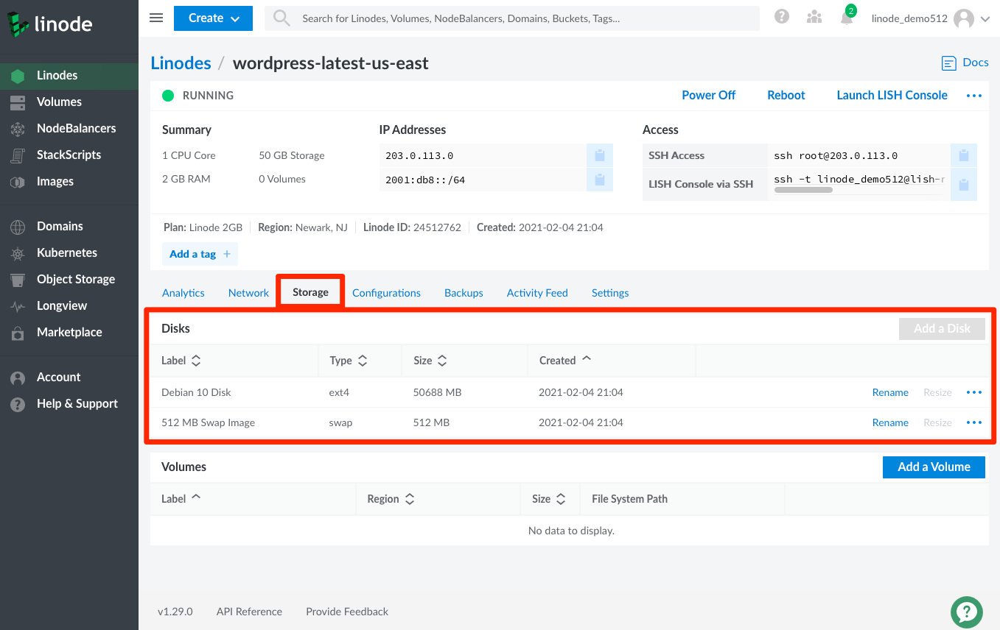

You can find your Linode's disks in the **Storage** tab of the Linode's detail page.

1.  Click the **Linodes** link in the sidebar menu and select the Linode whose disks you'd like to see.

1.  Then click the **Storage** tab. The disks are located in the **Disks** panel. Here you can add a disk if your Linode has unallocated disk space. For each individual disk, you can rename or resize the disk by clicking the respective **Rename** or **Resize** options, or click the **more options ellipses** to get a drop down menu for options such as `Imagize`, `Clone`, and `Delete`. On smaller views, the `Rename` and `Resize` options are also accessible from the **more options ellipses**. See the [Linode Disks and Storage](/docs/guides/linode-disks/) guide for additional details and instructions.

    
