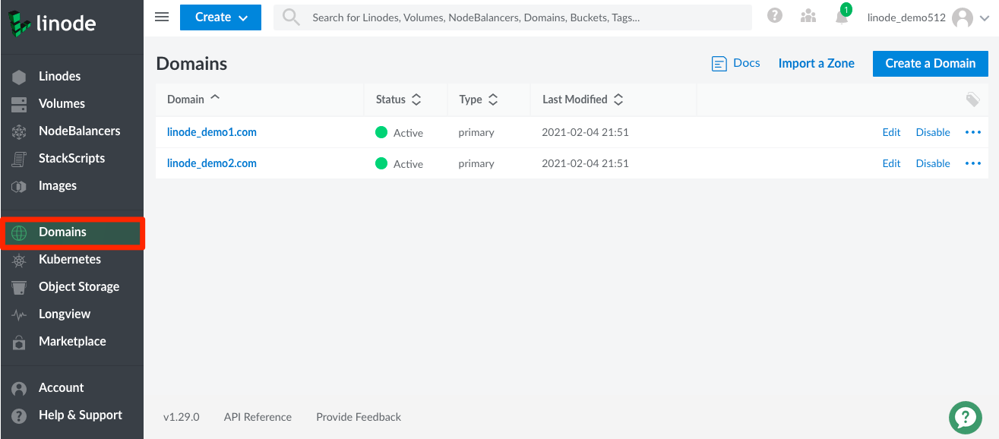

The DNS Manager allows you to control and manage your domains. You can access the DNS Manager by navigating to the **Domains** link in the Cloud Manager's sidebar.

For more information on Cloud Manager's DNS Manager, see the following guides:

- [DNS Manager](/docs/platform/manager/dns-manager/).
- [Common DNS Configurations](/docs/networking/dns/common-dns-configurations/)
- [Configure Your Linode for Reverse DNS](/docs/networking/dns/configure-your-linode-for-reverse-dns/)
