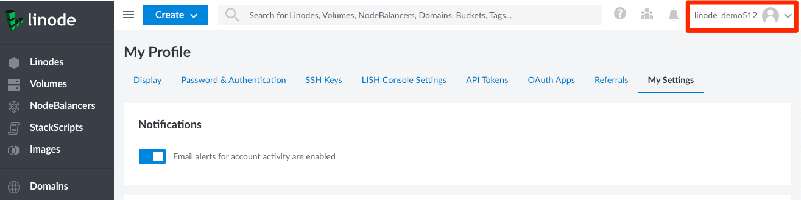

Email event notifications alert you when new events such as booting, shutting down, or updates to a Linode occur on your account. You can enable or disable email event notifications using the Cloud Manager.

Navigate to your profile by clicking on your username and select **My Settings**.

