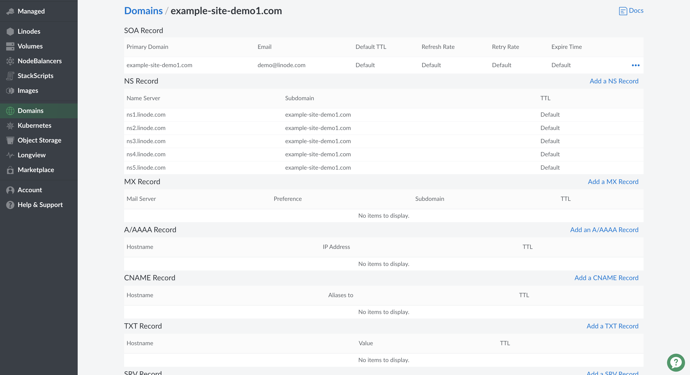
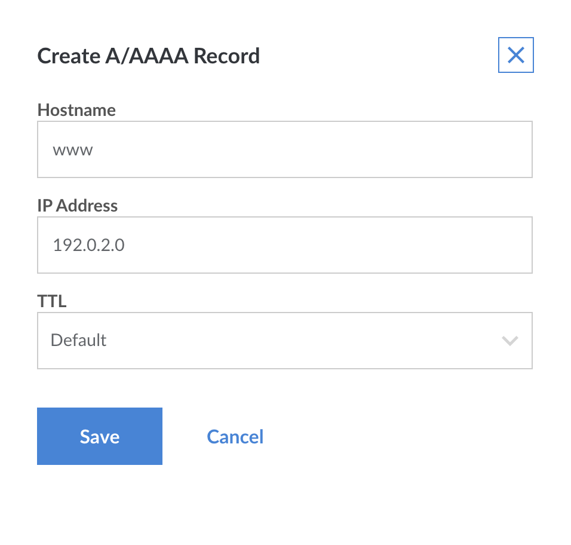

When you first create a domain, you'll need to add some DNS records. <!-- The DNS Manager can create some basic records to get you started when you create your domain zone, --> This section explains how to add your own records.

1.  Select a domain from within the **Domains** section of the Cloud Manager. The domain's detail page appears:

    

1.  The page is divided into different sections for each type of DNS record. Locate the section for the type of DNS record you want to add, then click **Add a Record**. The example below shows how to add an A/AAAA record.

    

    
The exact form fields will vary depending on the type of DNS record you select.


1.  Enter a hostname in the **Hostname** field.

1.  Enter the IP address of your server in the **IP Address** field. See [this quick answer page](/docs/quick-answers/linode-platform/find-your-linodes-ip-address/) to find your Linode's IP address.

1.  Select a time interval from the **TTL** menu. *TTL* stands for *time to live*, and affects how long DNS records are cached by DNS resolvers. When the designated time to live is reached, the resolver must query the authoritative name servers for new records.

1.  Click **Save**. It will only take a few minutes for new DNS records to become active.
