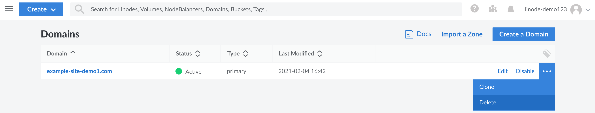

If one of your domain names has expired or if you want to start hosting it on another DNS provider, you should permanently delete the domain and all of its associated DNS records.

1.  From the **Domains** section of the Cloud Manager, find the domain you would like to delete and click its **more options ellipsis**.

1.  Select **Delete** to permanently delete the domain, including all associated DNS records. It will only take a few minutes for the changes to take effect.

    

    
Once deleted, you **MUST** delete the Linode nameserver entries from the domain at the registrar level. This is a very important step; if the entries are not deleted, someone could use your domain without your permission.

