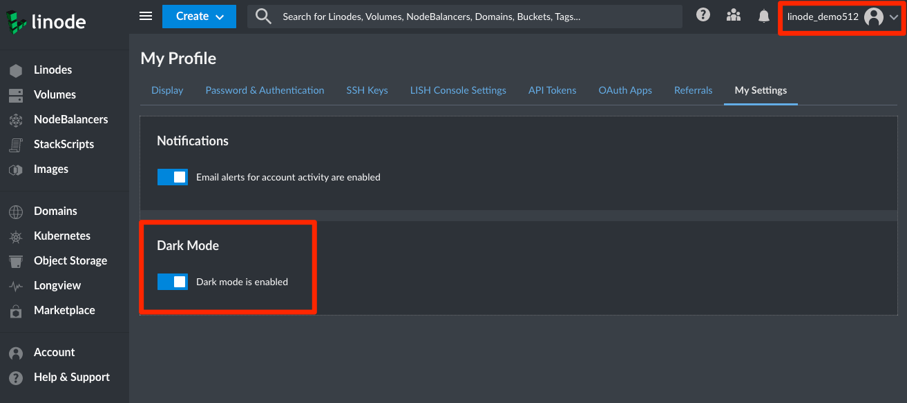
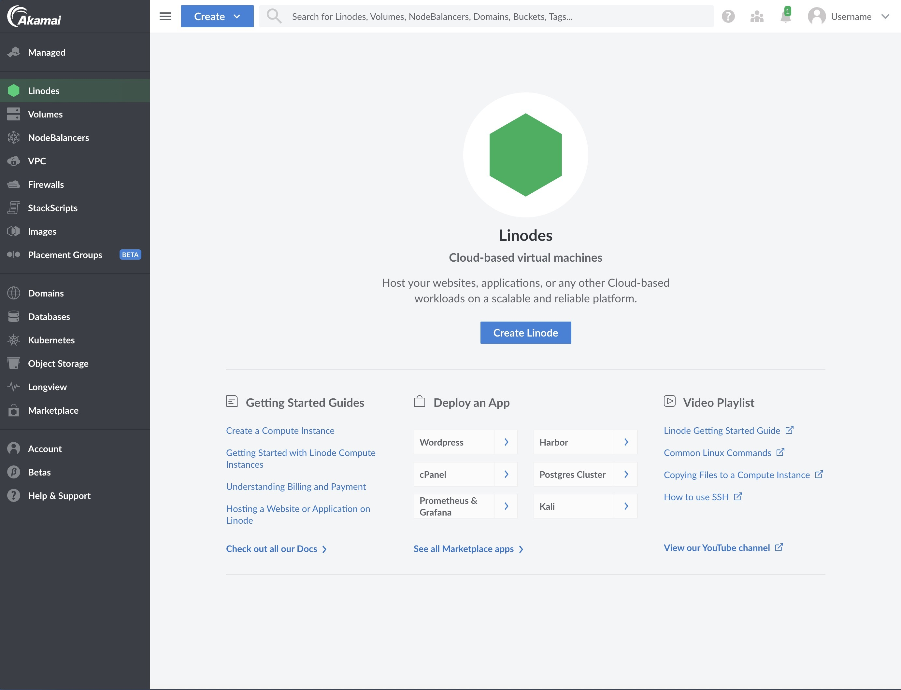
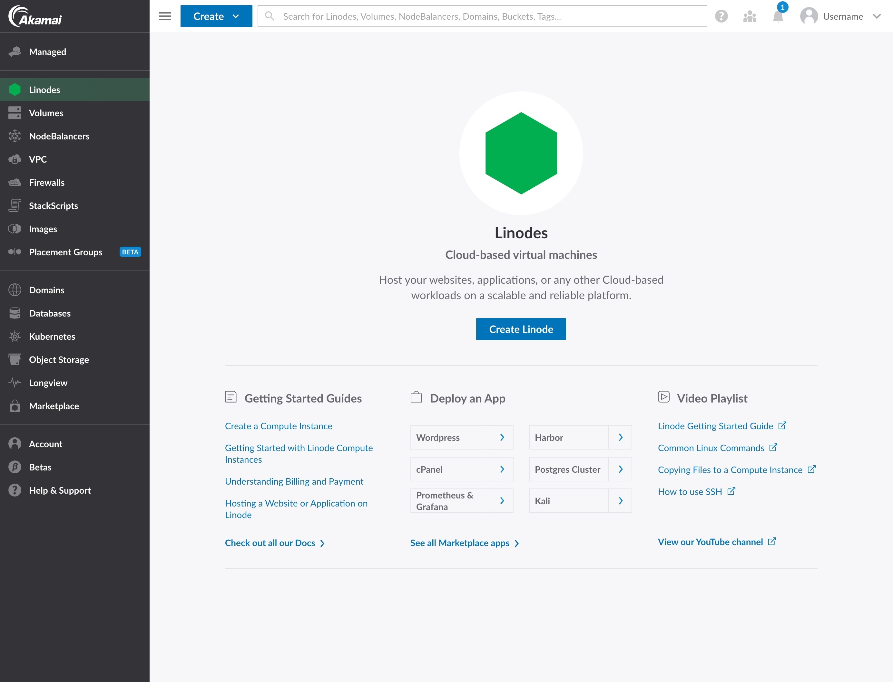
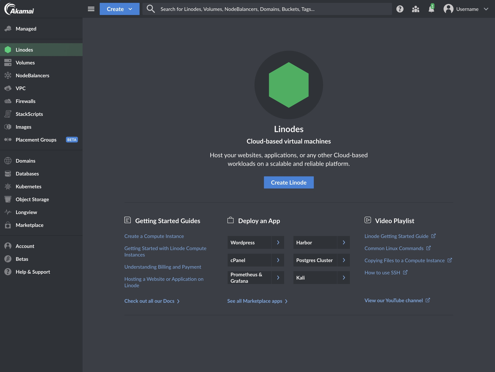
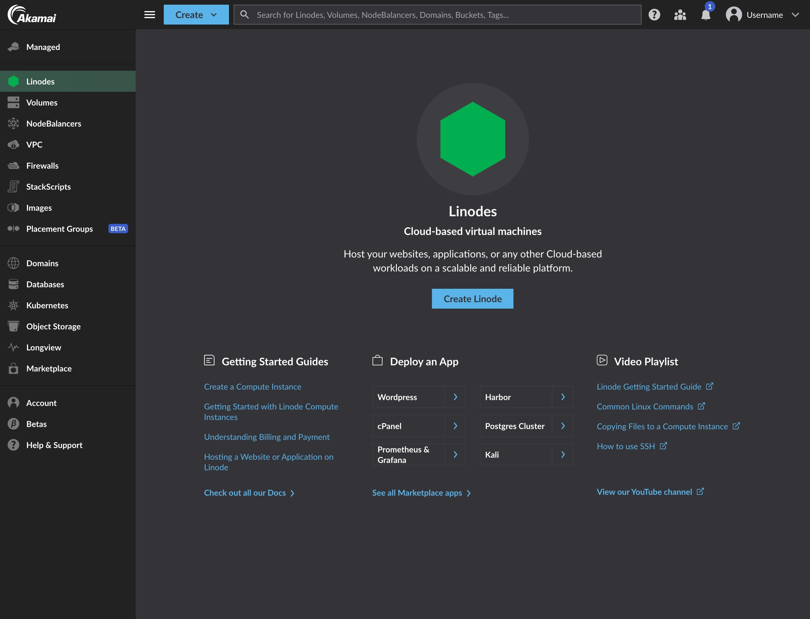

The [Cloud Manager](https://cloud.linode.com/) provides a user-friendly interface to manage your infrastructure, user accounts, billing and payments, and to open and track support tickets. You can easily create Linode instances, manage Kubernetes clusters, add backups to your Linodes, deploy Marketplace Apps, track event notifications, create Object Storage buckets, and more. The Cloud Manager is implemented solely atop our [public APIv4](/docs/api), which gives you access to all our latest products and services.

## In this Guide

This guide provides an overview of the features and services available in the Cloud Manager. Some of the topics that will be discussed are:

- An introduction to each section of the Cloud Manager, including links to related guides throughout our documentation library.
- The location of commonly used Cloud Manager features.
- Settings that might make your overall Cloud Manager experience better

## Linodes

{}

### Find Your Disks

{}

### Reboot Your Linode

{}

### Delete a Public IP Address

{}

## Volumes

{}

## Object Storage

{}

## NodeBalancers

{}

## Domains (DNS Manager)

{}

### Zone Files

The Cloud Manager automatically ensures that your Domain's zone file does not contain any errors when a Domain Record is created or updated.

- When creating a Zone File for a Domain, the [Linode API v4](/docs/api) checks for any errors that may exist. If an error is found, the Cloud Manager will respond with the corresponding error. This means that the Cloud Manager will not allow you to create an invalid zone file.

- Once your Domain and corresponding Zone File is created, you can use the `dig` command to further verify that each domain record contains the information you expect. It will take a few moments before a newly created domain record will show up when issuing the `dig` command.

        dig example.com
        dig example.com MX

    See the [Use dig to Perform Manual DNS Queries](/docs/guides/use-dig-to-perform-manual-dns-queries/) guide for more details on the `dig` command.

## Longview

{}

## Marketplace

{}

## Kubernetes

{}

## StackScripts

{}

## Images

{}

## Account (Management and Billing)

{}

### Find Credit Remaining

{}

### Printing an Invoice

{}

### Password Management

The Cloud Manager does not support forcing password expirations. Forcing password resets on a schedule is [bad practice from a security perspective](https://pages.nist.gov/800-63-FAQ/#q-b05). Current security research indicates that forced password changes do more harm than good. If you want to force password resets for users of your Linode account, we recommend using a password manager for this purpose.

## Tags

The Cloud Manager and [API v4](/docs/api) allow you to create tags to help organize and group your Linode resources. Tags can be applied to [Linode instances](#linodes), [Block Storage Volumes](#volumes), [NodeBalancers](#nodebalancers), and [Domains](#domains-dns-manager). See the [Tags and Groups](/docs/guides/tags-and-groups/) guide to learn how to create, apply, and search for tags.

## Events and Activity Feeds

Tasks performed using the Cloud Manager or other account specific tools like Linode’s [CLI](/docs/products/tools/cli/get-started/) or [API](https://www.linode.com/products/api/) will be logged to an individual Linode’s activity feed, or on your account’s [Events Page](https://cloud.linode.com/events). The events and activity pages are user accessible logs, or histories of events taking place on your account. They contain details regarding the most notable events affecting your Linodes, like reboots, shutdowns, migrations, and more.

For more details, see the [Understanding Events and Activity Feeds](/docs/products/tools/cloud-manager/guides/events-and-activity-feeds/) guide.

## My Profile

The **My Profile** section of Cloud Manager provides access to various settings related to your Linode account's profile. This area of Cloud Manager contains access to the following features and settings:

- [Changing your account's associated email address](/docs/products/platform/accounts/guides/change-user-email/) and timezone
- [Resetting your Account password](/docs/products/platform/accounts/guides/reset-user-password/)
- [Enabling two-factor authentication](/docs/products/platform/accounts/guides/user-security-controls/#2fa-two-factor-authentication)
- [Enabling Third Party Authentication (TPA)](/docs/guides/third-party-authentication/)
- Managing trusted devices
- [Adding and managing public SSH keys](/docs/products/platform/accounts/guides/manage-ssh-keys/)
- [Managing LISH authentication methods](/docs/products/compute/compute-instances/guides/lish/#add-your-public-key)
- [Adding and managing personal and third party API v4 access tokens](/docs/products/tools/api/get-started/#get-an-access-token)
- [Creating and managing OAuth Apps](/docs/products/tools/api/guides/create-an-oauth-app-with-the-python-api-library/#obtaining-a-client-id-and-a-client-secret)
- [Linode Referral Program](/docs/products/platform/billing/guides/referral-program/)
- Enable email alerts for account activity

### API Keys / API Tokens

{}

### OAuth Apps

{}

### Manage Email Event Notifications

{}

## Dark Mode

Cloud Manager provides a Dark Mode that you can toggle on and off depending on your preference.

1. Navigate to your profile by clicking on your username and select **My Settings**.

1. Toggle on **Dark Mode** to change the color scheme of the UI. Dark Mode is disabled by default.

## Accessibility

The Cloud Manager has been built with accessibility in mind. Currently, the Cloud Manager is actively being developed to achieve [WCAG 2.0 Level AA](https://www.w3.org/TR/WCAG20/).

We have received much helpful feedback from our users regarding accessibility. While we have addressed a lot of your feedback, this is still a work in progress and will be iterated upon with time. If you have comments or requests regarding accessibility, let us know by filling out our [feedback form](https://www.linode.com/feedback/).

## Experience Improvements

We're making improvements to the Linode Cloud Manager so that we can deliver a high-quality and consistent user experience across product families. These experience updates are driven by our new Akamai Core Design System.

*This section will be updated as we roll out additional experience improvements to the Cloud Manager. For a list of all changes to the Cloud Manager, review the [Cloud Manager changelog](https://github.com/linode/manager/releases).*

### July 2024

In early July, we've made minor branding changes to the Cloud Manager. As part of these changes, we've implemented higher color contrast to improve the accessibility of both text and interactive components. Review the screenshots below for a closer look of the changes.

| Previous Design | Updated Design&nbsp;&nbsp; |
| -- | -- |
|  |  |
|  |  |