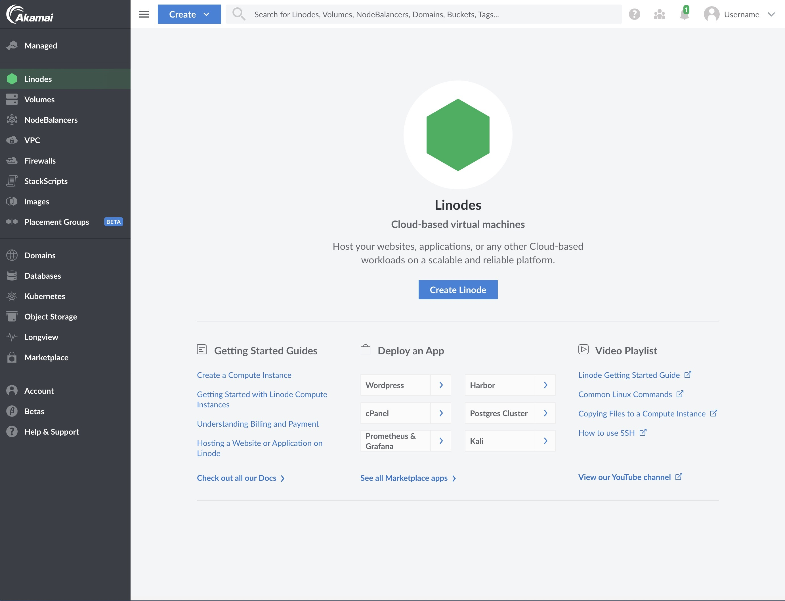
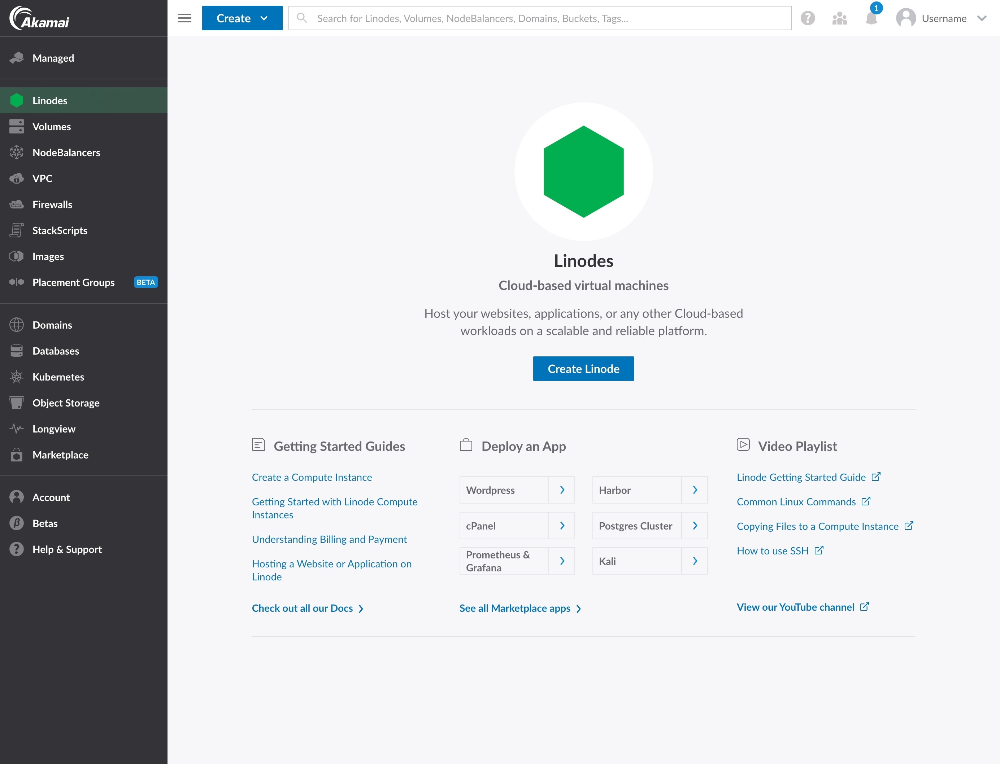
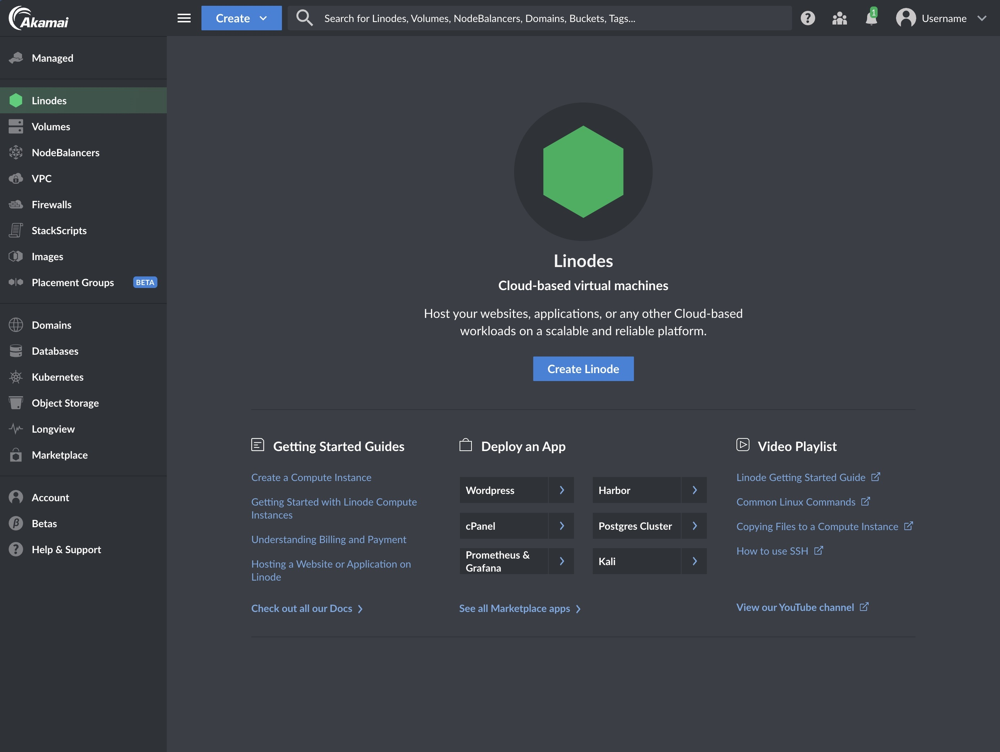
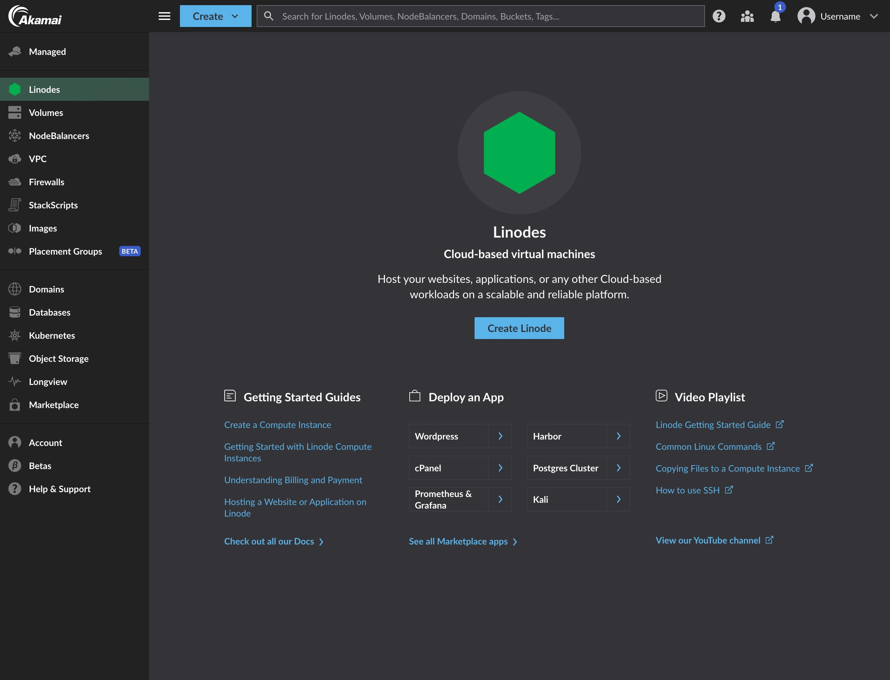

[Cloud Manager](https://cloud.linode.com/) provides a user-friendly interface to manage your infrastructure, user accounts, billing and payments, and to open and track support tickets. You can easily create Linode instances, manage Kubernetes clusters, add backups to your Linodes, deploy Marketplace Apps, track event notifications, create Object Storage buckets, and more. Cloud Manager is implemented solely atop our public [API](/docs/api), which gives you access to all our latest products and services.

## In this Guide

This guide provides an overview of the features and services available in Cloud Manager. Some of the topics that will be discussed are:

- An introduction to each section of Cloud Manager, including links to related guides throughout our documentation library.
- The location of commonly used Cloud Manager features.
- Settings that might make your overall Cloud Manager experience better

## Linodes

The Linodes section of Cloud Manager lets you create and manage your Linodes. Each Linode instance in Cloud Manager includes:

- [Summary information](/docs/products/compute/compute-instances/guides/monitor-and-maintain/#cloud-manager) about your Linode, like CPU usage, IPv4 and [IPv6 traffic](/docs/products/compute/compute-instances/guides/ipv6/), and Disk IO
- Access to any of your Linode's attached Volumes and the ability to [create a Volume](/docs/products/storage/block-storage/guides/manage-volumes/)
- Networking information and features, including the ability to add IPv4 and IPv6 addresses, [IP transfer](/docs/products/compute/compute-instances/guides/manage-ip-addresses/#transferring-ip-addresses) and [IP sharing](/docs/products/compute/compute-instances/guides/manage-ip-addresses/#configuring-ip-sharing)
- The ability to [resize your Linode](/docs/products/compute/compute-instances/guides/resize/), boot your Linode into [Rescue Mode](/docs/products/compute/compute-instances/guides/rescue-and-rebuild/#rescue-mode-overview), and [rebuild your Linode](/docs/products/compute/compute-instances/guides/rescue-and-rebuild/#rebuilding)
- Access to Linode's [Backup service](/docs/products/storage/backups/)
- An [Activity Feed](/docs/products/tools/cloud-manager/guides/events-and-activity-feeds/#viewing-a-linodes-activity-feed) that displays any relevant events related to this Linode
- Settings that allow you to update your Linode's label, [reset your Linode's root password](/docs/products/compute/compute-instances/guides/reset-root-password/), [manage system usage email notifications](/docs/products/compute/compute-instances/guides/monitor-and-maintain/#configure-cloud-manager-email-alerts), [manage Watchdog](/docs/products/compute/compute-instances/guides/lassie-shutdown-watchdog/) (Linode's automatic reboot feature), and delete your Linode
- Areas to [manage disks](/docs/products/compute/compute-instances/guides/disks-and-storage/) and [manage configuration profiles](/docs/products/compute/compute-instances/guides/configuration-profiles/)
- [Cross data center migrations](/docs/products/compute/compute-instances/guides/migrate-to-different-dc/)

## Volumes

The **Volumes** section of Cloud Manager gives you access to Linode's [Block Storage](https://www.linode.com/products/block-storage/) service. To learn how to create and manage Block Storage volumes using Cloud Manager, see our [Block Storage Overview](/docs/products/storage/block-storage/) guide.

## Object Storage

The **Object Storage** section of Cloud Manager gives you access to Linode’s [Object Storage service](https://www.linode.com/products/object-storage/) which is a globally-available, S3-compatible method for storing and accessing data.

To learn how to use Object Storage, view the [Get Started with Object Storage](/docs/products/storage/object-storage/get-started/) guide or take a look through all the [Object Storage guides](/docs/products/storage/object-storage/guides/).

## NodeBalancers

Linode's [NodeBalancers service](https://www.linode.com/products/nodebalancers/) provides load balancing for your applications and services ensuring that they are highly available for users. To learn how to get started with NodeBalancers using Cloud Manager, see our [Getting Started with NodeBalancers](/docs/products/networking/nodebalancers/get-started/) guide.

## Domains (DNS Manager)

The DNS Manager lets you control and manage your domains. You can access the DNS Manager by navigating to the **Domains** link in Cloud Manager's sidebar.

For more information on Cloud Manager's DNS Manager, see the following guides:

- [DNS Manager](/docs/products/networking/dns-manager/).
- [Common DNS Configurations](/docs/products/networking/dns-manager/guides/common-dns-configurations/)
- [Configure Your Linode for Reverse DNS](/docs/products/compute/compute-instances/guides/configure-rdns/)

## Longview

The **Longview** section of Cloud Manager gives you access to Linode’s system data graphing service. It tracks metrics for CPU, memory, and network bandwidth, both aggregate and per-process, and it provides real-time graphs that can help expose performance problems. The Longview service offers both [free and paid plan tiers](/docs/products/tools/longview/).

To get started using Longview, see the [Understanding Linode Longview](/docs/products/tools/longview/get-started/) guide.

## Marketplace

The **Marketplace** section of Cloud Manager gives you access to apps that make it easy to deploy and configure Marketplace Apps on a Linode. Some popular Marketplace Apps are [WordPress](/docs/products/tools/marketplace/guides/wordpress/), [Minecraft](/docs/products/tools/marketplace/guides/minecraft/), and [GitLab](/docs/products/tools/marketplace/guides/gitlab/). We are actively adding new and useful Marketplace apps. When a Marketplace App is deployed, a new Linode is created and the appropriate software is installed with the configurations you provide.

See [How to Use Linode's Marketplace Apps](/docs/products/tools/marketplace/get-started/) to get started using Marketplace Apps in Cloud Manager.

## Kubernetes (LKE)

The Kubernetes section of Cloud Manager gives you access to our managed Kubernetes service, the Linode Kubernetes Engine (LKE). LKE is a fully-managed container orchestration engine for deploying and managing containerized applications and workloads. LKE combines Linode’s ease of use and [simple pricing](https://www.linode.com/pricing/) with the infrastructure efficiency of Kubernetes.

To get started using LKE, see our [Tutorial for Deploying and Managing a Cluster with Linode Kubernetes Engine](/docs/products/compute/kubernetes/).

## StackScripts

[StackScripts](https://www.linode.com/stackscripts/) provide Linode users with the ability to automate the deployment of custom systems on top of our default Linux distribution images. StackScripts are usually Bash scripts, stored in Cloud Manager, and can be accessed when you deploy a Linode. Linodes deployed with a StackScript run the script as part of the first boot process.

To get started using StackScripts in Cloud Manager, see the [Automate Deployment with StackScripts](/docs/products/tools/stackscripts/) guide.

## Images

The Images section of Cloud Manager gives you access to Linode Images which allow you to take snapshots of your disks, and then deploy them to any Linode under your account. This can be useful for bootstrapping an image for a large deployment, or retaining a disk for a configuration that you may not need running, but wish to return to in the future.

To get started using Images with Cloud Manager, see [Linode Images](/docs/products/tools/images/).

## Account (Management and Billing)

The **Account** section of Cloud Manager lets you manage your account's billing information and users, and to configure various account-wide settings.

You can manage the following account and billing settings in the Account section of Cloud Manager:

- [Update contact information](/docs/products/platform/billing/guides/update-billing-contact-info/)
- [Adding a New Payment Method](/docs/products/platform/billing/guides/payment-methods/#add-a-new-payment-method)
- [Making a One-Time Payment](/docs/products/platform/billing/guides/make-a-payment/)
- [View recent invoices and payments](/docs/products/platform/billing/guides/view-history/)
- [Add new users and manage exiting user's profiles and permissions](/docs/products/platform/accounts/guides/user-permissions/)
- [Enable Backup auto enrollment for all new Linodes on your account](/docs/products/storage/backups/guides/enable/#auto-enroll-new-compute-instances-in-the-backup-service)
- [Enable Network Helper](/docs/products/compute/compute-instances/guides/network-helper/#global-account-wide-setting)
- [Cancel Object Storage](/docs/products/storage/object-storage/guides/cancel/)
- [Add the Linode Managed service to your account](/docs/products/services/managed/get-started/)

### Password Management

Cloud Manager does not support forcing password expirations. Forcing password resets on a schedule is [bad practice from a security perspective](https://pages.nist.gov/800-63-FAQ/#q-b05). Current security research indicates that forced password changes do more harm than good. If you want to force password resets for users of your Linode account, we recommend using a password manager for this purpose.

## Tags

Both Cloud Manager and [API v4](/docs/api) allow you to create tags to help organize and group your Linode resources. Tags can be applied to [Linode instances](#linodes), [Block Storage Volumes](#volumes), [NodeBalancers](#nodebalancers), and [Domains](#domains-dns-manager). See the [Tags and Groups](/docs/products/tools/cloud-manager/guides/tags-and-groups/) guide to learn how to create, apply, and search for tags.

## Events and Activity Feeds

Tasks performed using Cloud Manager or other account specific tools like Linode’s [CLI](/docs/products/tools/cli/get-started/) or [API](https://www.linode.com/products/api/) will be logged to an individual Linode’s activity feed, or on your account’s [Events Page](https://cloud.linode.com/events). The events and activity pages are user accessible logs, or histories of events taking place on your account. They contain details regarding the most notable events affecting your Linodes, like reboots, shutdowns, migrations, and more.

For more details, see the [Understanding Events and Activity Feeds](/docs/products/tools/cloud-manager/guides/events-and-activity-feeds/) guide.

## My Profile

The **My Profile** section of Cloud Manager provides access to various settings related to your Linode account's profile. This area of Cloud Manager contains access to the following features and settings:

- [Changing your account's associated email address](/docs/products/platform/accounts/guides/change-user-email/)
- [Resetting your Account password](/docs/products/platform/accounts/guides/reset-user-password/)
- [Enabling two-factor authentication](/docs/products/platform/accounts/guides/user-security-controls/#2fa-two-factor-authentication)
- [Enabling Third Party Authentication (TPA)](/docs/guides/third-party-authentication/)
- Managing trusted devices
- [Adding and managing public SSH keys](/docs/products/platform/accounts/guides/manage-ssh-keys/)
- [Managing LISH authentication methods](/docs/products/compute/compute-instances/guides/lish/#add-your-public-key)
- [Adding and managing personal and third party API v4 access tokens](/docs/products/platform/accounts/guides/manage-api-tokens/)
- [Creating and managing OAuth Apps](/docs/guides/create-an-oauth-app-with-the-python-api-library/#obtaining-a-client-id-and-a-client-secret)
- [Linode Referral Program](/docs/products/platform/billing/guides/referral-program/)
- Enable email alerts for account activity

### OAuth Apps

Cloud Manager supports the OAuth 2 authorization protocol. OAuth 2 allows a user to safely grant a third-party app permission to act on their behalf. This means that a user could authorize an app to access data and / or make changes to their Linode account and services that are exposed by the Linode API. For example, an app could create or destroy Linodes, manage a NodeBalancer, or alter a domain.

To learn how to get started with OAuth Apps see the [How To Create an OAuth App with the Linode Python API Library](/docs/guides/create-an-oauth-app-with-the-python-api-library/) guide. For details on the Linode API v4's OAuth workflow see the [Linode API v4 documentation](/docs/api/account/#oauth-clients-list).

### Manage Email Event Notifications

To learn more about events and how to enable or disable email notifications for these events, see the [Understanding Events and the Activity Feed](/docs/products/tools/cloud-manager/guides/events-and-activity-feeds/) guide.

### Change the Theme (Dark Mode)

Cloud Manager provides a way to set your preferred UI theme, including a light theme, dark theme, and the system theme.

1. Navigate to your profile by clicking on your username and select **My Settings**.

1. Within the **Theme** section, select your preferred theme from the available options: *Light*, *Dark*, or *System*. Once a selection is made, Cloud Manager's interface immediately switches to that theme.

### Set the Timezone

All events displayed in Cloud Manager are shown using your user's timezone setting. The timezone can be modified in your display settings.

1. Navigate to your profile by clicking on your username and select **Display**.

1. In the **Timezone** field, select your preferred timezone from the menu.

1. Click the **Update Timezone** button to save your settings.

## Accessibility

Cloud Manager has been built with accessibility in mind. Currently, Cloud Manager is actively being developed to achieve [WCAG 2.0 Level AA](https://www.w3.org/TR/WCAG20/).

We have received much helpful feedback from our users regarding accessibility. While we have addressed a lot of your feedback, this is still a work in progress and will be iterated upon with time. If you have comments or requests regarding accessibility, let us know by filling out our [feedback form](https://www.linode.com/feedback/).

## Experience Improvements

We're making improvements to Cloud Manager so that we can deliver a high-quality and consistent user experience across product families. These experience updates are driven by our new Akamai Core Design System.

*This section will be updated as we roll out additional experience improvements to Cloud Manager. For a list of all changes to Cloud Manager, review the [Cloud Manager changelog](https://github.com/linode/manager/releases).*

### July 2024

In early July, we've made minor branding changes to Cloud Manager. As part of these changes, we've implemented higher color contrast to improve the accessibility of both text and interactive components. Review the screenshots below for a closer look at the changes.

| Previous Design | Updated Design&nbsp;&nbsp; |
| -- | -- |
|  |  |
|  |  |