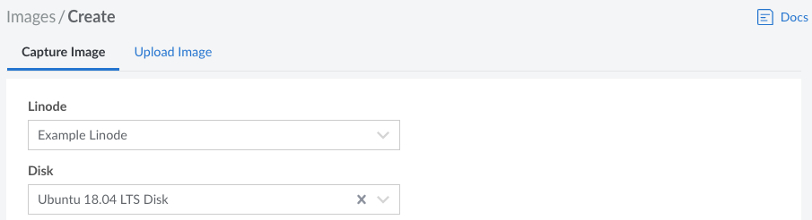
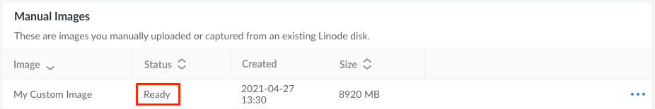

1. Log in to the Cloud Manager and open the **[Capture Image](https://cloud.linode.com/images/create/disk)** form by navigating to the **Images** page, clicking the **Create Image** button, and staying on the **Catpure Image** tab.

1. Select your *Linode* and *Disk* from their respective dropdown lists and type in an optional *Label* and *Description* for the Image. If no *Label* is entered, the label for the disk will be used. When selecting a Linode and Disk, keep in mind any limitations that may prevent the Image from creating successfully.

    

1. Click the **Create** button to start creating the Image. It will take some time to fully complete. You can check the status of this process by navigating to the main **Images** page, finding the new image in the **Custom Images** table, and looking at the *Status* column. If the Image has been captured and processed, the status should be set to *Ready*. The *Size* of the Image is based on the disk's usage, not the size of the disk itself.

    
