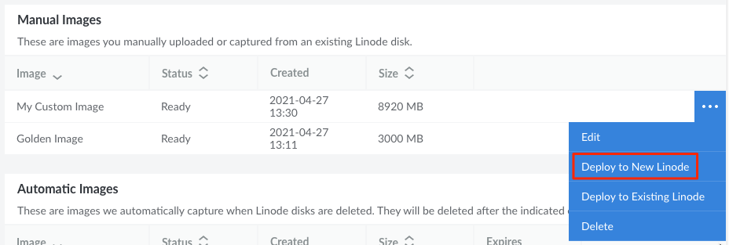

1. Log in to the Cloud Manager and navigate to the **Images** page.

1. On this page, locate the Image you wish to deploy and click the corresponding **ellipsis** options menu. Select **Deploy to a New Linode**.

    

1. You are redirected to the **Create Linode** form with the chosen Image preselected. Complete the remainder of this form, making sure to select your desired **Region**, **Linode Plan**, **Label**, **Root Password**, and any other options that may be needed. See [Getting Started with Linode → Create Linode](/docs/guides/getting-started/#create-a-linode) for full instructions on creating a Linode.

1. Click the **Create Linode** button to create the Linode based on the selected Image.