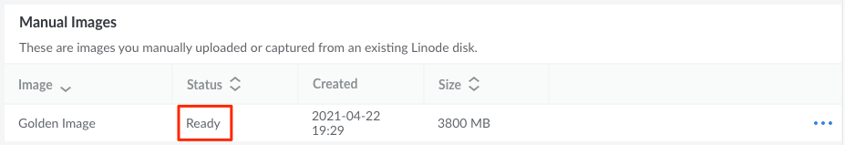

Once you have obtained a compatible image file that meets all the requirements, upload it through the **Upload Image** Cloud Manager form. After it's uploaded, you can then deploy Linodes using that Custom Image.

1.  Log in to the Cloud Manager and open the **[Upload Image](https://cloud.linode.com/images/create/upload)** form by navigating to the **Images** page, clicking the **Create Image** button, and selecting the **Upload Image** tab.

1.  Type in the *Label* of the new Image along with an optional *Description*. Select the *Region* you would like the Image to be created within. Since Images can be deployed to any data center (regardless of where they are located), it's recommended that you select the one closest to you geographically for the fastest upload speed.

1.  Specify the image file you'd like to use by either dragging the file into the designated area or by clicking the **Browse Files** button and selecting the file. The filename will appear along with a progress bar indicating the percentage completed for the file upload.

1.  Once the image file has been successfully uploaded, the Custom Image is created and the Cloud Manager will redirect you to the main Images page. Here, you should see the new Custom Image listed along with a status of *Pending Upload*. Once the Custom Image is ready to be deployed, the status will change to *Ready*.

    

    If there is an error when processing the uploaded image file, the newly created Image may be deleted and an error message will be written to the [Events](https://cloud.linode.com/events) log. See [Understanding Events and the Activity Feed](/docs/guides/cloud-manager-events-and-activity-feeds/) for more details on viewing Cloud Manager Events.