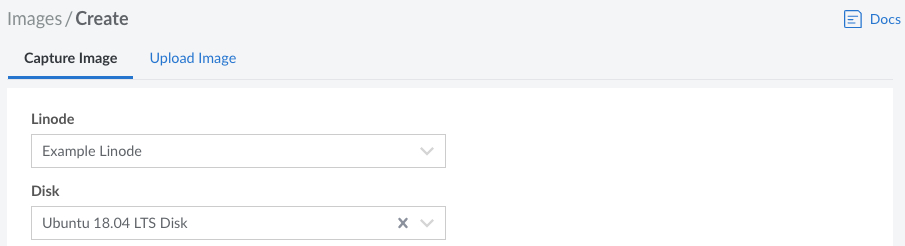
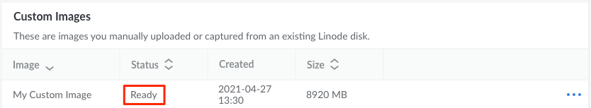

---
author:
  name: Linode
  email: docs@linode.com
title: Capture an Image
description: "How to capture an Image from a Linode."
---

## Requirements and Considerations

When capturing an image file from an existing Linode Compute Instance, keep the following limits, requirements, and considerations in mind.

- Review the overall [Technical Specifications](/docs/products/tools/images/#technical-specifications) of the Custom Images service.

- **Disk must be formatted using ext3/ext4 filesystems.** Images cannot be created if you are using raw disks or disks that have been formatted using custom filesystems. CoreOS disk images are in RAW format. Images made from CoreOS disks can't be used to deploy new Linodes.

- **Power off Linode to avoid database corruption.** If your Linode is running any active databases, it's recommended to power off the Linode down prior to creating the image. Creating an image that includes a running database can cause corruption or data loss in the imaged copy of the database.

- **Only the selected disk is saved to the Image.** The Image is comprised only of the disk selected during the creation process. The Image does not store other aspects of the Linode, such as Configuration Profiles, Block Storage Volumes, IP Addresses, and other Linode-based settings.

## Capturing an Image through the Cloud Manager

1. Log in to the Cloud Manager and open the **[Capture Image](https://cloud.linode.com/images/create/disk)** form by navigating to the **Images** page, clicking the **Create Image** button, and staying on the **Capture Image** tab.

1. Select your *Linode* and *Disk* from their respective dropdown lists and type in an optional *Label* and *Description* for the Image. If no *Label* is entered, the label for the disk will be used. When selecting a Linode and Disk, keep in mind any limitations that may prevent the Image from creating successfully.

    

1. Click the **Create** button to start creating the Image. It will take some time to fully complete. You can check the status of this process by navigating to the main **Images** page, finding the new image in the **Custom Images** table, and looking at the *Status* column. If the Image has been captured and processed, the status should be set to *Ready*. The *Size* of the Image is based on the disk's usage, not the size of the disk itself.

    
