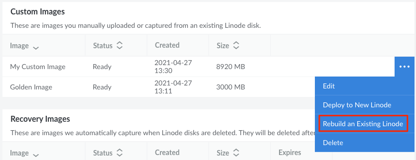
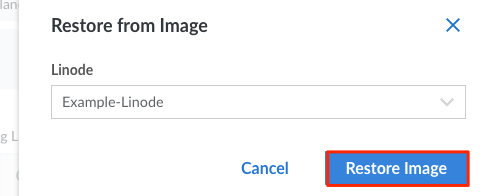
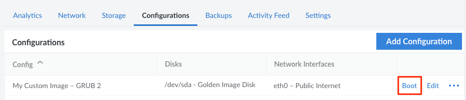

---
author:
  name: Linode
  email: docs@linode.com
title: "Deploy an Image to an Existing Compute Instance"
description: "Learn how to deploy an Image to an existing Linode Compute Instance by rebuilding it or adding a new disk."
aliases: ['/guides/deploy-an-image-to-a-linode/','/quick-answers/linode-platform/deploy-an-image-to-a-linode/','/quick-answers/linode-platform/deploy-an-image-to-a-linode-classic-manager/']
---

While it's typically more common to [deploy an Image to a *new* Compute Instance](/docs/products/tools/images/guides/deploy-image-to-new-linode/), you are also able to deploy an Image to an *existing* Instance. You may wish to do this if you want to maintain consistent billing or if you wish to add the Image alongside the existing data.

There are two methods to deploy an Image to an existing Compute Instance:

- [Rebuilding the Compute Instance](#deploy-an-image-by-rebuilding-a-compute-instance)
- [Adding a disk to the Compute Instance](#deploy-an-image-by-adding-a-disk-to-a-compute-instance)

## Deploy an Image by Rebuilding a Compute Instance

A common method of deploying an Image is to rebuild an existing Compute Instance with your desired Image. This deletes all data and disks on that Instance and creates new disks for the selected Image. Use this method only if you no longer need the data that's stored on the Instance.

1. Log in to the [Cloud Manager](https://cloud.linode.com/) and navigate to the **Images** page.

1. Locate the Image you wish to deploy and click the corresponding **ellipsis** options menu. Select **Rebuild an Existing Linode**.

    

1.  Within the **Restore from Image** panel that appears, select the Compute Instance to use and click the **Restore Image** button.

    

1. You are redirected to the dashboard page for that Linode and the **Rebuild** form is displayed with the chosen Image preselected. Complete the remainder of this form, making sure to select your desired **Root Password**, and any other options that may be needed. See [Rescue and Rebuild → Rebuilding](/docs/guides/rescue-and-rebuild/#rebuilding) for full instructions on rebuilding a Linode.

1. Click the **Rebuild Linode** button to rebuild the Linode. All existing disks will be deleted and a new disk will be created using the selected Image.

## Deploy an Image by Adding a Disk to a Compute Instance

If you instead wish to retain the data on your Compute Instance, you can add a disk with your desired Image to that Instance. This is useful if you wish to have multiple bootable configurations and only need to access one at a time.

1. Log in to the [Cloud Manager](https://cloud.linode.com/), click the **[Linodes](https://cloud.linode.com/linodes)** link in the sidebar, and select a Compute Instance from the list.

1. **Create a disk with the Image**. Follow the instructions to [create a disk](/docs/guides/disks-and-storage/#creating-a-disk) using the [Cloud Manager](https://cloud.linode.com/). Keep the following considerations in mind:

    - Confirm there is enough unallocated storage space to accommodate the new disk for the desired Image. If you aren't sure of the size of the Image, open the **[Images](https://cloud.linode.com/images)** page, find the Image within the list, and view the *Size* column.
    - When creating the disk, select the **Create from Image** option and select the Image you wish to deploy.

1. **Optionally create a swap disk**. Your image *may* require a swap disk in order to boot. If you already have a swap disk on your Compute Instance from a previous image deployment (visible under the **Disks** panel), you can reuse that same disk with your new image. Otherwise, you can create a new swap disk:

    1. Navigate back to the Linode's **Storage** tab and click the **Add a Disk** button.

    1. In the **Add Disk** form, select **Create Empty Disk** and choose the *swap* option from the **Filesystem** dropdown menu. Then enter a *Label* and *Size* (usually 128MB, 256MB, or 512MB). Click the **Add** button to create the disk.

1. **Create or edit a configuration profile**. To boot using the new disk, the disk needs to be properly assigned within a new or existing [configuration profile](/docs/guides/linode-configuration-profiles) and selected as the *Root Device*.

    1. Navigate to the Linode's **Configuration** tab and click the **Add Configuration** button. It's also possible to adjust an existing configuration profile by clicking the *Edit* link next to that configuration.

    1. Within the **Add (or Edit) Configuration** form that appears, assign the disk under **Block Device Assignment** and select that device as the **Root Device**. Here are the important fields within this form:

        | Field | Value |
        |-------|-------------|
        | Label | A name for the configuration profile. |
        | Comments | Enter any comments that may help you remember the purpose for your new configuration profile, or any other notes you'd like to record. |
        | Select a Kernel | In most cases, select *GRUB 2*. |
        | /dev/sda | Choose the disk for the new Image that was just deployed. |
        | /dev/sdb | Choose the swap disk, if one is available. |

        For all of Linode's standard distribution images, the other fields can retain their default values. For Custom Images, you may need to update other parts of the configuration profile. Review the [Managing Configuration Profiles on a Linode](/docs/guides/linode-configuration-profiles/#editing-a-configuration-profile) and [Install a Custom Distribution on a Linode](/docs/guides/install-a-custom-distribution-on-a-linode/) guides for further guidance.

1. Reboot the Compute Instance using the new Image. Navigate to the **Configuration** tab, find the new configuration profile in the list, and click the corresponding **Boot** link. This link may be displayed with the **More Options** ellipsis dropdown menu.

    

For help with configuring the software on your new disk, review the [Getting Started](/docs/guides/getting-started/) and [Setting Up and Securing a Compute Instance](/docs/guides/set-up-and-secure/) guides.
